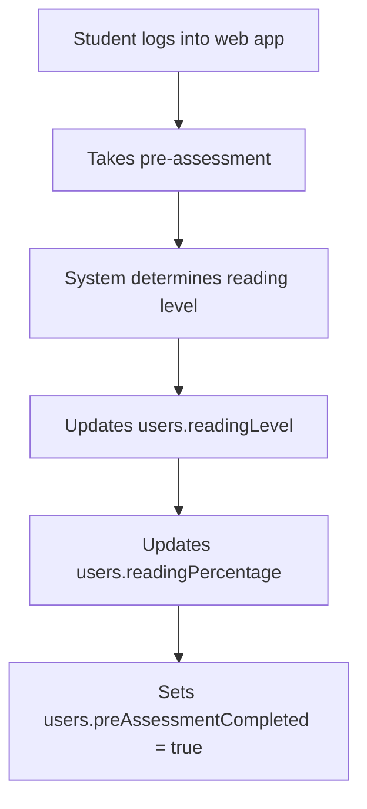

# Prescriptive Analytics Data Flow Documentation
**Complete K-12 Reading Assessment System: From Assessment to Intervention**

*Written for clear understanding - comprehensive coverage of the entire prescriptive analytics system*

---

## Table of Contents
1. [System Overview](#system-overview)
2. [Reading Level Progression System](#reading-level-progression-system)
3. [Complete Database Schema](#complete-database-schema)
4. [Step-by-Step Data Flow Process](#step-by-step-data-flow-process)
5. [Mathematical Models Explained](#mathematical-models-explained)
6. [Intervention System Architecture](#intervention-system-architecture)
7. [Real Student Journey Examples](#real-student-journey-examples)
8. [Integration Points & Automation](#integration-points--automation)
9. [Error Pattern Analysis](#error-pattern-analysis)
10. [Teacher Re-editing System](#teacher-re-editing-system)

---

## System Overview

### What is Prescriptive Analytics?
Think of prescriptive analytics like a smart tutor that:
1. **Watches** how you answer reading questions
2. **Analyzes** your mistakes and strengths using advanced math
3. **Prescribes** exactly what you need to study next
4. **Tracks** your improvement over time
5. **Decides** when you need human teacher help

### The Big Picture Flow
```
Student Takes Assessment 
    ↓
System Analyzes Performance (Math Magic Happens Here!)
    ↓
System Creates Personalized Study Plan
    ↓
Student Gets Targeted Practice Questions
    ↓
Still Struggling? → Teacher Re-edits Intervention Questions
Success? → Move to Next Level!
```

### Key Innovation: One-Time Digital Rule
- Each student gets exactly **ONE** chance at digital intervention per category
- If they fail the intervention → **Teacher can re-edit intervention questions**
- This prevents endless digital loops while allowing teacher customization when needed

---

## Reading Level Progression System

### The 5 Reading Levels (Like Game Levels!)

**🌱 Level 1: Low Emerging** - "Learning the Alphabet"
- **Categories**: Alphabet Knowledge only (1 category)
- **Focus**: Can you recognize letters A, B, C...?
- **Auto-Progression**: When Alphabet Knowledge passes (≥75%), system automatically updates user to High Emerging

**🌿 Level 2: High Emerging** - "Letters + Sounds"
- **Categories**: Alphabet Knowledge + Phonological Awareness (2 categories)
- **Focus**: Letters + Can you hear the difference between "B" and "P"?
- **Auto-Progression**: When both categories pass, system updates user to Developing and creates Decoding category_results

**🌳 Level 3: Developing** - "Building Words"
- **Categories**: Alphabet + Phonological + Decoding (3 categories)
- **Focus**: Previous + Can you sound out "C-A-T" = "cat"?
- **Auto-Progression**: When all 3 categories pass, system updates to Transitioning and creates Word Recognition category_results

**🌲 Level 4: Transitioning** - "Recognizing Words"
- **Categories**: Alphabet + Phonological + Decoding + Word Recognition (4 categories)
- **Focus**: Previous + Can you recognize "cat" without sounding it out?
- **Auto-Progression**: When all 4 categories pass, system updates to At Grade Level and creates Reading Comprehension category_results

**🏔️ Level 5: At Grade Level** - "Understanding Stories"
- **Categories**: All 5 categories including Reading Comprehension
- **Focus**: Previous + Can you understand what you read?
- **Auto-Progression**: Maximum level reached - student ready for advanced curriculum

### Automatic Reading Level Progression System

**How It Works:**
1. **Assessment Completion**: Student completes all categories for their current level
2. **Category Evaluation**: System checks if all categories have `passed: true` (score ≥ 75%)
3. **Automatic Update**: If all passed, system automatically:
   - Updates `users.readingLevel` to next level
   - Creates new `category_results` records for additional categories in next level
   - Preserves existing category results for reference
4. **Mobile Integration**: Mobile app checks progression eligibility to show appropriate assessments

**Category Weighting by Level:**
```javascript
CATEGORY_WEIGHTS = {
  "Low Emerging": {
    "Alphabet Knowledge": 1.0      // 100% focus on alphabet
  },
  "High Emerging": {
    "Alphabet Knowledge": 0.6,      // 60% alphabet
    "Phonological Awareness": 0.4   // 40% sounds
  },
  "Developing": {
    "Alphabet Knowledge": 0.35,     // 35% alphabet
    "Phonological Awareness": 0.30, // 30% sounds
    "Decoding": 0.35               // 35% decoding
  },
  "Transitioning": {
    "Alphabet Knowledge": 0.20,     // 20% alphabet
    "Phonological Awareness": 0.25, // 25% sounds
    "Decoding": 0.25,              // 25% decoding
    "Word Recognition": 0.30        // 30% word recognition
  },
  "At Grade Level": {
    "Alphabet Knowledge": 0.10,     // 10% alphabet
    "Phonological Awareness": 0.15, // 15% sounds
    "Decoding": 0.15,              // 15% decoding
    "Word Recognition": 0.20,       // 20% word recognition
    "Reading Comprehension": 0.40   // 40% comprehension
  }
};
```

---

## Complete Database Schema

### 1. Users Collection (`test.users`)
**Purpose**: Stores student information and current reading level (automatically updated by progression system)
```javascript
{
  "_id": ObjectId("..."),
  "idNumber": 202210222,              // Student ID number
  "firstName": "Juan",                 // Student's first name
  "lastName": "Dela Cruz",             // Student's last name
  "age": 8,                           // Student's age
  "readingLevel": "High Emerging",     // Current reading level (AUTOMATICALLY updated by CategoryResultsService.processReadingLevelProgression())
  "readingPercentage": 72,             // Overall reading score (UPDATED after pre assessment)
  "preAssessmentCompleted": true,      // Has completed pre-assessment?
  "lastAssessmentDate": "2025-01-15",  // When last assessed
  "gradeLevel": "Grade 2",            // School grade level
  "section": "Rose",                   // Class section
  "createdAt": Date,
  "lastLogin": Date
}
```

### 2. Main Assessment Collection (`test.main_assessment`)
**Purpose**: Stores the questions for each reading level and category (accessed via Mongoose models)
```javascript
{
  "_id": ObjectId("..."),
  "readingLevel": "High Emerging",     // Which level this assessment is for
  "category": "Phonological Awareness", // Which category (1 per document)
  "questionType": "malapantig",        // Type of question (matching, drag_drop, etc.)
  "questions": [                    // structure schema questions in related to the structure of phonological ONLY since this is an example only 
    {
      "questionText": "Pakinggan ang audio. Itugma ito sa katumbas na letra.",
      "questionId": "PA_001",           // Unique question identifier
      "questionSet": [
        {
          "audioTexts": ["H", "T", "N"],        // What student hears
          "matchingOptions": ["Hh", "Tt", "Nn", "Ll"], // What they can select
          "correctPairs": [                      // Correct answers
            {"audio": "H", "match": "Hh"},
            {"audio": "T", "match": "Tt"}, 
            {"audio": "N", "match": "Nn"}
          ]
        }
      ]
    }
  ],
  "totalQuestions": 6,                 // Number of questions in this category
  "isActive": true,                    // Is this assessment currently used?
  "status": "active",
  "createdAt": Date,
  "updatedAt": Date
}
```

### 3. Student Responses Collection (`test.student_responses`)
**Purpose**: Records every individual answer a student gives during assessment
```javascript
{
  "_id": ObjectId("..."),
  "studentId": 202210222,              // Links to users.idNumber
  "categoryId": ObjectId("..."),       // Links to main_assessment._id
  "questionId": "PA_001",              // Specific question answered
  "category": "Phonological Awareness", // Category name for easy filtering
  
  // RESPONSE DATA
  "response": [                        // Student's actual answer
    {"audio": "H", "match": "Tt"},     // Wrong! Should be "Hh"
    {"audio": "T", "match": "Hh"},     // Wrong! Should be "Tt"
    {"audio": "N", "match": "Nn"}      // Correct!
  ],
  "isCorrect": false,                  // Overall question result
  "correctMatches": 1,                 // For Phonological: matches gotten right
  "totalMatches": 3,                   // For Phonological: total possible matches
  
  // TIMING DATA (for advanced BKT)
  "responseTime": 12.5,                // Seconds to answer (12.5 seconds)
  "answeredAt": "2025-01-15T14:30:22Z", // Exact timestamp (important for BKT)
  
  // METADATA
  "readingLevel": "High Emerging",     // Student's level when answering
  "createdAt": Date
}
```

### 4. Category Results Collection (`test.category_results`)
**Purpose**: Aggregates all responses per category and determines pass/fail, triggers automatic progression
```javascript
{
  "_id": ObjectId("..."),
  "studentId": 202210222,              // Student who took assessment
  "assessmentDate": "2025-01-15T14:25:00Z",
  "categories": [
    {
      "categoryName": "Alphabet Knowledge",
      "totalQuestions": 15,             // How many questions in this category
      "correctAnswers": 14,             // How many correct
      "score": 93,                      // (14/15) * 100 = 93.33% ≈ 93%
      "isPassed": true,                 // 93% >= 75% threshold
      "passingThreshold": 75,           // Pass/fail cutoff
      "isCompleted": true,              // Student finished all questions?
      "lastQuestionAnswered": "AK_015", // Last question ID
      "interventionRequired": false,    // No intervention needed (passed)
      "interventionAttempts": 0,        // How many intervention attempts (0-3)
      "interventionCompleted": false,   // Has intervention been attempted?
      "currentInterventionId": null,    // Links to active intervention
      "interventionHistory": []         // List of all intervention attempts
    },
    {
      "categoryName": "Phonological Awareness",
      "totalQuestions": 6,
      "totalPossibleMatches": 18,       // Special for Phonological (6 questions × 3 matches each)
      "correctMatches": 8,              // Matches gotten right across all questions
      "score": 44,                      // (8/18) * 100 = 44.44% ≈ 44%
      "isPassed": false,                // 44% < 75%
      "interventionRequired": true,     // Needs intervention!
      "interventionAttempts": 0,        // No attempts yet
      "interventionCompleted": false,
      "currentInterventionId": null,
      "interventionHistory": []
    }
  ],
  "readingLevel": "High Emerging",
  "overallScore": 74,                   // Weighted average: (93×0.6) + (44×0.4) = 74%
  "prescriptiveAnalysisId": null,       // Will link to analysis when generated
  "createdAt": Date,
  "updatedAt": Date
}
```

### 5. Prescriptive Analysis Collection (`test.prescriptive_analysis`)
**Purpose**: The brain of the system - mathematical analysis and intervention planning
```javascript
{
  "_id": ObjectId("..."),
  "studentId": 202210222,              // Student being analyzed
  "categoryResultId": ObjectId("..."), // Links back to category_results
  "assessmentDate": "2025-01-15T14:30:00Z",
  "assessmentType": "main",            // "main" or "intervention"
  "readingLevel": "High Emerging",
  
  // BAYESIAN KNOWLEDGE TRACING (BKT) - The Math Magic!
  "skillMastery": {
    "Alphabet Knowledge": {
      "masteryProbability": 0.92,      // 92% chance student has mastered this skill
      "lastUpdated": Date,
      "totalQuestions": 15,
      "correctAnswers": 14,
      "score": 93,                     // Percentage score
      "isPassed": true,                // >= 75%
      "responseHistory": [             // Last 10 responses with BKT evolution
        {
          "questionId": "AK_001",
          "correct": true,
          "timestamp": "2025-01-15T14:25:30Z",
          "masteryAfter": 0.65         // BKT probability after this question
        },
        {
          "questionId": "AK_002", 
          "correct": true,
          "timestamp": "2025-01-15T14:25:45Z",
          "masteryAfter": 0.73         // Increased after correct answer
        },
        {
          "questionId": "AK_003",
          "correct": false,
          "timestamp": "2025-01-15T14:26:02Z", 
          "masteryAfter": 0.58         // Decreased after wrong answer
        }
        // ... continues through all 15 questions to final 0.92
      ]
    },
    "Phonological Awareness": {
      "masteryProbability": 0.31,      // Only 31% mastery - very low!
      "totalQuestions": 6,
      "totalPossibleMatches": 18,       // 6 questions × 3 matches each
      "correctMatches": 8,              // Got 8 matches right total
      "score": 44,                      // (8/18) * 100 = 44%
      "isPassed": false,                // 44% < 75%
      "responseHistory": [
        {
          "questionId": "PA_001",
          "correct": false,
          "correctMatches": 1,          // Only got 1 of 3 matches right
          "totalMatches": 3,
          "masteryAfter": 0.42         // BKT probability after this question
        }
        // ... continues through all 6 questions
      ]
    }
  },
  
  // ITEM RESPONSE THEORY (IRT) - Student Ability Estimates
  "abilityEstimates": {
    "Alphabet Knowledge": 1.2,         // Above average (+1.2 on -3 to +3 scale)
    "Phonological Awareness": -1.1     // Below average (-1.1 on -3 to +3 scale)
  },
  
  // ERROR PATTERN ANALYSIS - What Specific Mistakes?
  "errorPatterns": {
    "Phonological Awareness": {
      "matching_errors": {
        "count": 5,                     // 5 questions had errors
        "total": 6,                     // 6 total questions
        "percentage": 83,               // 83% error rate
        "avg_partial_success": 0.44,    // Average 44% matches correct per question
        "error_type": "sound_discrimination", // Type of error identified
        "questionIds": ["PA_001", "PA_002", "PA_003", "PA_004", "PA_006"] // Which questions
      }
    }
    // Alphabet Knowledge has no errors (passed), so not included
  },
  
  // INTERVENTION PLAN - What Should Student Study?
  "interventionPlan": {
    "required": true,                   // Intervention needed (any category < 75%)
    "priority": ["Phonological Awareness"], // Only one failed category
    "specificFocus": {
      "Phonological Awareness": {
        "focus": "sound_matching",      // Main area to work on
        "targetSounds": ["B-P", "M-N", "D-T"], // Common confusion pairs
        "recommendedActivities": [      // What activities to do
          "sound_discrimination", 
          "minimal_pairs",
          "rhyming_practice"
        ],
        "questionDistribution": {       // What types of questions in intervention
          "matching": 100               // 100% matching questions
        }
      }
    }
  },
  
  // INSIGHTS - Human-Readable Summary
  "insights": {
    "strengths": ["Alphabet Knowledge"], // What student is good at
    "weaknesses": ["Phonological Awareness - 44%"], // What needs work
    "overallReadiness": "Needs targeted intervention",
    "recommendedAction": "immediate_intervention", // What to do next
    "passedCategories": 1,             // 1 category passed
    "failedCategories": 1,             // 1 category failed
    "overallScore": 74                 // Just below passing (75%)
  },
  
  // INTERVENTION TRACKING
  "interventionHistory": [],           // No interventions attempted yet
  "createdAt": Date,
  "updatedAt": Date
}
```

### 6. Intervention Assessment Collection (`test.intervention_assessment`)
**Purpose**: Generates targeted practice questions based on prescriptive analysis
```javascript
{
  "_id": ObjectId("..."),
  "studentId": 202210222,              // Student who needs intervention
  "prescriptiveAnalysisId": ObjectId("..."), // Links to the analysis
  "category": "Phonological Awareness", // Which category needs help
  "readingLevel": "High Emerging",
  "passThreshold": 75,                 // Must score 75% to pass intervention
  
  // QUESTION SELECTION STRATEGY
  "questionSelectionStrategy": {
    "method": "error_focused",         // Based on error patterns
    "targetDifficulty": 0.7,          // 70% success probability target
    "focusAreas": {
      "sound_matching": 70,            // 70% of questions focus on sound matching
      "general_practice": 30           // 30% general reinforcement
    }
  },
  "totalQuestions": 10,                // Always exactly 10 questions
  
  // GENERATED QUESTIONS - Tailored to Student's Specific Errors
  "questions": [
    {
      "questionId": "int_pa_001",       // Intervention question ID
      "source": "generated",           // "generated", "template", or "main_assessment"
      "questionType": "malapantig",    // Matching type (matches category requirement)
      "questionText": "Pakinggan ang letra sa audio. Itugma ito sa katumbas na letra.",
      "questionSet": {
        "audioTexts": ["B", "P", "M"],  // Focuses on B-P confusion (from error analysis)
        "matchingOptions": ["Bb", "Pp", "Mm", "Nn"], // Extra option for difficulty
        "correctPairs": [
          {"audio": "B", "match": "Bb"},
          {"audio": "P", "match": "Pp"},
          {"audio": "M", "match": "Mm"}
        ]
      },
      "difficulty": -0.2,              // Slightly easier than average
      "discrimination": 1.1,           // How well this question separates abilities
      "targetSkill": "sound_discrimination",
      "targetElement": "B-P confusion" // Specific confusion being addressed
    }
    // ... 9 more questions targeting the same error patterns
  ],
  
  // INTERVENTION PARAMETERS
  "interventionParameters": {
    "fixedQuestions": 10,              // No adaptation during intervention
    "allowSkip": false,                // Must answer all questions
    "showProgress": true,              // Show "Question 5 of 10"
    "immediateFeeback": false          // Only show results at end
  },
  
  "status": "active",                  // "draft", "active", "completed"
  "createdBy": ObjectId("..."),        // Teacher/system who created it
  "createdAt": Date,
  "updatedAt": Date,
  
  // COMPLETION TRACKING
  "startedAt": null,                   // When student started
  "completedAt": null,                 // When student finished
  "interventionResultsId": null        // Links to results when completed
}
```

### 7. Intervention Responses Collection (`test.intervention_responses`)
**Purpose**: Records student answers during intervention (same structure as student_responses)
```javascript
{
  "_id": ObjectId("..."),
  "studentId": 202210222,
  "interventionAssessmentId": ObjectId("..."), // Links to intervention_assessment
  "questionId": "int_pa_001",          // Intervention question answered
  "category": "Phonological Awareness",
  "response": [                        // Student's answer
    {"audio": "B", "match": "Bb"},     // Correct!
    {"audio": "P", "match": "Pp"},     // Correct!
    {"audio": "M", "match": "Nn"}      // Wrong! Should be "Mm"
  ],
  "isCorrect": false,                  // 2/3 correct = false overall
  "correctMatches": 2,                 // Got 2 matches right
  "totalMatches": 3,                   // 3 total matches possible
  "responseTime": 8.7,                 // Faster response (improvement!)
  "answeredAt": "2025-01-16T10:15:30Z",
  "readingLevel": "High Emerging",
  "createdAt": Date
}
```

### 8. Intervention Results Collection (`test.intervention_results`)
**Purpose**: Final results of intervention attempt - pass/fail determination
```javascript
{
  "_id": ObjectId("..."),
  "studentId": 202210222,
  "interventionAssessmentId": ObjectId("..."),
  "category": "Phonological Awareness",
  "assessmentDate": "2025-01-16T10:00:00Z",
  
  // INTERVENTION PERFORMANCE
  "totalQuestions": 10,
  "totalPossibleMatches": 30,          // 10 questions × 3 matches each
  "correctMatches": 22,                // Got 22 matches right
  "score": 73,                         // (22/30) * 100 = 73.33% ≈ 73%
  "isPassed": false,                   // 73% < 75% - FAILED intervention
  "passThreshold": 75,
  
  // IMPROVEMENT TRACKING
  "previousScore": 44,                 // Original main assessment score
  "improvement": 29,                   // 73 - 44 = 29% improvement
  "improvementPercentage": 65.9,       // (29/44) * 100 = 65.9% relative improvement
  
  // BKT ANALYSIS FOR INTERVENTION
  "skillMastery": {
    "masteryProbability": 0.58,        // Improved from 0.31 to 0.58
    "masteryImprovement": 0.27,        // 0.58 - 0.31 = 0.27 increase
    "responseHistory": [               // BKT evolution during intervention
      {"questionId": "int_pa_001", "correct": false, "masteryAfter": 0.35},
      {"questionId": "int_pa_002", "correct": true, "masteryAfter": 0.42},
      // ... continues through all 10 intervention questions
    ]
  },
  
  // ERROR PATTERN EVOLUTION
  "errorPatterns": {
    "remaining_issues": {
      "B-P_confusion": "improved",     // Still some confusion but better
      "M-N_discrimination": "resolved", // No longer an issue
      "sequencing_difficulty": "new"   // New error pattern emerged
    }
  },
  
  // NEXT STEPS DETERMINATION
  "nextSteps": {
    "recommendedAction": "face_to_face_intervention", // Failed intervention
    "reason": "intervention_failed",   // Why face-to-face is needed
    "specificFocus": [                 // What teacher should focus on
      "B-P sound discrimination with audio support",
      "Sequential processing of multiple sound pairs"
    ],
    "estimatedTime": "15-20 minutes guided practice"
  },
  
  "completedAt": "2025-01-16T10:25:45Z",
  "createdAt": Date
}
```

### 9. Prescriptive Analysis Errors Collection (`test.prescriptive_analysis_errors`)
**Purpose**: Logs errors in the analysis system for debugging
```javascript
{
  "_id": ObjectId("..."),
  "categoryResultId": ObjectId("..."),
  "studentId": 202210222,
  "errorMessage": "BKT calculation failed: invalid response data",
  "errorStack": "Error: Invalid response...",
  "timestamp": "2025-01-15T14:35:00Z",
  "resolved": false,                   // Has this error been fixed?
  "resolution": null,                  // How it was resolved
  "createdAt": Date
}
```

---

## Step-by-Step Data Flow Process

### Phase 1: Pre-Assessment Setup


**What happens**: Student takes a quick test, system figures out their reading level (Low Emerging through At Grade Level), and saves this info.

### Phase 2: Main Assessment Categories Assignment
Based on reading level, system assigns categories:

```javascript
const categoryAssignment = {
  "Low Emerging": ["Alphabet Knowledge"],
  "High Emerging": ["Alphabet Knowledge", "Phonological Awareness"],
  "Developing": ["Alphabet Knowledge", "Phonological Awareness", "Decoding"],
  "Transitioning": ["Alphabet Knowledge", "Phonological Awareness", "Decoding", "Word Recognition"],
  "At Grade Level": ["Alphabet Knowledge", "Phonological Awareness", "Decoding", "Word Recognition", "Reading Comprehension"]
};
```

### Phase 3: Question Answering Process
For each question student answers:

```javascript
// Example: Student answers PA_001 question
const questionResponse = {
  // BEFORE: Question shows audio "H", "T", "N" with options "Hh", "Tt", "Nn", "Ll"
  // STUDENT ACTION: Student matches H→Tt, T→Hh, N→Nn (gets 1 of 3 correct)
  
  // SYSTEM CREATES RECORD IN THE MOBILE NOT IN THE WEB:
  studentId: 202210222,
  questionId: "PA_001",
  response: [
    {"audio": "H", "match": "Tt"},    // Wrong
    {"audio": "T", "match": "Hh"},    // Wrong  
    {"audio": "N", "match": "Nn"}     // Correct
  ],
  isCorrect: false,                   // Overall question = wrong
  correctMatches: 1,                  // But got 1 match right
  totalMatches: 3,                    // Out of 3 possible
  responseTime: 12.5,                 // Took 12.5 seconds
  answeredAt: "2025-01-15T14:25:30Z"  // Exact timestamp
};

// This creates a student_responses record
```

### Phase 4: Category Results Aggregation
After student completes all questions in all their categories:

```javascript
// System groups responses by category and calculates scores
const categoryResults = {
  "Alphabet Knowledge": {
    totalQuestions: 15,
    correctAnswers: 14,               // 14/15 correct
    score: 93,                        // (14/15) * 100 = 93%
    isPassed: true                    // 93% >= 75%
  },
  "Phonological Awareness": {
    totalQuestions: 6,
    totalPossibleMatches: 18,         // 6 questions × 3 matches each
    correctMatches: 8,                // Only 8/18 matches correct
    score: 44,                        // (8/18) * 100 = 44%
    isPassed: false                   // 44% < 75% - NEEDS INTERVENTION
  }
};

// Calculate weighted overall score based on reading level
const weights = {"Alphabet Knowledge": 0.6, "Phonological Awareness": 0.4};
const overallScore = (93 * 0.6) + (44 * 0.4) = 74; // Just below passing
```

### Phase 5: AUTOMATIC Prescriptive Analysis Trigger
**This is where the magic happens - completely automatic!**

```javascript
// In CategoryResultsService.createCategoryResult()
const savedCategoryResult = await categoryResultDoc.save();

// AUTOMATIC TRIGGER - No human intervention needed!
const prescriptiveAnalysis = await IntegrationTriggerService.triggerPrescriptiveAnalysis(savedCategoryResult);

// System automatically:
// 1. Fetches all student_responses for this student
// 2. Runs BKT calculations on response sequences
// 3. Calculates IRT ability estimates
// 4. Analyzes error patterns
// 5. Generates intervention plan
// 6. Creates comprehensive prescriptive_analysis record
```

### Phase 6: Mathematical Analysis Process

#### Step 6a: Bayesian Knowledge Tracing (BKT)
System processes each response chronologically:

```javascript
// Start with 50% mastery probability
let masteryProbability = 0.5;

// Process responses in order by timestamp
const responses = [
  {questionId: "PA_001", correct: false, timestamp: "14:25:30"},
  {questionId: "PA_002", correct: false, timestamp: "14:25:45"},
  {questionId: "PA_003", correct: true, timestamp: "14:26:00"},
  // ... more responses
];

for (const response of responses) {
  if (response.correct) {
    // Bayesian update for correct answer
    const pCorrect = masteryProbability * (1 - P_SLIP) + (1 - masteryProbability) * P_GUESS;
    const posterior = (masteryProbability * (1 - P_SLIP)) / pCorrect;
    masteryProbability = posterior + (1 - posterior) * P_LEARN;
  } else {
    // Bayesian update for incorrect answer  
    const pIncorrect = masteryProbability * P_SLIP + (1 - masteryProbability) * (1 - P_GUESS);
    const posterior = (masteryProbability * P_SLIP) / pIncorrect;
    masteryProbability = posterior + (1 - posterior) * P_LEARN;
  }
  
  // Save evolution: masteryProbability goes from 0.5 → 0.42 → 0.38 → 0.45 → ... → 0.31
}

// Final result: masteryProbability = 0.31 (31% mastery - very low!)
```

#### Step 6b: Error Pattern Analysis
System identifies specific learning problems:

```javascript
const errorAnalysis = {
  // Count how many questions had errors
  totalQuestions: 6,
  questionsWithErrors: 5,           // 5 out of 6 had errors
  errorRate: 83,                    // 83% error rate
  
  // Analyze partial success in matching questions
  averageMatchesPerQuestion: 8/6,   // 1.33 matches correct per question on average
  partialSuccessRate: 0.44,         // 44% of matches were correct
  
  // Classify error type
  errorType: "sound_discrimination", // Main problem: can't distinguish similar sounds
  
  // Identify specific problem areas
  confusionPairs: ["B-P", "M-N", "D-T"] // Common letter pairs student confuses
};
```

### Phase 7: Intervention Generation
If any category scored < 75%, system generates targeted intervention:

```javascript
// System analyzes errors and creates custom questions
const interventionPlan = {
  category: "Phonological Awareness",
  focusArea: "B-P sound discrimination",    // Based on error analysis
  totalQuestions: 10,                       // Always exactly 10
  questionDistribution: {
    "B-P_practice": 4,                      // 4 questions practicing B vs P
    "M-N_practice": 3,                      // 3 questions practicing M vs N  
    "general_reinforcement": 3              // 3 questions general practice
  }
};

// Creates intervention_assessment with 10 custom questions
// Questions are easier than original to help student succeed
```

### Phase 8: Intervention Attempt
Student takes the 10-question intervention:

```javascript
// Student answers intervention questions
const interventionPerformance = {
  question1: {correctMatches: 3, totalMatches: 3}, // Perfect!
  question2: {correctMatches: 2, totalMatches: 3}, // Good
  question3: {correctMatches: 1, totalMatches: 3}, // Still struggling
  // ... 7 more questions
  
  // Final tally
  totalCorrectMatches: 22,
  totalPossibleMatches: 30,
  interventionScore: 73,                    // (22/30) * 100 = 73%
  passed: false                             // 73% < 75% - FAILED
};
```

### Phase 9: Face-to-Face Escalation Decision
Since intervention failed (73% < 75%):

```javascript
const escalationDecision = {
  digitalInterventionFailed: true,          // Student scored < 75%
  previousAttempts: 1,                      // This was their one chance
  nextAction: "face_to_face_required",      // Human teacher needed
  teacherAlert: {
    student: "Juan Dela Cruz (202210222)",
    category: "Phonological Awareness", 
    originalScore: 44,                      // Main assessment score
    interventionScore: 73,                  // Intervention score
    improvement: 29,                        // 29% improvement but not enough
    specificProblems: ["B-P confusion", "sequential sound processing"],
    recommendedTime: "15-20 minutes guided practice with audio support"
  }
};

// Teacher dashboard shows alert: "Juan needs face-to-face help with sound discrimination"
```

---

## Mathematical Models Explained

### Bayesian Knowledge Tracing (BKT) - The Learning Tracker

**What BKT Does**: Tracks how much a student knows about a skill as they answer questions. Like a smart meter that goes up when you get things right and down when you get things wrong.

**The BKT Formula** (simplified):
```
New Knowledge Level = Old Knowledge Level + Learning Adjustment
```

**The Real Formula**:
```
P(L_n+1) = P(L_n | evidence_n) + (1 - P(L_n | evidence_n)) × P(T)
```

**What This Means**:
- `P(L_n+1)` = Probability student knows skill after question n+1
- `P(L_n)` = Probability student knew skill before question n+1  
- `P(T)` = Probability student learned something from this question

**BKT Parameters** (research-proven values):
- **P(L₀) = 0.5** - Start assuming 50% knowledge
- **P(T) = 0.1** - 10% chance of learning from each question
- **P(G) = 0.3** - 30% chance of guessing correct answer
- **P(S) = 0.1** - 10% chance of making careless mistake

**Real Example - Juan's Phonological Awareness Journey**:
```javascript
// Juan starts with 50% knowledge
let knowledge = 0.5;

// Question 1: Gets it wrong
// System thinks: "Maybe he doesn't know this, or maybe careless mistake?"
// New knowledge = 42% (decreased)

// Question 2: Gets it wrong again  
// System thinks: "Probably doesn't know this"
// New knowledge = 38% (decreased more)

// Question 3: Gets it right
// System thinks: "Maybe he learned something, or maybe lucky guess?"
// New knowledge = 45% (increased a little)

// ... continues through 6 questions ...

// Final knowledge = 31% - System is confident Juan needs help
```

### Item Response Theory (IRT) - The Ability Measurer

**What IRT Does**: Measures student ability on a scale from -3 (very low) to +3 (very high). Like a thermometer for academic ability.

**The IRT Formula**:
```
P(correct) = 1 / (1 + e^(-1.702 × discrimination × (ability - difficulty)))
```

**What This Means**:
- Higher ability → Higher chance of getting question right
- Harder questions → Lower chance of getting right
- Better questions discriminate more between high/low ability

**Real Example - Juan's Ability Estimates**:
```javascript
// Juan's performance:
const performance = {
  "Alphabet Knowledge": {
    correctAnswers: 14,
    totalQuestions: 15,
    percentage: 93.3          // Very high performance
  },
  "Phonological Awareness": {
    correctMatches: 8,
    totalPossibleMatches: 18,
    percentage: 44.4          // Low performance
  }
};

// Convert to IRT ability scale (-3 to +3)
const abilityEstimates = {
  "Alphabet Knowledge": +1.2,    // Above average ability
  "Phonological Awareness": -1.1 // Below average ability
};

// This tells us: Juan knows letters well but struggles with sounds
```

### Category Weighting System

**Why Weighting Matters**: Different skills are more important at different reading levels.

**Example for High Emerging Student**:
```javascript
// Juan is "High Emerging" so weighting is:
const weights = {
  "Alphabet Knowledge": 0.6,        // 60% of overall score
  "Phonological Awareness": 0.4     // 40% of overall score
};

// Juan's scores:
const scores = {
  "Alphabet Knowledge": 93,         // Excellent
  "Phonological Awareness": 44      // Poor
};

// Weighted overall score:
const overall = (93 × 0.6) + (44 × 0.4) = 55.8 + 17.6 = 73.4 ≈ 74%

// This means: Even though Juan is great at letters, his sound problems
// bring his overall score below passing (75%)
```

---

## Intervention System Architecture

### The One-Time Digital Rule

**Core Principle**: Each student gets exactly ONE chance at digital intervention per category. If they fail, human teacher steps in.

**Why This Rule Exists**:
1. **Prevents Endless Loops**: Students can't keep retrying forever
2. **Ensures Human Support**: Some problems need face-to-face help
3. **Maintains Motivation**: Too many failures can discourage students
4. **Research-Based**: Studies show diminishing returns after first intervention

### Implementation Architecture

```javascript
class InterventionGenerator {
  async generateIntervention(analysisId, category) {
    // Step 1: Enforce one-time rule
    const analysis = await PrescriptiveAnalysis.findById(analysisId);
    const interventionHistory = analysis.interventionHistory || [];
    
    const previousAttempt = interventionHistory.find(h => h.category === category);
    if (previousAttempt) {
      throw new Error(`Student already tried intervention for ${category}. Face-to-face support required.`);
    }
    
    // Step 2: Generate exactly 10 targeted questions based on error analysis
    const errorPatterns = analysis.errorPatterns[category];
    const focusPlan = analysis.interventionPlan.specificFocus[category];
    
    const questions = await this.createTargetedQuestions(
      category,
      errorPatterns,
      focusPlan,
      10 // Always exactly 10 questions
    );
    
    // Step 3: Create intervention assessment
    const intervention = {
      studentId: analysis.studentId,
      category: category,
      totalQuestions: 10,
      passThreshold: 75,        // Must score 75% to pass
      questions: questions,
      oneTimeAttempt: true,     // This is their only chance
      createdAt: new Date()
    };
    
    return intervention;
  }
}
```

### Question Generation Strategy

**How System Creates Custom Questions**:

1. **Analyze Error Patterns**: What specific mistakes did student make?
2. **Identify Focus Areas**: Which skills need the most work?
3. **Generate Targeted Questions**: Create questions that address those specific problems
4. **Adjust Difficulty**: Make questions slightly easier to build confidence
5. **Ensure Variety**: Mix question types but focus on problem areas

**Example for Juan's Phonological Awareness Intervention**:
```javascript
const juanErrorAnalysis = {
  mainProblem: "B-P sound confusion",      // Primary issue
  secondaryProblem: "M-N discrimination",   // Secondary issue
  errorRate: 83,                           // Very high error rate
  partialSuccess: 44                       // Some partial success
};

const interventionQuestions = {
  // 4 questions focusing on B-P (main problem)
  "B-P_discrimination": [
    {audioTexts: ["B", "P", "T"], correctPairs: [{"B":"Bb"}, {"P":"Pp"}, {"T":"Tt"}]},
    {audioTexts: ["P", "B", "L"], correctPairs: [{"P":"Pp"}, {"B":"Bb"}, {"L":"Ll"}]},
    // ... 2 more B-P questions
  ],
  
  // 3 questions focusing on M-N (secondary problem)  
  "M-N_discrimination": [
    {audioTexts: ["M", "N", "H"], correctPairs: [{"M":"Mm"}, {"N":"Nn"}, {"H":"Hh"}]},
    // ... 2 more M-N questions
  ],
  
  // 3 questions for general reinforcement
  "general_practice": [
    {audioTexts: ["T", "L", "S"], correctPairs: [{"T":"Tt"}, {"L":"Ll"}, {"S":"Ss"}]},
    // ... 2 more general questions
  ]
};

// Total: 10 questions, 70% focused on Juan's specific problems
```

---

## Real Student Journey Examples

### Example 1: Juan - Success After Struggle

**Background**: Juan, 8 years old, Grade 2, reading level "High Emerging"

#### Step 1: Main Assessment
```javascript
// Juan takes assessment with 2 categories
const juanMainAssessment = {
  "Alphabet Knowledge": {
    questions: 15,
    correctAnswers: 14,
    score: 93,
    result: "PASSED"
  },
  "Phonological Awareness": {
    questions: 6,
    totalMatches: 18,
    correctMatches: 8,
    score: 44,
    result: "FAILED - Needs Intervention"
  }
};

// Overall weighted score: (93 × 0.6) + (44 × 0.4) = 74% - Just below passing
```

#### Step 2: Automatic Prescriptive Analysis
```javascript
// System automatically analyzes Juan's performance
const juanAnalysis = {
  skillMastery: {
    "Alphabet Knowledge": {masteryProbability: 0.92}, // Very confident Juan knows letters
    "Phonological Awareness": {masteryProbability: 0.31} // Low confidence - needs help
  },
  errorPatterns: {
    "Phonological Awareness": {
      error_type: "sound_discrimination",
      confusion_pairs: ["B-P", "M-N"],
      error_rate: 83
    }
  },
  interventionPlan: {
    required: true,
    priority: ["Phonological Awareness"],
    focus: "B-P sound discrimination"
  }
};
```

#### Step 3: Intervention Generation
```javascript
// System creates 10 custom questions for Juan
const juanIntervention = {
  category: "Phonological Awareness",
  totalQuestions: 10,
  questionFocus: {
    "B-P_practice": 4,      // 40% focus on main problem
    "M-N_practice": 3,      // 30% focus on secondary problem  
    "general_practice": 3   // 30% general reinforcement
  },
  difficulty: "slightly_easier", // To build confidence
  oneTimeAttempt: true
};
```

#### Step 4: Intervention Results
```javascript
// Juan attempts the intervention
const juanInterventionResults = {
  totalQuestions: 10,
  totalMatches: 30,
  correctMatches: 22,
  score: 73,              // (22/30) * 100 = 73%
  result: "FAILED",       // 73% < 75%
  improvement: 29,        // Improved from 44% to 73% (+29%)
  
  // BKT shows learning occurred
  masteryImprovement: {
    before: 0.31,         // 31% mastery before intervention
    after: 0.58,          // 58% mastery after intervention
    increase: 0.27        // Significant improvement but not enough
  }
};
```

#### Step 5: Face-to-Face Escalation
```javascript
// System determines human help needed
const teacherAlert = {
  student: "Juan Dela Cruz",
  alert: "FACE-TO-FACE INTERVENTION REQUIRED",
  category: "Phonological Awareness",
  reason: "Student showed improvement (44%→73%) but didn't reach 75% threshold",
  specificProblems: [
    "Still confusing B and P sounds",
    "Difficulty with sequential sound processing"
  ],
  recommendedApproach: [
    "Direct instruction with audio support",
    "Physical mouth position demonstration for B vs P",
    "One-on-one practice with immediate feedback"
  ],
  estimatedTime: "15-20 minutes guided practice",
  analyticsData: {
    originalScore: 44,
    interventionScore: 73,
    masteryGrowth: "31% → 58%",
    readyForNextAttempt: "after face-to-face support"
  }
};
```

#### Step 6: Teacher Follow-Up (Future)
After face-to-face help, if Juan retakes assessment and passes, his reading level might advance to "Developing" (3 categories).

### Example 2: Maria - Success Story

**Background**: Maria, 9 years old, Grade 3, reading level "Developing"

#### Her Journey:
```javascript
const mariaJourney = {
  mainAssessment: {
    "Alphabet Knowledge": {score: 87, result: "PASSED"},
    "Phonological Awareness": {score: 89, result: "PASSED"},
    "Decoding": {score: 71, result: "FAILED"}
  },
  
  prescriptiveAnalysis: {
    errorPatterns: {
      "Decoding": {
        error_type: "initial_sound_difficulty",
        problem_position: "beginning_of_words",
        error_rate: 29
      }
    }
  },
  
  interventionResults: {
    category: "Decoding",
    score: 82,               // Success!
    result: "PASSED",
    improvement: 11          // 71% → 82%
  },
  
  outcome: {
    status: "READY_FOR_NEXT_LEVEL",
    newReadingLevel: "Transitioning",
    nextCategories: ["Alphabet", "Phonological", "Decoding", "Word Recognition"]
  }
};
```

---

## Integration Points & Automation

### The Automatic Trigger System

**Key Innovation**: The system automatically generates prescriptive analysis without human intervention.

```javascript
// This happens automatically when category_results is saved
class CategoryResultsService {
  async createCategoryResult(studentId, responses) {
    // 1. Process responses and calculate scores
    const categoryResult = await this.processResponses(studentId, responses);
    
    // 2. Save category results to database
    const savedResult = await categoryResultDoc.save();
    
    // 3. AUTOMATIC TRIGGER - The magic happens here!
    try {
      const prescriptiveAnalysis = await IntegrationTriggerService.triggerPrescriptiveAnalysis(savedResult);
      
      // 4. Link analysis back to category result
      if (prescriptiveAnalysis) {
        savedResult.prescriptiveAnalysisId = prescriptiveAnalysis._id;
        await savedResult.save();
      }
    } catch (error) {
      // 5. Log error but don't break assessment flow
      console.error('Prescriptive analysis failed:', error);
      await this.logAnalysisError(savedResult, error);
    }
    
    return savedResult;
  }
}
```

### Data Flow Dependencies

**The Complete Chain**:
```
main_assessment → student_responses → category_results → prescriptive_analysis → intervention_assessment → intervention_responses → intervention_results
```

**Detailed Dependency Map**:
```javascript
const dependencyChain = {
  step1: {
    collection: "main_assessment",
    purpose: "Provides questions for each reading level/category",
    triggers: "student answering questions"
  },
  
  step2: {
    collection: "student_responses", 
    purpose: "Records each individual answer with timing",
    dependsOn: "main_assessment._id (via categoryId)",
    triggers: "completion of category"
  },
  
  step3: {
    collection: "category_results",
    purpose: "Aggregates responses into pass/fail by category", 
    dependsOn: "student_responses (grouped by category)",
    triggers: "AUTOMATIC prescriptive analysis generation"
  },
  
  step4: {
    collection: "prescriptive_analysis",
    purpose: "BKT/IRT analysis + intervention planning",
    dependsOn: "category_results._id + all student_responses",
    triggers: "intervention generation (if needed)"
  },
  
  step5: {
    collection: "intervention_assessment", 
    purpose: "Custom questions based on error analysis",
    dependsOn: "prescriptive_analysis._id",
    triggers: "student taking intervention"
  },
  
  step6: {
    collection: "intervention_responses",
    purpose: "Records intervention answers",
    dependsOn: "intervention_assessment._id", 
    triggers: "intervention completion"
  },
  
  step7: {
    collection: "intervention_results",
    purpose: "Final intervention pass/fail + next steps",
    dependsOn: "intervention_responses (aggregated)",
    triggers: "face-to-face alert (if failed) or level advancement (if passed)"
  }
};
```

### Service Integration Architecture

```javascript
class IntegrationTriggerService {
  static async triggerPrescriptiveAnalysis(categoryResult) {
    console.log(`Triggering prescriptive analysis for student ${categoryResult.studentId}`);
    
    // Step 1: Validation
    if (!categoryResult || !categoryResult.studentId) {
      return null;
    }
    
    // Step 2: Check for duplicates
    const existingAnalysis = await this.checkExistingAnalysis(categoryResult._id);
    if (existingAnalysis) {
      console.log('Analysis already exists');
      return existingAnalysis;
    }
    
    // Step 3: Generate comprehensive analysis
    const analysis = await PrescriptiveAnalyticsService.generatePrescriptiveAnalysis(categoryResult._id);
    
    // Step 4: Post-processing (notifications, alerts, etc.)
    await this.postAnalysisProcessing(analysis);
    
    console.log(`Successfully generated analysis ${analysis._id}`);
    return analysis;
  }
  
  static async postAnalysisProcessing(analysis) {
    // Check if intervention is required
    if (analysis.interventionPlan?.required) {
      console.log(`Student ${analysis.studentId} requires intervention in: ${analysis.interventionPlan.priority.join(', ')}`);
      
      // Could trigger teacher notification here
      // await NotificationService.notifyTeacher(analysis);
    }
    
    // Check if face-to-face is immediately needed (severe cases)
    if (analysis.insights?.recommendedAction === 'intensive_intervention') {
      console.log(`Student ${analysis.studentId} requires immediate face-to-face support`);
      
      // Could trigger urgent alert here
      // await AlertService.urgentAlert(analysis);
    }
    
    // Update dashboard statistics
    // await DashboardService.updateStudentProgress(analysis.studentId);
  }
}
```

---

## Error Pattern Analysis

### Category-Specific Error Detection

The system identifies different types of errors for each category:

#### 1. Alphabet Knowledge Errors
```javascript
const alphabetErrorAnalysis = {
  // Vowel (patinig) errors
  patinig_errors: {
    count: 1,                    // 1 vowel error out of 5 vowel questions
    total: 5,
    percentage: 20,              // 20% vowel error rate
    specific_letters: ["O"],     // Student confused the letter "O"
    error_type: "visual_confusion", // Looks similar to other letters
    questionIds: ["AK_007"]      // Specific question with error
  },
  
  // Consonant (katinig) errors
  katinig_errors: {
    count: 0,                    // No consonant errors
    total: 10,
    percentage: 0                // 0% consonant error rate
  },
  
  // Overall pattern
  pattern_analysis: {
    primary_difficulty: "vowel_discrimination",
    secondary_difficulty: null,
    overall_performance: "strong", // 93% overall
    intervention_priority: "low"   // Only minor vowel confusion
  }
};
```

#### 2. Phonological Awareness Errors (Most Complex)
```javascript
const phonologicalErrorAnalysis = {
  matching_errors: {
    count: 5,                    // 5 questions had errors
    total: 6,                    // 6 total questions
    percentage: 83,              // 83% error rate - very high!
    avg_partial_success: 0.44,   // 44% of matches correct on average
    error_type: "sound_discrimination", // Primary error classification
    
    // Specific confusion analysis
    confusion_pairs: [
      {"sounds": ["B", "P"], "confusion_rate": 75}, // Confuses B and P 75% of time
      {"sounds": ["M", "N"], "confusion_rate": 60}, // Confuses M and N 60% of time
      {"sounds": ["D", "T"], "confusion_rate": 50}  // Confuses D and T 50% of time
    ],
    
    // Sequential processing analysis
    sequential_difficulty: {
      two_sounds: 60,            // 60% success with 2-sound sequences
      three_sounds: 30,          // 30% success with 3-sound sequences  
      four_sounds: 10            // 10% success with 4-sound sequences
    },
    
    questionIds: ["PA_001", "PA_002", "PA_003", "PA_004", "PA_006"]
  }
};
```

#### 3. Decoding Errors
```javascript
const decodingErrorAnalysis = {
  decoding_errors: {
    count: 3,                    // 3 questions had errors
    total: 10,                   // 10 total questions
    percentage: 30,              // 30% error rate
    
    // Position analysis (where in word is error?)
    position_analysis: {
      beginning: 2,              // 2 errors at start of word
      middle: 1,                 // 1 error in middle 
      end: 0                     // 0 errors at end
    },
    most_error_position: 0,      // Position 0 = beginning of words
    
    // Pattern analysis
    pattern_types: [
      {"pattern": "CVC", "error_rate": 40},     // 40% error on consonant-vowel-consonant
      {"pattern": "CVCV", "error_rate": 20}    // 20% error on consonant-vowel-consonant-vowel
    ],
    
    error_type: "initial_sound_difficulty",    // Main problem: first sounds in words
    questionIds: ["DC_003", "DC_007", "DC_009"]
  }
};
```

#### 4. Word Recognition Errors
```javascript
const wordRecognitionErrorAnalysis = {
  word_errors: {
    count: 3,                    // 3 questions had errors
    total: 10,                   // 10 total questions
    percentage: 30,              // 30% error rate
    
    // Task-specific analysis
    sentence_completion_errors: 2, // 2 errors in sentence completion tasks
    rhyming_errors: 1,            // 1 error in rhyming tasks
    
    // Error classification
    error_type: "context_clues",  // Difficulty using sentence context
    secondary_type: "word_families", // Some difficulty with rhyming patterns
    
    questionIds: ["WR_002", "WR_005", "WR_008"]
  }
};
```

#### 5. Reading Comprehension Errors
```javascript
const comprehensionErrorAnalysis = {
  comprehension_errors: {
    count: 2,                    // 2 questions had errors
    total: 5,                    // 5 total questions
    percentage: 40,              // 40% error rate
    
    // Comprehension skill breakdown
    literal_comprehension: {
      errors: 1,
      description: "difficulty finding stated facts"
    },
    inferential_comprehension: {
      errors: 1, 
      description: "difficulty making connections"
    },
    critical_analysis: {
      errors: 0,
      description: "no errors in analysis tasks"
    },
    
    error_type: "literal_comprehension", // Primary difficulty
    questionIds: ["RC_002", "RC_004"]
  }
};
```

### Advanced Error Pattern Recognition

The system uses pattern recognition to identify learning disabilities and specific cognitive issues:

```javascript
class AdvancedErrorAnalysis {
  static identifyLearningPattern(errorPatterns, performanceData) {
    const patterns = {};
    
    // Dyslexia indicators
    if (this.checkDyslexiaIndicators(errorPatterns)) {
      patterns.dyslexia_risk = {
        risk_level: "moderate_to_high",
        indicators: [
          "phonological processing difficulties",
          "sound-symbol association problems", 
          "sequential processing issues"
        ],
        recommendation: "comprehensive evaluation recommended"
      };
    }
    
    // Auditory processing issues
    if (this.checkAuditoryProcessingIssues(errorPatterns)) {
      patterns.auditory_processing = {
        risk_level: "moderate",
        indicators: [
          "difficulty discriminating similar sounds",
          "poor performance with background noise",
          "sequential sound processing problems"
        ],
        recommendation: "audiological assessment recommended"
      };
    }
    
    // Visual processing issues
    if (this.checkVisualProcessingIssues(errorPatterns)) {
      patterns.visual_processing = {
        risk_level: "low_to_moderate", 
        indicators: [
          "letter confusion (b/d, p/q)",
          "visual-spatial processing difficulties",
          "letter sequence errors"
        ],
        recommendation: "vision and visual processing evaluation"
      };
    }
    
    return patterns;
  }
  
  static checkDyslexiaIndicators(errorPatterns) {
    const indicators = [];
    
    // Check phonological awareness difficulties
    const paErrors = errorPatterns["Phonological Awareness"];
    if (paErrors && paErrors.matching_errors.percentage > 70) {
      indicators.push("severe_phonological_difficulties");
    }
    
    // Check decoding difficulties
    const decodingErrors = errorPatterns["Decoding"]; 
    if (decodingErrors && decodingErrors.decoding_errors.percentage > 50) {
      indicators.push("decoding_difficulties");
    }
    
    // Check sound-symbol correspondence
    const akErrors = errorPatterns["Alphabet Knowledge"];
    if (akErrors && (akErrors.patinig_errors || akErrors.katinig_errors)) {
      indicators.push("sound_symbol_difficulties");
    }
    
    return indicators.length >= 2; // Need at least 2 indicators
  }
}
```

---

## Face-to-Face Escalation System

### When Face-to-Face Support is Required

The system escalates to human teacher support in these scenarios:

#### Scenario 1: Intervention Failure
```javascript
const interventionFailure = {
  trigger: "student_scored_below_75_percent",
  example: {
    studentName: "Juan Dela Cruz",
    category: "Phonological Awareness",
    originalScore: 44,           // Main assessment score
    interventionScore: 73,       // Intervention score  
    improvement: 29,             // Showed improvement but not enough
    threshold: 75,               // Required to pass
    result: "FACE_TO_FACE_REQUIRED"
  }
};
```

#### Scenario 2: Multiple Category Failures
```javascript
const multipleFailures = {
  trigger: "failed_interventions_in_multiple_categories",
  example: {
    studentName: "Ana Santos",
    failedCategories: [
      {"category": "Phonological Awareness", "score": 68},
      {"category": "Decoding", "score": 71}
    ],
    pattern: "widespread_difficulties",
    recommendation: "comprehensive_face_to_face_assessment",
    estimatedTime: "30-45 minutes"
  }
};
```

#### Scenario 3: Severe Learning Indicators
```javascript
const severeIndicators = {
  trigger: "multiple_learning_difficulty_indicators",
  example: {
    studentName: "Carlos Miguel", 
    indicators: [
      "severe phonological processing difficulties (15% score)",
      "sound-symbol correspondence problems",
      "sequential processing deficits",
      "possible dyslexia risk factors"
    ],
    recommendation: "immediate_comprehensive_evaluation",
    urgency: "high"
  }
};
```

### Teacher Dashboard Alert System

```javascript
const teacherAlert = {
  alertId: "FA_001_202210222",
  alertType: "FACE_TO_FACE_REQUIRED",
  priority: "HIGH",
  
  // Student Information
  student: {
    name: "Juan Dela Cruz",
    id: 202210222,
    age: 8,
    grade: "Grade 2", 
    section: "Rose",
    readingLevel: "High Emerging"
  },
  
  // Problem Summary
  issue: {
    category: "Phonological Awareness",
    mainProblem: "Sound discrimination difficulties",
    specificIssues: [
      "Confuses B and P sounds (75% error rate)",
      "Difficulty with M and N discrimination (60% error rate)",
      "Sequential sound processing problems"
    ]
  },
  
  // Performance Data
  performance: {
    originalAssessment: {
      score: 44,
      masteryLevel: 0.31,
      errorRate: 83
    },
    intervention: {
      score: 73,
      masteryImprovement: 0.27,  // Improved from 0.31 to 0.58
      stillStrugglingWith: ["B-P discrimination", "sequential processing"]
    },
    improvement: {
      scoreIncrease: 29,         // 44% → 73%
      percentImprovement: 65.9   // 65.9% relative improvement
    }
  },
  
  // Teacher Action Plan
  recommendedActions: {
    immediateActions: [
      "Direct instruction with audio support",
      "Physical demonstration of mouth positions for B vs P sounds",
      "One-on-one practice with immediate feedback",
      "Use of visual and tactile cues"
    ],
    materials: [
      "Letter sound cards",
      "Audio recordings of B and P sounds", 
      "Mirror for mouth position practice",
      "Phonological awareness activities"
    ],
    estimatedTime: "15-20 minutes guided practice",
    followUpAssessment: "after_2_3_sessions"
  },
  
  // Analytics Insights
  analyticsInsights: {
    learningStyle: "benefits_from_multimodal_approach",
    strengthsToLeverage: ["strong alphabet knowledge", "motivated learner"],
    cognitiveProfile: "auditory_processing_difficulties",
    prognosis: "good_with_targeted_intervention"
  },
  
  timestamp: "2025-01-16T10:30:00Z",
  status: "ACTIVE"
};
```

### Teacher Response Actions

```javascript
class TeacherResponseSystem {
  // Teacher acknowledges alert
  static async acknowledgeAlert(alertId, teacherId) {
    const alert = await FaceToFaceAlert.findById(alertId);
    alert.acknowledgedBy = teacherId;
    alert.acknowledgedAt = new Date();
    alert.status = "IN_PROGRESS";
    await alert.save();
  }
  
  // Teacher completes face-to-face session
  static async completeFaceToFaceSession(alertId, sessionData) {
    const session = {
      alertId: alertId,
      teacherId: sessionData.teacherId,
      sessionDate: sessionData.date,
      duration: sessionData.duration,
      activitiesUsed: sessionData.activities,
      studentResponse: sessionData.response,
      improvements: sessionData.improvements,
      nextSteps: sessionData.nextSteps,
      readyForReassessment: sessionData.ready
    };
    
    await FaceToFaceSession.create(session);
    
    // Update alert status
    const alert = await FaceToFaceAlert.findById(alertId);
    alert.status = "COMPLETED";
    alert.completedAt = new Date();
    await alert.save();
  }
  
  // Schedule reassessment after face-to-face
  static async scheduleReassessment(studentId, category, scheduledDate) {
    const reassessment = {
      studentId: studentId,
      category: category,
      type: "post_face_to_face",
      scheduledDate: scheduledDate,
      status: "SCHEDULED"
    };
    
    await Reassessment.create(reassessment);
  }
}
```

---

## Summary: Complete System Integration

### The Data Transformation Pipeline

**Visual Summary**:
```
📱 Student uses web app
    ↓
📊 Individual answers recorded (student_responses)
    ↓ 
📈 Scores calculated by category (category_results)
    ↓ [AUTOMATIC TRIGGER]
🧠 Mathematical analysis performed (prescriptive_analysis)
    ↓ [IF INTERVENTION NEEDED]
🎯 Custom questions generated (intervention_assessment)
    ↓ 
📝 Student attempts intervention (intervention_responses)
    ↓
🔍 Results evaluated (intervention_results)
    ↓ [IF FAILED]
🤝 Teacher alerted for face-to-face help (teacher_dashboard)
```

### Key Mathematical Transformations

1. **Raw Responses** → **BKT Mastery Probabilities** (0.0 to 1.0 scale)
2. **Performance Data** → **IRT Ability Estimates** (-3.0 to +3.0 scale)
3. **Individual Category Scores** → **Weighted Composite Scores** (by reading level)
4. **Error Patterns** → **Targeted Intervention Plans** (category-specific)
5. **Response Timing** → **Confidence Adjustments** (advanced BKT)

### System Innovations

#### 1. **One-Time Digital Intervention Rule**
- Prevents endless digital loops
- Ensures human support when needed
- Research-based approach to intervention effectiveness

#### 2. **Automatic Prescriptive Analysis Generation**
- No manual teacher intervention required
- Instant analysis after assessment completion
- Mathematical rigor with practical application

#### 3. **Advanced Error Pattern Recognition**
- Category-specific error analysis
- Learning disability risk identification
- Targeted intervention question generation

#### 4. **Bayesian Knowledge Tracing Integration**
- Real-time learning progression tracking
- Confidence-based skill assessment
- Research-proven mathematical foundation

#### 5. **Face-to-Face Escalation Intelligence**
- Data-driven decisions for human intervention
- Specific teacher guidance and materials
- Performance tracking through entire pipeline

### Real-World Impact

**For Students**: Personalized learning paths that adapt to their specific needs and learning patterns.

**For Teachers**: Data-driven insights that tell them exactly which students need help and what kind of help they need.

**For Schools**: Systematic approach to reading intervention that prevents students from falling through the cracks.

**For Education**: Research-based integration of advanced educational psychology with practical classroom application.

---

*This comprehensive documentation provides complete visibility into how raw assessment data transforms into personalized, research-based intervention recommendations using advanced Bayesian Knowledge Tracing and Item Response Theory mathematical models, culminating in intelligent escalation to face-to-face teacher support when digital intervention is insufficient.*