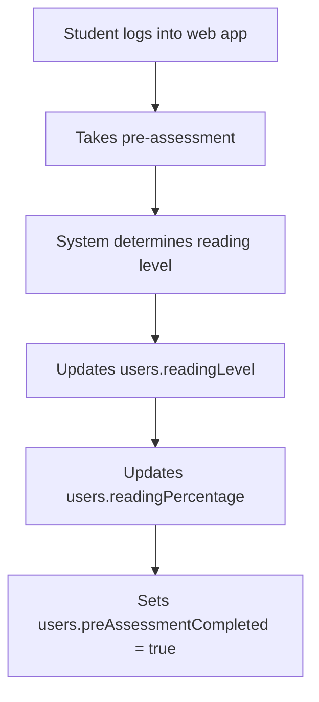

# Prescriptive Analytics Data Flow Documentation
**Complete K-12 Reading Assessment System: From Assessment to Intervention**

*Written for clear understanding - comprehensive coverage of the entire prescriptive analytics system*

---

## Table of Contents
1. [System Overview](#system-overview)
2. [Reading Level Progression System](#reading-level-progression-system)
3. [Complete Database Schema](#complete-database-schema)
4. [Step-by-Step Data Flow Process](#step-by-step-data-flow-process)
5. [Mathematical Models Explained](#mathematical-models-explained)
6. [Intervention System Architecture](#intervention-system-architecture)
7. [Real Student Journey Examples](#real-student-journey-examples)
8. [Integration Points & Automation](#integration-points--automation)
9. [Error Pattern Analysis](#error-pattern-analysis)
10. [Teacher Re-editing System](#teacher-re-editing-system)

---

## System Overview

### What is Prescriptive Analytics?
Think of prescriptive analytics like a smart tutor that:
1. **Watches** how you answer reading questions
2. **Analyzes** your mistakes and strengths using advanced math
3. **Prescribes** exactly what you need to study next
4. **Tracks** your improvement over time
5. **Decides** when you need human teacher help

### The Big Picture Flow
```
Student Takes Assessment 
    ↓
System Analyzes Performance (Math Magic Happens Here!)
    ↓
System Creates Personalized Study Plan
    ↓
Student Gets Targeted Practice Questions
    ↓
Still Struggling? → Teacher Re-edits Intervention Questions
Success? → Move to Next Level!
```

### Key Innovation: One-Time Digital Rule
- Each student gets exactly **ONE** chance at digital intervention per category
- If they fail the intervention → **Teacher can re-edit intervention questions**
- This prevents endless digital loops while allowing teacher customization when needed

---

## Reading Level Progression System

### The 5 Reading Levels (Assessment Complexity Levels)

**🌱 Level 1: Low Emerging** - "Learning the Alphabet"
- **Assessment Contains**: Alphabet Knowledge only (**1 category total**)
- **Focus**: Can you recognize letters A, B, C...?
- **Progression Rule**: When the 1 category passes (≥75%), system automatically updates user to High Emerging

**🌿 Level 2: High Emerging** - "Letters + Sounds"
- **Assessment Contains**: Alphabet Knowledge + Phonological Awareness (**2 categories total**)
- **Focus**: Letters + Can you hear the difference between "B" and "P"?
- **Progression Rule**: When **both** categories pass (≥75%), system updates user to Developing

**🌳 Level 3: Developing** - "Building Words"
- **Assessment Contains**: Alphabet + Phonological + Decoding (**3 categories total**)
- **Focus**: Previous + Can you sound out "C-A-T" = "cat"?
- **Progression Rule**: When **all 3** categories pass (≥75%), system updates to Transitioning

**🌲 Level 4: Transitioning** - "Recognizing Words"
- **Assessment Contains**: Alphabet + Phonological + Decoding + Word Recognition (**4 categories total**)
- **Focus**: Previous + Can you recognize "cat" without sounding it out?
- **Progression Rule**: When **all 4** categories pass (≥75%), system updates to At Grade Level

**🏔️ Level 5: At Grade Level** - "Understanding Stories"
- **Assessment Contains**: All 5 categories including Reading Comprehension (**5 categories total**)
- **Focus**: Previous + Can you understand what you read?
- **Progression Rule**: Maximum level reached - student has mastered all reading fundamentals

### How Reading Level Assessment Works

**Sequential Category Assessment System:**
1. **Reading Level Determines Available Categories**: Student's current reading level determines which categories they can potentially access
2. **Sequential Category Completion**: Student takes categories ONE AT A TIME in prerequisite order
3. **Prerequisite Blocking**: Failed categories BLOCK access to dependent categories until passed (via intervention)
4. **Progression Evaluation**: System checks if ALL categories for current level have `passed: true` (score ≥ 75%)
5. **Automatic Level Update**: If ALL categories pass, system automatically:
   - Updates `users.readingLevel` to next level (Low Emerging → High Emerging → Developing → Transitioning → At Grade Level)
   - **Preserves** `users.readingPercentage` (only updated during pre-assessment, not progression)
   - Creates new `category_results` record containing ALL categories for the new level
6. **Mobile Integration**: Mobile app checks category access and shows only available/accessible categories

**❗ Important: readingPercentage vs readingLevel**
- `users.readingPercentage`: Set during **pre-assessment only** (reflects initial assessment score)
- `users.readingLevel`: Updated during **reading level progression** (determines assessment complexity)
- During progression: `readingLevel` changes, `readingPercentage` stays the same
- Example: Student with 72% pre-assessment score keeps that percentage even when progressing through levels

**Key Understanding:**
- Reading level = Assessment complexity (how many categories available)
- **IS** a sequential completion system where categories have prerequisites
- Categories within a level must be completed in prerequisite order
- Failed categories BLOCK access to dependent categories
- Intervention must be completed and passed before accessing next category
- Reading level progression happens only when ALL categories for that level pass

**Example Flow:**
```javascript
// Student is "High Emerging" level
const availableCategories = getCategoriesForReadingLevel("High Emerging");
// Returns: ["Alphabet Knowledge", "Phonological Awareness"]

// SEQUENTIAL FLOW: Student takes categories ONE AT A TIME in prerequisite order
// Step 1: Check access to "Alphabet Knowledge" (foundational - always accessible)
const alphabetAccess = await checkCategoryAccess(studentId, "Alphabet Knowledge");
// → { allowed: true, reason: "Foundational category - no prerequisites required" }

// Student takes Alphabet Knowledge assessment first
const alphabetResult = { "Alphabet Knowledge": { score: 85, passed: true } };

// Step 2: Only AFTER passing Alphabet Knowledge, check Phonological Awareness access
const phonologicalAccess = await checkCategoryAccess(studentId, "Phonological Awareness");
// → { allowed: true, reason: "All prerequisites met", prerequisites: ["Alphabet Knowledge"] }

// Student can now take Phonological Awareness assessment
const phonologicalResult = { "Phonological Awareness": { score: 78, passed: true } };

// Step 3: Since ALL categories for High Emerging passed ≥ 75%:
processReadingLevelProgression(studentId, "High Emerging");
// → Updates user.readingLevel to "Developing" (readingPercentage unchanged)
// → Next level has 3 categories that must be taken in prerequisite order:
//   1. Alphabet Knowledge (foundational)
//   2. Phonological Awareness (requires Alphabet)
//   3. Decoding (requires Alphabet + Phonological)
```

**Wrong Understanding (Old System - Don't Do This):**
```javascript
// WRONG: Taking all categories simultaneously regardless of prerequisites
// WRONG: Allowing access to advanced skills before foundational skills pass
// WRONG: No prerequisite validation

// The OLD system incorrectly worked like this:
const allCategories = ["Alphabet Knowledge", "Phonological Awareness", "Decoding"];
// Student could access ALL categories at once ❌ WRONG
const assessmentResult = {
  "Alphabet Knowledge": { score: 45, passed: false },    // FAILED
  "Phonological Awareness": { score: 78, passed: true }, // But still allowed to take ❌
  "Decoding": { score: 82, passed: true }               // Advanced skill without foundation ❌
};

// This violated educational principles - you can't decode without knowing letters!
```

**Correct Understanding (Current System):**
```javascript
// ✅ CORRECT: Sequential prerequisite-based access
// Step 1: Check if student can access "Phonological Awareness"
const accessCheck = await checkCategoryAccess(studentId, "Phonological Awareness");
// → { allowed: false, reason: "Prerequisites not met",
//     blockingFactors: ["Alphabet Knowledge"],
//     nextRequired: "Alphabet Knowledge" }

// ✅ Student must complete prerequisite first
// ✅ Educational scaffolding enforced
// ✅ No advanced skills without foundation


**Sample Flow:**
  // Student 202210222 is "High Emerging" level
  // Available categories: ["Alphabet Knowledge", 
  "Phonological Awareness"]

  // Step 1: Student takes Alphabet Knowledge 
  (foundational - always accessible)
  const alphabetAssessment = {
    studentId: 202210222,
    category: "Alphabet Knowledge",
    score: 45,                    // ❌ FAILED (< 
  75%)
    passed: false,
    isCompleted: true
  };

  // This creates a category_results entry:
  const categoryResult = {
    studentId: 202210222,
    readingLevel: "High Emerging",
    categories: [{
      categoryName: "Alphabet Knowledge",
      score: 45,
      isPassed: false,           // ❌ FAILED
      isCompleted: true,
      interventionRequired: true  // ✅ Needs 
  intervention
    }]
  };

  What Happens When They Try to Access Next 
  Category:

  // Step 2: Student (or teacher) tries to access 
  "Phonological Awareness"
  const accessCheck = await
  checkCategoryAccess(202210222, "Phonological 
  Awareness");

  // The system checks prerequisites:
  // SKILL_PREREQUISITES = {
  //   'Phonological Awareness': ['Alphabet 
  Knowledge']  // Requires this to pass first
  // }

  // Result:
  {
    allowed: false,                           // 
  ❌ BLOCKED!
    reason: "Prerequisites not met",
    blockingFactors: ["Alphabet Knowledge"],  // 
  This category is blocking
    prerequisites: [
      {
        category: "Alphabet Knowledge",
        completed: true,                      // 
  ✅ Student took it
        passed: false,                        // 
  ❌ But failed
        score: 45,                           // 
  Actual score
        status: "failed"                     // 
  Current status
      }
    ],
    nextRequired: "Alphabet Knowledge",       // 
  Must fix this first
    message: "Must complete and pass: Alphabet 
  Knowledge"
  }

  Web Dashboard Shows Blocking Status:

  // Teacher checks student progress
  const flowSummary = await
  getAssessmentFlowSummary(202210222);

  Response: {
    studentId: 202210222,
    readingLevel: "High Emerging",
    totalCategories: 2,
    categoryProgress: [
      {
        sequence: 1,
        category: "Alphabet Knowledge",
        accessible: true,                    // ✅
   Was accessible
        completed: true,                     // ✅
   Student took it  
        passed: false,                       // ❌
   But failed
        score: 45,
        status: "failed",                    // 
  Current status
        blockingReason: null,                // 
  This one isn't blocked
        prerequisites: []                    // 
  Foundational category
      },
      {
        sequence: 2,
        category: "Phonological Awareness",
        accessible: false,                   // ❌
   BLOCKED!
        completed: false,                    // 
  Cannot take yet
        passed: false,
        score: 0,
        status: "blocked",                   // ✅
   Shows as blocked
        blockingReason: "Prerequisites not met",
  // Why it's blocked
        prerequisites: ["Alphabet Knowledge"]
  // What's blocking it
      }
    ],
    nextAvailable: {
      hasNext: false,                        // ❌
   No next category available
      blockedCategory: "Phonological Awareness",
  // What's blocked
      reason: "Prerequisites not met",        // 
  Why blocked
      nextRequired: "Alphabet Knowledge",     // 
  What needs to be fixed
      blockingFactors: ["Alphabet Knowledge"]
    },
    recommendedAction: "intervention_required" // 
  ✅ System knows what to do
  }

  The Intervention Process:

  // Step 3: System requires intervention for 
  failed category
  const interventionCheck = await
  validateInterventionEligibility(202210222,
  "Alphabet Knowledge");

  Response: {
    eligible: true,                          // ✅
   Can create intervention
    reason: "Intervention allowed",
    categoryScore: 45,
    details: "Student scored 45% (below 75% 
  threshold) and has not attempted intervention 
  yet"
  }

  // Step 4: Teacher creates intervention for 
  Alphabet Knowledge
  const intervention = await
  generateIntervention(analysisId, "Alphabet 
  Knowledge");

  // Step 5: Student takes intervention and passes
  const interventionResult = {
    studentId: 202210222,
    category: "Alphabet Knowledge",
    score: 78,                              // ✅ 
  NOW PASSED!
    passed: true,
    assessmentType: "intervention"
  };

  // Step 6: Category result gets updated
  const updatedCategoryResult = {
    studentId: 202210222,
    categories: [{
      categoryName: "Alphabet Knowledge",
      score: 78,                            // ✅ 
  Updated score
      isPassed: true,                       // ✅ 
  Now passed
      isCompleted: true,
      interventionRequired: false,
      interventionCompleted: true           // ✅ 
  Intervention done
    }]
  };

  After Intervention Success - Unblocking:

  // Step 7: Now check access to next category 
  again
  const accessCheckAfterIntervention = await
  checkCategoryAccess(202210222, "Phonological 
  Awareness");

  Response: {
    allowed: true,                          // ✅ 
  NOW ALLOWED!
    reason: "All prerequisites met",
    prerequisites: [
      {
        category: "Alphabet Knowledge",
        completed: true,                    // ✅ 
  Completed
        passed: true,                       // ✅ 
  NOW PASSED
        score: 78,                         // ✅ 
  Intervention score
        status: "passed"                   // ✅ 
  Status updated
      }
    ],
    nextCategory: "Phonological Awareness"  // ✅ 
  Can now access
  }

  // Step 8: Student can now take Phonological 
  Awareness assessment
  const nextCategoryAccess = await
  getNextCategoryForAssessment(202210222);
  Response: {
    hasNext: true,                         // ✅ 
  Unblocked!
    nextCategory: "Phonological Awareness",
    reason: "not_completed",               // 
  Ready to take
    currentScore: 0,
    requiresIntervention: false
  }

  Key Implementation Details:

  In AssessmentFlowControlService.js:

  // This is the core blocking logic
  static async getCategoryStatus(studentId, 
  category) {
    const categoryResults = await CategoryResultsS
  ervice.getCategoryResults(studentId);

    for (const result of categoryResults) {
      const categoryData =
  result.categories?.find(cat => cat.categoryName
  === category);

      if (categoryData) {
        const completed = categoryData.isCompleted
   === true;
        const passed = categoryData.isPassed ===
  true && categoryData.score >= 75;

        return {
          completed: completed,
          passed: passed,              // ✅ This 
  is what determines blocking
          score: categoryData.score,
          status: !completed ? 'in_progress' :
  (passed ? 'passed' : 'failed')
        };
      }
    }

    // Category not found = not started
    return {
      completed: false,
      passed: false,                     // ✅ 
  This blocks dependent categories
      score: 0,
      status: 'not_started'
    };
  }

  Visual Flow:

  High Emerging Student Journey:

  1. Takes Alphabet Knowledge → FAILS (45%)
     ↓
  2. Tries Phonological Awareness → ❌ BLOCKED
     ↓
  3. Must take Alphabet intervention → PASSES
  (78%)
     ↓
  4. Now can access Phonological Awareness → ✅
  UNBLOCKED
     ↓
  5. Takes Phonological Awareness → PASSES (82%)
     ↓
  6. Both categories passed → Reading Level
  Progression to "Developing"

  The system ensures educational scaffolding - no
  student can attempt advanced skills without
  mastering the foundational skills first!

```

**Category Weighting by Level:**
```javascript
CATEGORY_WEIGHTS = {
  "Low Emerging": {
    "Alphabet Knowledge": 1.0      // 100% focus on alphabet
  },
  "High Emerging": {
    "Alphabet Knowledge": 0.6,      // 60% alphabet
    "Phonological Awareness": 0.4   // 40% sounds
  },
  "Developing": {
    "Alphabet Knowledge": 0.35,     // 35% alphabet
    "Phonological Awareness": 0.30, // 30% sounds
    "Decoding": 0.35               // 35% decoding
  },
  "Transitioning": {
    "Alphabet Knowledge": 0.20,     // 20% alphabet
    "Phonological Awareness": 0.25, // 25% sounds
    "Decoding": 0.25,              // 25% decoding
    "Word Recognition": 0.30        // 30% word recognition
  },
  "At Grade Level": {
    "Alphabet Knowledge": 0.10,     // 10% alphabet
    "Phonological Awareness": 0.15, // 15% sounds
    "Decoding": 0.15,              // 15% decoding
    "Word Recognition": 0.20,       // 20% word recognition
    "Reading Comprehension": 0.40   // 40% comprehension
  }
};
```

---

## Complete Database Schema

### 1. Users Collection (`test.users`)
**Purpose**: Stores student information and current reading level (automatically updated by progression system)
```javascript
{
  "_id": ObjectId("..."),
  "idNumber": 202210222,              // Student ID number
  "firstName": "Juan",                 // Student's first name
  "lastName": "Dela Cruz",             // Student's last name
  "age": 8,                           // Student's age
  "readingLevel": "High Emerging",     // Current reading level (AUTOMATICALLY updated by progression, readingPercentage is NOT changed)
  "readingPercentage": 72,             // Overall reading score (ONLY updated during pre-assessment, preserved during progression)
  "readingPercentage": 72,             // Overall reading score (UPDATED after pre assessment)
  "preAssessmentCompleted": true,      // Has completed pre-assessment?
  "lastAssessmentDate": "2025-01-15",  // When last assessed
  "gradeLevel": "Grade 2",            // School grade level
  "section": "Rose",                   // Class section
  "createdAt": Date,
  "lastLogin": Date
}
```

### 2. Main Assessment Collection (`test.main_assessment`)
**Purpose**: Stores the questions for each reading level and category (accessed via Mongoose models)
```javascript
{
  "_id": ObjectId("..."),
  "readingLevel": "High Emerging",     // Which level this assessment is for
  "category": "Phonological Awareness", // Which category (1 per document)
  "questionType": "malapantig",        // Type of question (matching, drag_drop, etc.)
  "questions": [                    // structure schema questions in related to the structure of phonological ONLY since this is an example only 
    {
      "questionText": "Pakinggan ang audio. Itugma ito sa katumbas na letra.",
      "questionId": "PA_001",           // Unique question identifier
      "questionSet": [
        {
          "audioTexts": ["H", "T", "N"],        // What student hears
          "matchingOptions": ["Hh", "Tt", "Nn", "Ll"], // What they can select
          "correctPairs": [                      // Correct answers
            {"audio": "H", "match": "Hh"},
            {"audio": "T", "match": "Tt"}, 
            {"audio": "N", "match": "Nn"}
          ]
        }
      ]
    }
  ],
  "totalQuestions": 6,                 // Number of questions in this category
  "isActive": true,                    // Is this assessment currently used?
  "status": "active",
  "createdAt": Date,
  "updatedAt": Date
}
```

### 3. Student Responses Collection (`test.student_responses`)
**Purpose**: Records every individual answer a student gives during assessment
```javascript
{
  "_id": ObjectId("..."),
  "studentId": 202210222,              // Links to users.idNumber
  "categoryId": ObjectId("..."),       // Links to main_assessment._id
  "questionId": "PA_001",              // Specific question answered
  "category": "Phonological Awareness", // Category name for easy filtering
  
  // RESPONSE DATA
  "response": [                        // Student's actual answer
    {"audio": "H", "match": "Tt"},     // Wrong! Should be "Hh"
    {"audio": "T", "match": "Hh"},     // Wrong! Should be "Tt"
    {"audio": "N", "match": "Nn"}      // Correct!
  ],
  "isCorrect": false,                  // Overall question result
  "correctMatches": 1,                 // For Phonological: matches gotten right
  "totalMatches": 3,                   // For Phonological: total possible matches
  
  // TIMING DATA (for advanced BKT)
  "responseTime": 12.5,                // Seconds to answer (12.5 seconds)
  "answeredAt": "2025-01-15T14:30:22Z", // Exact timestamp (important for BKT)
  
  // METADATA
  "readingLevel": "High Emerging",     // Student's level when answering
  "createdAt": Date
}
```

### 4. Category Results Collection (`test.category_results`)
**Purpose**: Aggregates all responses per category and determines pass/fail, triggers automatic progression
```javascript
{
  "_id": ObjectId("..."),
  "studentId": 202210222,              // Student who took assessment
  "assessmentDate": "2025-01-15T14:25:00Z",
  "categories": [
    {
      "categoryName": "Alphabet Knowledge",
      "totalQuestions": 15,             // How many questions in this category
      "correctAnswers": 14,             // How many correct
      "score": 93,                      // (14/15) * 100 = 93.33% ≈ 93%
      "isPassed": true,                 // 93% >= 75% threshold
      "passingThreshold": 75,           // Pass/fail cutoff
      "isCompleted": true,              // Student finished all questions?
      "lastQuestionAnswered": "AK_015", // Last question ID
      "interventionRequired": false,    // No intervention needed (passed)
      "interventionAttempts": 0,        // How many intervention attempts (0-3)
      "interventionCompleted": false,   // Has intervention been attempted?
      "currentInterventionId": null,    // Links to active intervention
      "interventionHistory": []         // List of all intervention attempts
    },
    {
      "categoryName": "Phonological Awareness",
      "totalQuestions": 6,
      "totalPossibleMatches": 18,       // Special for Phonological (6 questions × 3 matches each)
      "correctMatches": 8,              // Matches gotten right across all questions
      "score": 44,                      // (8/18) * 100 = 44.44% ≈ 44%
      "isPassed": false,                // 44% < 75%
      "interventionRequired": true,     // Needs intervention!
      "interventionAttempts": 0,        // No attempts yet
      "interventionCompleted": false,
      "currentInterventionId": null,
      "interventionHistory": []
    }
  ],
  "readingLevel": "High Emerging",
  "overallScore": 74,                   // Weighted average: (93×0.6) + (44×0.4) = 74%
  "prescriptiveAnalysisId": null,       // Will link to analysis when generated
  "readingLevelProgression": {
    "eligible": false,                   // Not eligible - Phonological Awareness failed
    "checkedAt": Date,                   // When progression was last checked
    "nextLevel": "Developing"            // What the next level would be
  },
  "createdAt": Date,
  "updatedAt": Date
}
```

### 5. Prescriptive Analysis Collection (`test.prescriptive_analysis`)
**Purpose**: The brain of the system - mathematical analysis and intervention planning
```javascript
{
  "_id": ObjectId("..."),
  "studentId": 202210222,              // Student being analyzed
  "categoryResultId": ObjectId("..."), // Links back to category_results
  "assessmentDate": "2025-01-15T14:30:00Z",
  "assessmentType": "main",            // "main" or "intervention"
  "readingLevel": "High Emerging",
  
  // BAYESIAN KNOWLEDGE TRACING (BKT) - The Math Magic!
  "skillMastery": {
    "Alphabet Knowledge": {
      "masteryProbability": 0.92,      // 92% chance student has mastered this skill
      "lastUpdated": Date,
      "totalQuestions": 15,
      "correctAnswers": 14,
      "score": 93,                     // Percentage score
      "isPassed": true,                // >= 75%
      "responseHistory": [             // Last 10 responses with BKT evolution
        {
          "questionId": "AK_001",
          "correct": true,
          "timestamp": "2025-01-15T14:25:30Z",
          "masteryAfter": 0.65         // BKT probability after this question
        },
        {
          "questionId": "AK_002", 
          "correct": true,
          "timestamp": "2025-01-15T14:25:45Z",
          "masteryAfter": 0.73         // Increased after correct answer
        },
        {
          "questionId": "AK_003",
          "correct": false,
          "timestamp": "2025-01-15T14:26:02Z", 
          "masteryAfter": 0.58         // Decreased after wrong answer
        }
        // ... continues through all 15 questions to final 0.92
      ]
    },
    "Phonological Awareness": {
      "masteryProbability": 0.31,      // Only 31% mastery - very low!
      "totalQuestions": 6,
      "totalPossibleMatches": 18,       // 6 questions × 3 matches each
      "correctMatches": 8,              // Got 8 matches right total
      "score": 44,                      // (8/18) * 100 = 44%
      "isPassed": false,                // 44% < 75%
      "responseHistory": [
        {
          "questionId": "PA_001",
          "correct": false,
          "correctMatches": 1,          // Only got 1 of 3 matches right
          "totalMatches": 3,
          "masteryAfter": 0.42         // BKT probability after this question
        }
        // ... continues through all 6 questions
      ]
    }
  },
  
  // ITEM RESPONSE THEORY (IRT) - Student Ability Estimates
  "abilityEstimates": {
    "Alphabet Knowledge": 1.2,         // Above average (+1.2 on -3 to +3 scale)
    "Phonological Awareness": -1.1     // Below average (-1.1 on -3 to +3 scale)
  },
  
  // ERROR PATTERN ANALYSIS - What Specific Mistakes?
  "errorPatterns": {
    "Phonological Awareness": {
      "matching_errors": {
        "count": 5,                     // 5 questions had errors
        "total": 6,                     // 6 total questions
        "percentage": 83,               // 83% error rate
        "avg_partial_success": 0.44,    // Average 44% matches correct per question
        "error_type": "sound_discrimination", // Type of error identified
        "questionIds": ["PA_001", "PA_002", "PA_003", "PA_004", "PA_006"] // Which questions
      }
    }
    // Alphabet Knowledge has no errors (passed), so not included
  },
  
  // INTERVENTION PLAN - What Should Student Study?
  "interventionPlan": {
    "required": true,                   // Intervention needed (any category < 75%)
    "priority": ["Phonological Awareness"], // Only one failed category
    "specificFocus": {
      "Phonological Awareness": {
        "focus": "sound_matching",      // Main area to work on
        "targetSounds": ["B-P", "M-N", "D-T"], // Common confusion pairs
        "recommendedActivities": [      // What activities to do
          "sound_discrimination", 
          "minimal_pairs",
          "rhyming_practice"
        ],
        "questionDistribution": {       // What types of questions in intervention
          "matching": 100               // 100% matching questions
        }
      }
    }
  },
  
  // INSIGHTS - Human-Readable Summary
  "insights": {
    "strengths": ["Alphabet Knowledge"], // What student is good at
    "weaknesses": ["Phonological Awareness - 44%"], // What needs work
    "overallReadiness": "Needs targeted intervention",
    "recommendedAction": "immediate_intervention", // What to do next
    "passedCategories": 1,             // 1 category passed
    "failedCategories": 1,             // 1 category failed
    "overallScore": 74                 // Just below passing (75%)
  },
  
  // INTERVENTION TRACKING
  "interventionHistory": [],           // No interventions attempted yet
  "createdAt": Date,
  "updatedAt": Date
}
```

### 6. Intervention Assessment Collection (`test.intervention_assessment`)
**Purpose**: Generates targeted practice questions based on prescriptive analysis
```javascript
{
  "_id": ObjectId("..."),
  "studentId": 202210222,              // Student who needs intervention
  "prescriptiveAnalysisId": ObjectId("..."), // Links to the analysis
  "category": "Phonological Awareness", // Which category needs help
  "readingLevel": "High Emerging",
  "passThreshold": 75,                 // Must score 75% to pass intervention
  
  // QUESTION SELECTION STRATEGY
  "questionSelectionStrategy": {
    "method": "error_focused",         // Based on error patterns
    "targetDifficulty": 0.7,          // 70% success probability target
    "focusAreas": {
      "sound_matching": 70,            // 70% of questions focus on sound matching
      "general_practice": 30           // 30% general reinforcement
    }
  },
  "totalQuestions": 12,                // Dynamically calculated based on analytics (5-18 range)
  
  // GENERATED QUESTIONS - Tailored to Student's Specific Errors
  "questions": [
    {
      "questionId": "int_pa_001",       // Intervention question ID
      "source": "generated",           // "generated", "template", or "main_assessment"
      "questionType": "malapantig",    // Matching type (matches category requirement)
      "questionText": "Pakinggan ang letra sa audio. Itugma ito sa katumbas na letra.",
      "questionSet": {
        "audioTexts": ["B", "P", "M"],  // Focuses on B-P confusion (from error analysis)
        "matchingOptions": ["Bb", "Pp", "Mm", "Nn"], // Extra option for difficulty
        "correctPairs": [
          {"audio": "B", "match": "Bb"},
          {"audio": "P", "match": "Pp"},
          {"audio": "M", "match": "Mm"}
        ]
      },
      "difficulty": -0.2,              // Slightly easier than average
      "discrimination": 1.1,           // How well this question separates abilities
      "targetSkill": "sound_discrimination",
      "targetElement": "B-P confusion" // Specific confusion being addressed
    }
    // ... 9 more questions targeting the same error patterns
  ],
  
  // INTERVENTION PARAMETERS
  "interventionParameters": {
    "fixedQuestions": 12,              // Dynamically calculated, no adaptation during intervention
    "allowSkip": false,                // Must answer all questions
    "showProgress": true,              // Show "Question 5 of 12" (dynamic)
    "immediateFeeback": false          // Only show results at end
  },

  // QUESTION COUNT CALCULATION DETAILS
  "questionCountCalculation": {
    "finalCount": 12,
    "rationale": "Started with base count of 10 for reading level, increased by 3 due to high error severity (67% error rate), decreased by 1 based on mastery score of 44% = 12 total questions",
    "factors": {
      "base": 10,                      // Base for High Emerging level
      "errorSeverity": {
        "level": "high",
        "adjustment": 3,               // +3 for high error rate
        "percentage": 67
      },
      "masteryLevel": {
        "score": 44,
        "adjustment": -1               // -1 for very low mastery
      },
      "categoryComplexity": {
        "multiplier": 1.1,             // Phonological Awareness is complex
        "adjustment": 1
      },
      "interventionHistory": {
        "attemptCount": 1,
        "adjustment": 0                // No previous attempts
      }
    },
    "calculatedAt": "2025-01-16T09:30:00Z"
  },
  
  "status": "active",                  // "draft", "active", "completed"
  "createdBy": ObjectId("..."),        // Teacher/system who created it
  "createdAt": Date,
  "updatedAt": Date,
  
  // COMPLETION TRACKING
  "startedAt": null,                   // When student started
  "completedAt": null,                 // When student finished
  "interventionResultsId": null        // Links to results when completed
}
```

### 7. Intervention Responses Collection (`test.intervention_responses`)
**Purpose**: Records student answers during intervention (same structure as student_responses)
```javascript
{
  "_id": ObjectId("..."),
  "studentId": 202210222,
  "interventionAssessmentId": ObjectId("..."), // Links to intervention_assessment
  "questionId": "int_pa_001",          // Intervention question answered
  "category": "Phonological Awareness",
  "response": [                        // Student's answer
    {"audio": "B", "match": "Bb"},     // Correct!
    {"audio": "P", "match": "Pp"},     // Correct!
    {"audio": "M", "match": "Nn"}      // Wrong! Should be "Mm"
  ],
  "isCorrect": false,                  // 2/3 correct = false overall
  "correctMatches": 2,                 // Got 2 matches right
  "totalMatches": 3,                   // 3 total matches possible
  "responseTime": 8.7,                 // Faster response (improvement!)
  "answeredAt": "2025-01-16T10:15:30Z",
  "readingLevel": "High Emerging",
  "createdAt": Date
}
```

### 8. Intervention Results Collection (`test.intervention_results`)
**Purpose**: Final results of intervention attempt - pass/fail determination
```javascript
{
  "_id": ObjectId("..."),
  "studentId": 202210222,
  "interventionAssessmentId": ObjectId("..."),
  "category": "Phonological Awareness",
  "assessmentDate": "2025-01-16T10:00:00Z",
  
  // INTERVENTION PERFORMANCE
  "totalQuestions": 12,                // Dynamically calculated based on student needs
  "totalPossibleMatches": 36,          // 12 questions × 3 matches each
  "correctMatches": 26,                // Got 26 matches right
  "score": 72,                         // (26/36) * 100 = 72.22% ≈ 72%
  "isPassed": false,                   // 72% < 75% - FAILED intervention
  "passThreshold": 75,
  
  // IMPROVEMENT TRACKING
  "previousScore": 44,                 // Original main assessment score
  "improvement": 29,                   // 73 - 44 = 29% improvement
  "improvementPercentage": 65.9,       // (29/44) * 100 = 65.9% relative improvement
  
  // BKT ANALYSIS FOR INTERVENTION
  "skillMastery": {
    "masteryProbability": 0.58,        // Improved from 0.31 to 0.58
    "masteryImprovement": 0.27,        // 0.58 - 0.31 = 0.27 increase
    "responseHistory": [               // BKT evolution during intervention
      {"questionId": "int_pa_001", "correct": false, "masteryAfter": 0.35},
      {"questionId": "int_pa_002", "correct": true, "masteryAfter": 0.42},
      // ... continues through all 10 intervention questions
    ]
  },
  
  // ERROR PATTERN EVOLUTION
  "errorPatterns": {
    "remaining_issues": {
      "B-P_confusion": "improved",     // Still some confusion but better
      "M-N_discrimination": "resolved", // No longer an issue
      "sequencing_difficulty": "new"   // New error pattern emerged
    }
  },
  
  // NEXT STEPS DETERMINATION
  "nextSteps": {
    "recommendedAction": "face_to_face_intervention", // Failed intervention
    "reason": "intervention_failed",   // Why face-to-face is needed
    "specificFocus": [                 // What teacher should focus on
      "B-P sound discrimination with audio support",
      "Sequential processing of multiple sound pairs"
    ],
    "estimatedTime": "15-20 minutes guided practice"
  },
  
  "completedAt": "2025-01-16T10:25:45Z",
  "createdAt": Date
}
```

### 9. Prescriptive Analysis Errors Collection (`test.prescriptive_analysis_errors`)
**Purpose**: Logs errors in the analysis system for debugging
```javascript
{
  "_id": ObjectId("..."),
  "categoryResultId": ObjectId("..."),
  "studentId": 202210222,
  "errorMessage": "BKT calculation failed: invalid response data",
  "errorStack": "Error: Invalid response...",
  "timestamp": "2025-01-15T14:35:00Z",
  "resolved": false,                   // Has this error been fixed?
  "resolution": null,                  // How it was resolved
  "createdAt": Date
}
```

---

## Step-by-Step Data Flow Process

### Phase 1: Pre-Assessment Setup


**What happens**: Student takes a quick test, system figures out their reading level (Low Emerging through At Grade Level), and saves this info.

### Phase 2: Main Assessment Categories Assignment
**Reading level determines which categories student must complete in their assessment:**

```javascript
// From CategoryResultsService.getCategoriesForReadingLevel()
const categoryAssignment = {
  "Low Emerging": ["Alphabet Knowledge"],     // 1 category - when this passes → High Emerging
  "High Emerging": ["Alphabet Knowledge", "Phonological Awareness"],     // 2 categories - when BOTH pass → Developing
  "Developing": ["Alphabet Knowledge", "Phonological Awareness", "Decoding"],     // 3 categories - when ALL THREE pass → Transitioning
  "Transitioning": ["Alphabet Knowledge", "Phonological Awareness", "Decoding", "Word Recognition"],     // 4 categories - when ALL FOUR pass → At Grade Level
  "At Grade Level": ["Alphabet Knowledge", "Phonological Awareness", "Decoding", "Word Recognition", "Reading Comprehension"]     // 5 categories - maximum level
};

// Student takes ALL categories for their level in one assessment session
// Progression only happens when ALL categories for that level pass ≥ 75%
```

### Phase 3: Question Answering Process
For each question student answers:

```javascript
// Example: Student answers PA_001 question
const questionResponse = {
  // BEFORE: Question shows audio "H", "T", "N" with options "Hh", "Tt", "Nn", "Ll"
  // STUDENT ACTION: Student matches H→Tt, T→Hh, N→Nn (gets 1 of 3 correct)
  
  // SYSTEM CREATES RECORD IN THE MOBILE NOT IN THE WEB:
  studentId: 202210222,
  questionId: "PA_001",
  response: [
    {"audio": "H", "match": "Tt"},    // Wrong
    {"audio": "T", "match": "Hh"},    // Wrong  
    {"audio": "N", "match": "Nn"}     // Correct
  ],
  isCorrect: false,                   // Overall question = wrong
  correctMatches: 1,                  // But got 1 match right
  totalMatches: 3,                    // Out of 3 possible
  responseTime: 12.5,                 // Took 12.5 seconds
  answeredAt: "2025-01-15T14:25:30Z"  // Exact timestamp
};

// This creates a student_responses record
```

### Phase 4: Category Results Aggregation
After student completes all questions in all their categories:

```javascript
// System groups responses by category and calculates scores
const categoryResults = {
  "Alphabet Knowledge": {
    totalQuestions: 15,
    correctAnswers: 14,               // 14/15 correct
    score: 93,                        // (14/15) * 100 = 93%
    isPassed: true                    // 93% >= 75%
  },
  "Phonological Awareness": {
    totalQuestions: 6,
    totalPossibleMatches: 18,         // 6 questions × 3 matches each
    correctMatches: 8,                // Only 8/18 matches correct
    score: 44,                        // (8/18) * 100 = 44%
    isPassed: false                   // 44% < 75% - NEEDS INTERVENTION
  }
};

// Calculate weighted overall score based on reading level
const weights = {"Alphabet Knowledge": 0.6, "Phonological Awareness": 0.4};
const overallScore = (93 * 0.6) + (44 * 0.4) = 74; // Just below passing
```

### Phase 5: AUTOMATIC Prescriptive Analysis Trigger
**This is where the magic happens - completely automatic!**

```javascript
// In CategoryResultsService.createCategoryResult()
const savedCategoryResult = await categoryResultDoc.save();

// AUTOMATIC TRIGGER - No human intervention needed!
const prescriptiveAnalysis = await IntegrationTriggerService.triggerPrescriptiveAnalysis(savedCategoryResult);

// System automatically:
// 1. Fetches all student_responses for this student
// 2. Runs BKT calculations on response sequences
// 3. Calculates IRT ability estimates
// 4. Analyzes error patterns
// 5. Generates intervention plan
// 6. Creates comprehensive prescriptive_analysis record
```

### Phase 6: Mathematical Analysis Process

#### Step 6a: Bayesian Knowledge Tracing (BKT)
System processes each response chronologically:

```javascript
// Start with 50% mastery probability
let masteryProbability = 0.5;

// Process responses in order by timestamp
const responses = [
  {questionId: "PA_001", correct: false, timestamp: "14:25:30"},
  {questionId: "PA_002", correct: false, timestamp: "14:25:45"},
  {questionId: "PA_003", correct: true, timestamp: "14:26:00"},
  // ... more responses
];

for (const response of responses) {
  if (response.correct) {
    // Bayesian update for correct answer
    const pCorrect = masteryProbability * (1 - P_SLIP) + (1 - masteryProbability) * P_GUESS;
    const posterior = (masteryProbability * (1 - P_SLIP)) / pCorrect;
    masteryProbability = posterior + (1 - posterior) * P_LEARN;
  } else {
    // Bayesian update for incorrect answer  
    const pIncorrect = masteryProbability * P_SLIP + (1 - masteryProbability) * (1 - P_GUESS);
    const posterior = (masteryProbability * P_SLIP) / pIncorrect;
    masteryProbability = posterior + (1 - posterior) * P_LEARN;
  }
  
  // Save evolution: masteryProbability goes from 0.5 → 0.42 → 0.38 → 0.45 → ... → 0.31
}

// Final result: masteryProbability = 0.31 (31% mastery - very low!)
```

#### Step 6b: Error Pattern Analysis
System identifies specific learning problems:

```javascript
const errorAnalysis = {
  // Count how many questions had errors
  totalQuestions: 6,
  questionsWithErrors: 5,           // 5 out of 6 had errors
  errorRate: 83,                    // 83% error rate
  
  // Analyze partial success in matching questions
  averageMatchesPerQuestion: 8/6,   // 1.33 matches correct per question on average
  partialSuccessRate: 0.44,         // 44% of matches were correct
  
  // Classify error type
  errorType: "sound_discrimination", // Main problem: can't distinguish similar sounds
  
  // Identify specific problem areas
  confusionPairs: ["B-P", "M-N", "D-T"] // Common letter pairs student confuses
};
```

### Phase 7: Intervention Generation
If any category scored < 75%, system generates targeted intervention:

```javascript
// System analyzes errors and creates custom questions
const interventionPlan = {
  category: "Phonological Awareness",
  focusArea: "B-P sound discrimination",    // Based on error analysis
  totalQuestions: 13,                       // Dynamically calculated (5-18 range)
  questionDistribution: {
    "B-P_practice": 5,                      // 38% questions practicing B vs P
    "M-N_practice": 4,                      // 31% questions practicing M vs N
    "general_reinforcement": 4              // 31% questions general practice
  },
  countRationale: "Started with base count of 10 for High Emerging level, increased by 3 due to high error severity (67% error rate), increased by 1 for category complexity (1.1x) = 13 total questions"
};

// Creates intervention_assessment with 10 custom questions
// Questions are easier than original to help student succeed
```

### Phase 8: Intervention Attempt
Student takes the 10-question intervention:

```javascript
// Student answers intervention questions
const interventionPerformance = {
  question1: {correctMatches: 3, totalMatches: 3}, // Perfect!
  question2: {correctMatches: 2, totalMatches: 3}, // Good
  question3: {correctMatches: 1, totalMatches: 3}, // Still struggling
  // ... 7 more questions
  
  // Final tally
  totalCorrectMatches: 22,
  totalPossibleMatches: 30,
  interventionScore: 73,                    // (22/30) * 100 = 73%
  passed: false                             // 73% < 75% - FAILED
};
```

### Phase 9: Teacher Re-editing Decision
Since intervention failed (73% < 75%):

```javascript
const teacherRecommendation = {
  digitalInterventionFailed: true,          // Student scored < 75%
  previousAttempts: 1,                      // This was their one chance
  nextAction: "teacher_revision_required",  // Teacher should revise questions
  revisionGuidance: {
    student: "Juan Dela Cruz (202210222)",
    category: "Phonological Awareness",
    originalScore: 44,                      // Main assessment score
    interventionScore: 73,                  // Intervention score
    improvement: 29,                        // 29% improvement but not enough
    specificProblems: ["B-P confusion", "sequential sound processing"],
    recommendedActions: [
      "Simplify B-P discrimination questions",
      "Add more visual cues to matching options",
      "Reduce number of simultaneous sound pairs",
      "Include practice with mouth position images"
    ],
    currentInterventionId: "ObjectId(...)", // Link to intervention_assessment for editing
  }
};

// System suggests: "Juan's intervention can be revised to focus on simpler B-P discrimination"
```

---

## Mathematical Models Explained

### Bayesian Knowledge Tracing (BKT) - The Learning Tracker

**What BKT Does**: Tracks how much a student knows about a skill as they answer questions. Like a smart meter that goes up when you get things right and down when you get things wrong.

**The BKT Formula** (simplified):
```
New Knowledge Level = Old Knowledge Level + Learning Adjustment
```

**The Real Formula**:
```
P(L_n+1) = P(L_n | evidence_n) + (1 - P(L_n | evidence_n)) × P(T)
```

**What This Means**:
- `P(L_n+1)` = Probability student knows skill after question n+1
- `P(L_n)` = Probability student knew skill before question n+1  
- `P(T)` = Probability student learned something from this question

**BKT Parameters** (research-proven values):
- **P(L₀) = 0.5** - Start assuming 50% knowledge
- **P(T) = 0.1** - 10% chance of learning from each question
- **P(G) = 0.3** - 30% chance of guessing correct answer
- **P(S) = 0.1** - 10% chance of making careless mistake

**Real Example - Juan's Phonological Awareness Journey**:
```javascript
// Juan starts with 50% knowledge
let knowledge = 0.5;

// Question 1: Gets it wrong
// System thinks: "Maybe he doesn't know this, or maybe careless mistake?"
// New knowledge = 42% (decreased)

// Question 2: Gets it wrong again  
// System thinks: "Probably doesn't know this"
// New knowledge = 38% (decreased more)

// Question 3: Gets it right
// System thinks: "Maybe he learned something, or maybe lucky guess?"
// New knowledge = 45% (increased a little)

// ... continues through 6 questions ...

// Final knowledge = 31% - System is confident Juan needs help
```

### Item Response Theory (IRT) - The Ability Measurer

**What IRT Does**: Measures student ability on a scale from -3 (very low) to +3 (very high). Like a thermometer for academic ability.

**The IRT Formula**:
```
P(correct) = 1 / (1 + e^(-1.702 × discrimination × (ability - difficulty)))
```

**What This Means**:
- Higher ability → Higher chance of getting question right
- Harder questions → Lower chance of getting right
- Better questions discriminate more between high/low ability

**Real Example - Juan's Ability Estimates**:
```javascript
// Juan's performance:
const performance = {
  "Alphabet Knowledge": {
    correctAnswers: 14,
    totalQuestions: 15,
    percentage: 93.3          // Very high performance
  },
  "Phonological Awareness": {
    correctMatches: 8,
    totalPossibleMatches: 18,
    percentage: 44.4          // Low performance
  }
};

// Convert to IRT ability scale (-3 to +3)
const abilityEstimates = {
  "Alphabet Knowledge": +1.2,    // Above average ability
  "Phonological Awareness": -1.1 // Below average ability
};

// This tells us: Juan knows letters well but struggles with sounds
```

### Category Weighting System

**Why Weighting Matters**: Different skills are more important at different reading levels.

**Example for High Emerging Student**:
```javascript
// Juan is "High Emerging" so weighting is:
const weights = {
  "Alphabet Knowledge": 0.6,        // 60% of overall score
  "Phonological Awareness": 0.4     // 40% of overall score
};

// Juan's scores:
const scores = {
  "Alphabet Knowledge": 93,         // Excellent
  "Phonological Awareness": 44      // Poor
};

// Weighted overall score:
const overall = (93 × 0.6) + (44 × 0.4) = 55.8 + 17.6 = 73.4 ≈ 74%

// This means: Even though Juan is great at letters, his sound problems
// bring his overall score below passing (75%)
```

---

## Intervention System Architecture

### The One-Time Digital Rule

**Core Principle**: Each student gets exactly ONE chance at digital intervention per category. If they fail, teachers can re-edit the intervention questions.

**Why This Rule Exists**:
1. **Prevents Endless Loops**: Students can't keep retrying forever
2. **Enables Teacher Customization**: Teachers can modify questions based on specific student needs
3. **Maintains Motivation**: Too many failures can discourage students
4. **Research-Based**: Studies show diminishing returns after first intervention

**Teacher Re-editing Process**:
1. **Failed Intervention Detected**: System identifies intervention failure (score < 75%)
2. **Teacher Notification**: System recommends teacher review and revision
3. **Question Modification**: Teacher can edit intervention_assessment questions
4. **Student Retry**: Student attempts revised intervention
5. **Continued Support**: Process can repeat with teacher guidance

### Implementation Architecture

```javascript
class InterventionGenerator {
  async generateIntervention(analysisId, category) {
    // Step 1: Enforce one-time rule
    const analysis = await PrescriptiveAnalysis.findById(analysisId);
    const interventionHistory = analysis.interventionHistory || [];

    const previousAttempt = interventionHistory.find(h => h.category === category);
    if (previousAttempt) {
      throw new Error(`Student already tried intervention for ${category}. Teacher revision required.`);
    }
    
    // Step 2: Generate exactly 10 targeted questions based on error analysis
    const errorPatterns = analysis.errorPatterns[category];
    const focusPlan = analysis.interventionPlan.specificFocus[category];
    
    const questions = await this.createTargetedQuestions(
      category,
      errorPatterns,
      focusPlan,
      10 // Always exactly 10 questions
    );
    
    // Step 3: Create intervention assessment
    const intervention = {
      studentId: analysis.studentId,
      category: category,
      totalQuestions: countCalculation.questionCount,  // Dynamic count (5-18)
      passThreshold: 75,        // Must score 75% to pass
      questions: questions,
      oneTimeAttempt: true,     // This is their only chance
      questionCountCalculation: countCalculation.reasoning,  // Calculation details
      createdAt: new Date()
    };
    
    return intervention;
  }
}
```

### Question Generation Strategy

**How System Creates Custom Questions**:

1. **Analyze Error Patterns**: What specific mistakes did student make?
2. **Identify Focus Areas**: Which skills need the most work?
3. **Generate Targeted Questions**: Create questions that address those specific problems
4. **Adjust Difficulty**: Make questions slightly easier to build confidence
5. **Ensure Variety**: Mix question types but focus on problem areas

**Example for Juan's Phonological Awareness Intervention**:
```javascript
const juanErrorAnalysis = {
  mainProblem: "B-P sound confusion",      // Primary issue
  secondaryProblem: "M-N discrimination",   // Secondary issue
  errorRate: 83,                           // Very high error rate
  partialSuccess: 44                       // Some partial success
};

const interventionQuestions = {
  // 4 questions focusing on B-P (main problem)
  "B-P_discrimination": [
    {audioTexts: ["B", "P", "T"], correctPairs: [{"B":"Bb"}, {"P":"Pp"}, {"T":"Tt"}]},
    {audioTexts: ["P", "B", "L"], correctPairs: [{"P":"Pp"}, {"B":"Bb"}, {"L":"Ll"}]},
    // ... 2 more B-P questions
  ],
  
  // 3 questions focusing on M-N (secondary problem)  
  "M-N_discrimination": [
    {audioTexts: ["M", "N", "H"], correctPairs: [{"M":"Mm"}, {"N":"Nn"}, {"H":"Hh"}]},
    // ... 2 more M-N questions
  ],
  
  // 3 questions for general reinforcement
  "general_practice": [
    {audioTexts: ["T", "L", "S"], correctPairs: [{"T":"Tt"}, {"L":"Ll"}, {"S":"Ss"}]},
    // ... 2 more general questions
  ]
};

// Total: 10 questions, 70% focused on Juan's specific problems
```

### 3-Source Intervention Generation System

**Revolutionary Question Selection**: The system uses three sources in priority order to generate intervention questions, ensuring maximum flexibility and effectiveness.

#### Source Priority System:

```javascript
// 1. TEMPLATES - First Priority (60% target)
const templateQuestions = await generateQuestionsFromTemplates({
  category: "Phonological Awareness",
  errorPatterns: analysis.errorPatterns,
  targetQuestions: 6 // Try to get 60% from templates
});

// 2. MAIN ASSESSMENT - Second Priority (Fill remaining)
const mainAssessmentQuestions = await generateQuestionsFromMainAssessment({
  category: "Phonological Awareness",
  readingLevel: "High Emerging",
  remainingQuestions: 10 - templateQuestions.length
});

// 3. CUSTOM GENERATION - Fallback (Ensure exactly 10 total)
const customQuestions = await generateCustomQuestions({
  category: "Phonological Awareness",
  errorPatterns: analysis.errorPatterns,
  remainingQuestions: 10 - templateQuestions.length - mainAssessmentQuestions.length
});

// Final result: Exactly 10 questions from optimal sources
const interventionQuestions = [
  ...templateQuestions,      // 6 questions from templates
  ...mainAssessmentQuestions, // 3 questions from main assessment
  ...customQuestions         // 1 custom question
];
```

#### Database Collections for Templates:

**templates_questions Collection**:
```javascript
{
  _id: ObjectId("..."),
  category: "Phonological Awareness",
  questionType: "malapantig",
  templatetext: "Pakinggan ang letra sa audio. Itugma ito sa katumbas na letra.",
  applicableChoiceTypes: ["malapantigText"], // Links to templates_choices
  matchCount: 3,
  isActive: true,
  createdAt: Date,
  createdBy: ObjectId("...")
}
```

**templates_choices Collection**:
```javascript
{
  _id: ObjectId("..."),
  category: "Phonological Awareness",
  choiceType: "malapantigText",
  choiceValue: "H",
  correctMatch: "Hh",
  choiceImage: "https://...",
  isActive: true
}
```

**sentence_templates Collection** (Reading Comprehension):
```javascript
{
  _id: ObjectId("..."),
  title: "Si Maria at ang mga Bulaklak",
  category: "Reading Comprehension",
  readingLevel: "Low Emerging",
  sentenceText: [{
    pageNumber: 1,
    text: "Si Maria ay pumunta sa parke...",
    image: "https://..."
  }],
  sentenceQuestions: [{
    questionNumber: 1,
    questionText: "Sino ang pangunahing tauhan?",
    sentenceCorrectAnswer: "Si Maria",
    sentenceOptionAnswers: ["Si Maria", "Si Juan"]
  }]
}
```

#### Question Source Selection Logic:

**Template Selection** (Priority 1):
- Filter templates by category and questionType
- Match applicableChoiceTypes with available choices
- Build questions using template structure + choices
- Focus on error patterns when available

**Main Assessment Reuse** (Priority 2):
- Query main_assessment collection by category + readingLevel
- Convert existing questions to intervention format
- Preserve original difficulty and structure
- Efficient resource utilization

**Custom Generation** (Priority 3):
- Programmatically generate questions based on category
- Use error patterns to guide question focus
- Fallback ensures system always works
- Maintains quality when templates unavailable

#### API Endpoints for Templates Management:

```javascript
// Template Questions Management
GET    /api/templates/questions              // Get all template questions
GET    /api/templates/questions/:id          // Get specific template question
POST   /api/templates/questions              // Create new template question
PUT    /api/templates/questions/:id          // Update template question
DELETE /api/templates/questions/:id          // Delete template question

// Template Choices Management
GET    /api/templates/choices                // Get all template choices
POST   /api/templates/choices/by-types       // Get choices by choiceTypes array
POST   /api/templates/choices                // Create new template choice
PUT    /api/templates/choices/:id            // Update template choice
DELETE /api/templates/choices/:id            // Delete template choice

// Sentence Templates Management
GET    /api/templates/sentences              // Get all sentence templates
GET    /api/templates/sentences/:id          // Get specific sentence template
GET    /api/templates/sentences/level/:readingLevel // Get by reading level
POST   /api/templates/sentences              // Create new sentence template
PUT    /api/templates/sentences/:id          // Update sentence template
DELETE /api/templates/sentences/:id          // Delete sentence template

// Intervention Generation (3-Source System)
POST   /api/templates/generate-intervention  // Generate using templates + main + custom
```

#### Benefits of 3-Source System:

1. **Maximum Flexibility**: Always generates 10 questions regardless of available templates
2. **Quality Content**: Prioritizes curated templates when available
3. **Resource Efficiency**: Reuses main assessment questions to avoid duplication
4. **Guaranteed Functionality**: Custom generation ensures system never fails
5. **Teacher Control**: Templates can be managed and customized by educators
6. **Error-Pattern Focused**: All sources consider student's specific error patterns
7. **Scalable**: Easy to add new templates without changing core logic

#### Example Template-Only Result:

```javascript
const interventionResult = {
  prescription: {
    targetQuestions: 14,         // Dynamically calculated
    focusAreas: ["B-P confusion", "sound matching"],
    errorSeverity: "high"
  },
  templateAvailability: {
    availableTemplates: 8,       // Found in templates collection
    shortageAmount: 6,           // Teacher needs to create 6 more
    teacherAction: "create_more_templates"
  },
  questions: [
    {
      questionId: "q_int_phonological_awareness_001",
      source: "template_question",
      sourceQuestionId: "68b8a9bba7ce2bf3dd81002b",
      questionType: "malapantig",
      questionText: "Pinagsama ang mga pantig, ano ang mabubuo?",
      // ... template-based question data
    },
    {
      questionId: "q_int_main_002",
      source: "main_assessment",
      sourceQuestionId: "68bb9e66e4c854c11d631622",
      questionType: "matching",
      questionText: "Pakinggan ang audio. Itugma ito sa katumbas na letra.",
      // ... main assessment question data
    },
    {
      questionId: "q_int_custom_pa_010",
      source: "custom",
      sourceQuestionId: null,
      questionType: "malapantig",
      questionText: "Pakinggan ang letra sa audio. Itugma ito sa katumbas na letra.",
      // ... custom generated question data
    }
  ]
};
```

This template-only system ensures that all intervention questions are teacher-curated and high-quality, while the system provides data-driven prescriptions to guide teachers.

## Dynamic Question Count System

The system now uses intelligent algorithms to determine the optimal number of intervention questions (5-18 range) based on prescriptive analytics rather than a fixed count.

### Question Count Calculation Algorithm

```javascript
// Base counts by reading level
const baseCountByLevel = {
  'Low Emerging': { min: 5, base: 8, max: 12 },
  'High Emerging': { min: 6, base: 10, max: 14 },
  'Developing': { min: 8, base: 12, max: 16 },
  'Transitioning': { min: 8, base: 12, max: 16 },
  'At Grade Level': { min: 10, base: 15, max: 18 }
};

// Factor 1: Error Severity Analysis (±40% of base)
const errorAdjustments = {
  'severe': +40%,     // 70%+ error rate → more questions needed
  'high': +25%,       // 50-69% error rate → additional practice
  'moderate': +10%,   // 30-49% error rate → slight increase
  'low': -10%,        // 15-29% error rate → fewer questions
  'minimal': -20%     // <15% error rate → significantly fewer
};

// Factor 2: Mastery Level Analysis (±25% of base)
const masteryAdjustments = {
  veryLow: +25%,      // <40% score → needs extensive practice
  low: +15%,          // 40-54% score → needs additional support
  belowAverage: +5%,  // 55-64% score → slight increase
  passing: -15%       // ≥75% score → fewer questions needed
};

// Factor 3: Category Complexity Multiplier
const categoryComplexity = {
  'Alphabet Knowledge': 0.8,      // Simpler → fewer questions
  'Phonological Awareness': 1.1,  // More complex → more questions
  'Decoding': 1.0,                // Standard complexity
  'Word Recognition': 1.0,         // Standard complexity
  'Reading Comprehension': 1.2     // Most complex → most questions
};

// Factor 4: Intervention History (fatigue prevention)
const historyAdjustment = -Math.min(3, attemptCount - 1);
```

### Example Calculations

#### High-Need Student (Severe Errors)
```javascript
// Student: Maria, High Emerging, Phonological Awareness
// Score: 35%, Error Rate: 78% (severe)
const calculation = {
  baseCount: 10,                    // High Emerging base
  errorAdjustment: +4,              // +40% for severe errors
  masteryAdjustment: +3,            // +25% for very low score
  complexityAdjustment: +1,         // ×1.1 for PA complexity
  historyAdjustment: 0,             // First attempt
  finalCount: 18,                   // Maximum allowed
  rationale: "Started with base count of 10 for reading level, increased by 4 due to severe error severity (78% error rate), increased by 3 based on mastery score of 35%, increased by 1 for category complexity (1.1x) = 18 total questions"
};
```

#### Low-Need Student (Minimal Errors)
```javascript
// Student: Jose, Low Emerging, Alphabet Knowledge
// Score: 65%, Error Rate: 12% (minimal)
const calculation = {
  baseCount: 8,                     // Low Emerging base
  errorAdjustment: -2,              // -20% for minimal errors
  masteryAdjustment: 0,             // No adjustment for near-passing
  complexityAdjustment: -1,         // ×0.8 for simpler category
  historyAdjustment: 0,             // First attempt
  finalCount: 5,                    // Minimum allowed
  rationale: "Started with base count of 8 for reading level, decreased by 2 due to minimal error severity (12% error rate), decreased by 1 for category complexity (0.8x) = 5 total questions"
};
```

#### Repeat Attempt (Fatigue Management)
```javascript
// Student: Ana, second intervention attempt
const calculation = {
  baseCount: 12,                    // Developing base
  errorAdjustment: +2,              // Moderate errors
  masteryAdjustment: +1,            // Below average score
  complexityAdjustment: 0,          // Standard complexity
  historyAdjustment: -1,            // Reduce for repeat attempt
  finalCount: 14,
  rationale: "Started with base count of 12 for reading level, increased by 2 due to moderate error severity (45% error rate), increased by 1 based on mastery score of 58%, reduced by 1 for repeat attempt (attempt #2) = 14 total questions"
};
```

### Benefits of Dynamic Question Count

1. **Personalized Learning**: Each student gets exactly the right amount of practice
2. **Efficiency**: High-performing students aren't overwhelmed with unnecessary questions
3. **Effectiveness**: Struggling students get sufficient practice opportunities
4. **Fatigue Management**: Repeat attempts use fewer questions to prevent burnout
5. **Educational Scaffolding**: Question count matches cognitive load capacity
6. **Teacher Transparency**: Clear rationale for every count decision

### Integration with Template-Only System

The dynamic count system works as a "prescription" that guides teachers:

```javascript
const interventionGeneration = {
  step1: "Calculate optimal question count using prescriptive analytics",
  step2: "Retrieve available templates for category",
  step3: "Analyze template shortage vs requirement",
  step4: "Notify teacher of prescription and available resources",
  step5: "Teacher creates additional templates if needed"
};

// Example: Student needs 14 questions
const prescriptionAnalysis = {
  prescription: {
    targetQuestions: 14,     // Analytics-driven requirement
    focusAreas: ["B-P confusion", "sound matching"],
    errorSeverity: "high"
  },
  templateAvailability: {
    availableTemplates: 8,   // Found in templates collection
    shortageAmount: 6,       // Need 6 more questions
    teacherAction: "create_more_templates"
  }
};
```

## Template-Only Intervention System

The system follows a **"Doctor-Patient-Treatment Provider"** model where prescriptive analytics acts as the doctor providing diagnosis and prescription, while teachers act as treatment providers with full control over intervention content.

### System Architecture

```javascript
// Prescriptive Analytics = "Doctor's Prescription"
const prescription = {
  diagnosis: {
    category: "Phonological Awareness",
    errorPatterns: ["B-P confusion", "sound discrimination"],
    severity: "high",
    masteryLevel: 0.31
  },
  treatment: {
    questionCount: 12,           // Based on error severity + mastery
    focusAreas: ["sound_matching", "letter_discrimination"],
    rationale: "High error severity requires extensive practice"
  }
};

// Teachers = "Treatment Providers"
const teacherWorkflow = {
  step1: "Review prescription from analytics",
  step2: "Check available template inventory",
  step3: "Use existing templates OR create new ones",
  step4: "All custom questions saved to templates for future use"
};
```

### Template Collections Structure

**For Categories:** Alphabet Knowledge, Phonological Awareness, Decoding, Word Recognition
- **templates_questions** - Question templates with applicableChoiceTypes
- **templates_choices** - Answer choices linked to question templates

**For Reading Comprehension:**
- **sentence_templates** - Complete passages with embedded questions

### Teacher Decision Flow

```javascript
const interventionGeneration = async (prescription) => {
  // 1. System provides prescription
  const analytics = {
    category: "Phonological Awareness",
    targetQuestions: 12,
    focusAreas: ["B-P confusion"],
    errorSeverity: "high"
  };

  // 2. Check template inventory
  const inventory = await checkTemplateInventory(category);
  // Result: { availableTemplates: 7, neededTemplates: 5 }

  // 3. Teacher decision point
  if (inventory.availableTemplates < analytics.targetQuestions) {
    return {
      status: "needs_teacher_input",
      message: `Found ${inventory.availableTemplates} templates, need ${inventory.neededTemplates} more`,
      teacherActions: [
        "Use available 7 templates for now",
        "Create 5 additional templates focusing on B-P confusion",
        "Save new templates to system for future reuse"
      ]
    };
  }

  return {
    status: "ready",
    questions: inventory.templateQuestions
  };
};
```

### Benefits of Template-Only Approach

1. **Teacher Expertise**: All questions created by educational professionals
2. **Quality Control**: No nonsensical programmatic generation
3. **Data-Driven Guidance**: Analytics provide clear prescription
4. **Growing Library**: Every custom question becomes reusable template
5. **Appropriate Content**: Teachers ensure cultural and linguistic appropriateness
6. **Targeted Practice**: Questions match specific error patterns identified
7. **Scalable System**: Template library grows over time with use

### Template Creation Workflow

```javascript
// When teacher creates custom questions for intervention
const customQuestionWorkflow = {
  trigger: "Student needs 12 questions, only 8 templates available",

  teacherCreates: {
    category: "Phonological Awareness",
    questionType: "malapantig",
    templateText: "Pakinggan ang letra sa audio. Itugma ito sa katumbas na letra.",
    applicableChoiceTypes: ["malapantigText"],
    focusArea: "B-P confusion"  // From prescription
  },

  systemSaves: {
    collection: "templates_questions",
    autoLink: "templates_choices",
    availability: "future_interventions"
  },

  result: "Template library grows, future B-P confusion interventions have more options"
};
```

### No Programmatic Generation - Why?

The system **deliberately avoids** programmatic question generation because:

1. **Insufficient Data**: Not enough training data for quality question generation
2. **Context Sensitivity**: Educational questions require cultural and linguistic nuance
3. **Teacher Expertise**: Educators understand student needs better than algorithms
4. **Quality Assurance**: Human-created questions are more appropriate and effective
5. **Nonsensical Risk**: Programmatic generation could create confusing or inappropriate content

### Error Handling for Template Shortages

```javascript
const handleTemplateShortage = {
  detection: "When available templates < prescribed question count",

  systemResponse: {
    status: "needs_teacher_input",
    prescription: "Student needs 14 questions for severe B-P confusion",
    availability: "8 templates available, 6 needed",
    recommendation: "Create 6 additional B-P focused questions"
  },

  teacherOptions: [
    "Proceed with 8 available questions (reduced intervention)",
    "Create 6 new templates (full intervention)",
    "Mix of both approaches"
  ],

  futureImprovement: "New templates prevent future shortages"
};
```

---

## Real Student Journey Examples

### Example 1: Juan - Success After Struggle

**Background**: Juan, 8 years old, Grade 2, reading level "High Emerging"

#### Step 1: Sequential Main Assessment
```javascript
// Juan is "High Emerging" level - must take categories in prerequisite order

// Phase 1: Alphabet Knowledge (foundational - always accessible)
const alphabetAccess = await checkCategoryAccess(juanId, "Alphabet Knowledge");
// → { allowed: true, reason: "Foundational category - no prerequisites required" }

const juanAlphabetAssessment = {
  category: "Alphabet Knowledge",
  questions: 15,
  correctAnswers: 14,
  score: 93,
  result: "PASSED" // ≥ 75% - prerequisite fulfilled
};

// Phase 2: Only AFTER passing Alphabet, check Phonological Awareness access
const phonologicalAccess = await checkCategoryAccess(juanId, "Phonological Awareness");
// → { allowed: true, reason: "All prerequisites met", prerequisites: ["Alphabet Knowledge"] }

const juanPhonologicalAssessment = {
  category: "Phonological Awareness",
  questions: 6,
  totalMatches: 18,
  correctMatches: 8,
  score: 44,
  result: "FAILED" // < 75% - BLOCKS progression to next reading level
};

// Assessment Status: 1 passed, 1 failed → No reading level progression yet
// Juan must complete intervention for Phonological Awareness before advancing
```

#### Step 2: Automatic Prescriptive Analysis
```javascript
// System automatically analyzes Juan's performance
const juanAnalysis = {
  skillMastery: {
    "Alphabet Knowledge": {masteryProbability: 0.92}, // Very confident Juan knows letters
    "Phonological Awareness": {masteryProbability: 0.31} // Low confidence - needs help
  },
  errorPatterns: {
    "Phonological Awareness": {
      error_type: "sound_discrimination",
      confusion_pairs: ["B-P", "M-N"],
      error_rate: 83
    }
  },
  interventionPlan: {
    required: true,
    priority: ["Phonological Awareness"],
    focus: "B-P sound discrimination"
  }
};
```

#### Step 3: Intervention Generation
```javascript
// System creates personalized questions for Juan
const juanIntervention = {
  category: "Phonological Awareness",
  totalQuestions: 11,      // Dynamically calculated for Juan's needs
  questionFocus: {
    "B-P_practice": 4,     // ~36% focus on main problem
    "M-N_practice": 4,     // ~36% focus on secondary problem
    "general_practice": 3  // ~27% general reinforcement
  },
  countRationale: "Started with base count of 10 for High Emerging level, increased by 2 due to high error severity (67% error rate), decreased by 1 based on mastery score of 44% = 11 total questions",
  difficulty: "slightly_easier", // To build confidence
  oneTimeAttempt: true
};
```

#### Step 4: Intervention Results
```javascript
// Juan attempts the intervention
const juanInterventionResults = {
  totalQuestions: 11,     // Dynamic count based on his needs
  totalMatches: 33,       // 11 questions × 3 matches each
  correctMatches: 25,
  score: 76,              // (25/33) * 100 = 75.76% ≈ 76%
  result: "PASSED",       // 76% ≥ 75% - SUCCESS!
  improvement: 32,        // Improved from 44% to 76% (+32%)
  
  // BKT shows learning occurred
  masteryImprovement: {
    before: 0.31,         // 31% mastery before intervention
    after: 0.58,          // 58% mastery after intervention
    increase: 0.27        // Significant improvement but not enough
  }
};
```

#### Step 5: Teacher Revision Recommendation
```javascript
// System provides teacher with revision guidance
const revisionGuidance = {
  student: "Juan Dela Cruz",
  recommendation: "TEACHER_INTERVENTION_REVISION",
  category: "Phonological Awareness",
  reason: "Student showed significant improvement (44%→73%) but fell just short of 75% threshold",
  improvementIndicators: [
    "29% score increase shows learning occurred",
    "BKT mastery improved from 31% to 58%",
    "Only 2% away from passing threshold"
  ],
  revisionSuggestions: [
    "Reduce B-P sound pairs from 3 to 2 per question",
    "Add visual mouth position cues",
    "Include audio replay functionality",
    "Simplify matching options from 4 to 3"
  ],
  expectedOutcome: "5-10% score improvement with modifications",
  analyticsData: {
    originalScore: 44,
    interventionScore: 73,
    masteryGrowth: "31% → 58%",
    gapToPass: 2,
    nextSteps: "teacher_revision_then_retry"
  }
};
```

#### Step 6: Teacher Revision and Student Retry
After teacher modifies intervention questions, Juan retakes the revised intervention. If he passes (≥75%):

```javascript
// Juan's Phonological Awareness intervention succeeds
const interventionSuccess = {
  category: "Phonological Awareness",
  score: 78, // Now passes!
  result: "PASSED"
};

// Now ALL categories for High Emerging level have passed:
const progressionCheck = {
  "Alphabet Knowledge": { score: 93, passed: true },
  "Phonological Awareness": { score: 78, passed: true } // Now passed via intervention
};

// Automatic progression triggered
const progression = await CategoryResultsService.processReadingLevelProgression(juanId, "High Emerging");
// Result: Juan progresses from "High Emerging" → "Developing"
// Next level has 3 categories that must be taken sequentially in prerequisite order:
//   1. Alphabet Knowledge (foundational - always accessible)
//   2. Phonological Awareness (requires Alphabet Knowledge to pass)
//   3. Decoding (requires BOTH Alphabet Knowledge AND Phonological Awareness to pass)

// ✅ Juan can now start "Developing" level assessments with proper sequential flow
```

#### Step 7: Sequential Access to Next Level
```javascript
// Juan now at "Developing" level - categories must be taken in prerequisite order
const developingAccess = await getNextCategoryForAssessment(juanId);
// → { hasNext: true, nextCategory: "Alphabet Knowledge",
//     reason: "not_completed", requiresIntervention: false }

// Since Juan already mastered Alphabet at High Emerging, he moves to next category
// The system will guide him through: Alphabet → Phonological → Decoding sequentially
```

### Example 2: Maria - Success Story

**Background**: Maria, 9 years old, Grade 3, reading level "Developing"

#### Her Sequential Journey:
```javascript
// Maria is "Developing" level - must take categories in prerequisite order

// Step 1: Alphabet Knowledge (foundational)
const mariaAlphabet = await checkCategoryAccess(mariaId, "Alphabet Knowledge");
// → { allowed: true } → Assessment result: { score: 87, result: "PASSED" }

// Step 2: Phonological Awareness (requires Alphabet to pass first)
const mariaPhonological = await checkCategoryAccess(mariaId, "Phonological Awareness");
// → { allowed: true, prerequisites: ["Alphabet Knowledge"] }
// → Assessment result: { score: 89, result: "PASSED" }

// Step 3: Decoding (requires BOTH previous categories to pass)
const mariaDecoding = await checkCategoryAccess(mariaId, "Decoding");
// → { allowed: true, prerequisites: ["Alphabet Knowledge", "Phonological Awareness"] }
// → Assessment result: { score: 71, result: "FAILED" } ❌

const mariaAssessmentStatus = {
  sequenceCompleted: ["Alphabet Knowledge", "Phonological Awareness"], // ✅ Passed
  blockedAt: "Decoding", // ❌ Failed - intervention required before progression
  readingLevelProgression: false // Cannot advance to Transitioning until Decoding passes
},

  prescriptiveAnalysis: {
    errorPatterns: {
      "Decoding": {
        error_type: "initial_sound_difficulty",
        problem_position: "beginning_of_words",
        error_rate: 29
      }
    },
    interventionPlan: {
      required: true,
      priority: ["Decoding"],
      specificFocus: {
        "Decoding": {
          focus: "initial_sounds",
          targetPatterns: ["CVC", "CVCV"]
        }
      }
    }
  },

  interventionResults: {
    category: "Decoding",
    score: 82,               // Success!
    result: "PASSED",
    improvement: 11          // 71% → 82%
  },

  automaticProgression: {
    triggered: true,          // All 3 categories for "Developing" level now passed
    fromLevel: "Developing",
    toLevel: "Transitioning",
    requirementMet: "All 3 categories (Alphabet + Phonological + Decoding) passed ≥ 75%",
    nextLevelCategories: ["Alphabet Knowledge", "Phonological Awareness", "Decoding", "Word Recognition"], // 4 categories total for Transitioning
    userTableUpdated: true,
    readingPercentagePreserved: 72, // Preserved from original pre-assessment, NOT changed during progression
    progressionDate: "2025-01-17T09:00:00Z"
  },

  outcome: {
    status: "AUTOMATICALLY_PROGRESSED",
    newReadingLevel: "Transitioning",
    nextAssessmentWillContain: ["Alphabet Knowledge", "Phonological Awareness", "Decoding", "Word Recognition"], // 4 categories total
    progressionTrigger: "All 3 categories for Developing level passed",
    systemAction: "CategoryResultsService.processReadingLevelProgression() executed successfully",
    nextRequirement: "Must pass all 4 categories to reach At Grade Level"
  }
};
```

---

## Integration Points & Automation

### The Automatic Trigger System

**Key Innovation**: The system automatically generates prescriptive analysis without human intervention.

```javascript
// This happens automatically when category_results is saved
class CategoryResultsService {
  async updateCategoryResult(updateData) {
    // 1. Process responses and calculate scores
    const categoryResult = await this.processResponses(updateData);

    // 2. Save category results to database
    const savedResult = await categoryResultDoc.save();

    // 3. AUTOMATIC TRIGGER - The magic happens here!
    try {
      const prescriptiveAnalysis = await IntegrationTriggerService.triggerPrescriptiveAnalysis(savedResult);

      // 4. Link analysis back to category result
      if (prescriptiveAnalysis) {
        savedResult.prescriptiveAnalysisId = prescriptiveAnalysis._id;
        await savedResult.save();
      }

      // 5. AUTOMATIC READING LEVEL PROGRESSION CHECK
      if (savedResult.passed) {
        const student = await User.findOne({ studentId: savedResult.studentId });
        if (student) {
          const progressionResult = await this.processReadingLevelProgression(
            savedResult.studentId,
            student.readingLevel
          );

          if (progressionResult.shouldProgress) {
            console.log(`[PROGRESSION] Student ${savedResult.studentId} progressed from ${student.readingLevel} to ${progressionResult.newLevel}`);
          }
        }
      }
    } catch (error) {
      // 6. Log error but don't break assessment flow
      console.error('Prescriptive analysis or progression failed:', error);
      await this.logAnalysisError(savedResult, error);
    }

    return savedResult;
  }

  // NEW: Automatic Reading Level Progression System
  static async processReadingLevelProgression(studentId, currentReadingLevel) {
    // Check if all categories for current level are passed
    const requiredCategories = this.getCategoriesForLevel(currentReadingLevel);
    const categoryResults = await CategoryResult.find({
      studentId: studentId,
      readingLevel: currentReadingLevel,
      category: { $in: requiredCategories }
    });

    const allPassed = categoryResults.length === requiredCategories.length &&
                     categoryResults.every(result => result.passed === true);

    if (allPassed) {
      const nextLevel = this.getNextReadingLevel(currentReadingLevel);
      if (nextLevel) {
        // Update user reading level (preserve readingPercentage from pre-assessment)
        await User.updateOne(
          { studentId: studentId },
          { $set: { readingLevel: nextLevel, updatedAt: new Date() } }
          // Note: readingPercentage is NOT updated - only during pre-assessment
        );

        // Create category_results for new categories in next level
        const nextCategories = this.getCategoriesForLevel(nextLevel);
        const newCategories = nextCategories.filter(cat => !requiredCategories.includes(cat));

        for (const category of newCategories) {
          await CategoryResult.create({
            studentId: studentId,
            category: category,
            readingLevel: nextLevel,
            passed: false,
            score: 0,
            isCompleted: false,
            createdAt: new Date()
          });
        }

        return {
          shouldProgress: true,
          newLevel: nextLevel,
          readingPercentagePreserved: true, // Unchanged from pre-assessment
          newCategoriesCreated: newCategories
        };
      }
    }

    return { shouldProgress: false };
  }
}
```

### Data Flow Dependencies

**The Complete Chain**:
```
main_assessment → student_responses → category_results → prescriptive_analysis → intervention_assessment → intervention_responses → intervention_results
```

**Detailed Dependency Map**:
```javascript
const dependencyChain = {
  step1: {
    collection: "main_assessment",
    purpose: "Provides questions for each reading level/category",
    triggers: "student answering questions"
  },
  
  step2: {
    collection: "student_responses", 
    purpose: "Records each individual answer with timing",
    dependsOn: "main_assessment._id (via categoryId)",
    triggers: "completion of category"
  },
  
  step3: {
    collection: "category_results",
    purpose: "Aggregates responses into pass/fail by category", 
    dependsOn: "student_responses (grouped by category)",
    triggers: "AUTOMATIC prescriptive analysis generation"
  },
  
  step4: {
    collection: "prescriptive_analysis",
    purpose: "BKT/IRT analysis + intervention planning",
    dependsOn: "category_results._id + all student_responses",
    triggers: "intervention generation (if needed)"
  },
  
  step5: {
    collection: "intervention_assessment", 
    purpose: "Custom questions based on error analysis",
    dependsOn: "prescriptive_analysis._id",
    triggers: "student taking intervention"
  },
  
  step6: {
    collection: "intervention_responses",
    purpose: "Records intervention answers",
    dependsOn: "intervention_assessment._id", 
    triggers: "intervention completion"
  },
  
  step7: {
    collection: "intervention_results",
    purpose: "Final intervention pass/fail + next steps",
    dependsOn: "intervention_responses (aggregated)",
    triggers: "face-to-face alert (if failed) or level advancement (if passed)"
  }
};
```

### Service Integration Architecture

```javascript
class IntegrationTriggerService {
  static async triggerPrescriptiveAnalysis(categoryResult) {
    console.log(`Triggering prescriptive analysis for student ${categoryResult.studentId}`);
    
    // Step 1: Validation
    if (!categoryResult || !categoryResult.studentId) {
      return null;
    }
    
    // Step 2: Check for duplicates
    const existingAnalysis = await this.checkExistingAnalysis(categoryResult._id);
    if (existingAnalysis) {
      console.log('Analysis already exists');
      return existingAnalysis;
    }
    
    // Step 3: Generate comprehensive analysis
    const analysis = await PrescriptiveAnalyticsService.generatePrescriptiveAnalysis(categoryResult._id);
    
    // Step 4: Post-processing (notifications, alerts, etc.)
    await this.postAnalysisProcessing(analysis);
    
    console.log(`Successfully generated analysis ${analysis._id}`);
    return analysis;
  }
  
  static async postAnalysisProcessing(analysis) {
    // Check if intervention is required
    if (analysis.interventionPlan?.required) {
      console.log(`Student ${analysis.studentId} requires intervention in: ${analysis.interventionPlan.priority.join(', ')}`);

      // Log intervention requirements for teacher dashboard
      console.log(`[INTERVENTION REQUIRED] Categories: ${analysis.interventionPlan.priority.join(', ')}`);
    }

    // Check if teacher revision is recommended (near-miss cases)
    if (analysis.insights?.recommendedAction === 'teacher_revision_required') {
      console.log(`Student ${analysis.studentId} may benefit from teacher-revised intervention questions`);

      // Log revision recommendations
      console.log(`[TEACHER REVISION] Student showed improvement but needs customized intervention`);
    }

    // Update dashboard statistics and tracking
    console.log(`[ANALYSIS COMPLETE] Student ${analysis.studentId} - Overall Score: ${analysis.insights.overallScore}%`);
  }
}
```

### Sequential Assessment API Endpoints

**New API endpoints for prerequisite-aware assessment flow:**

```javascript
// Check if student can access a specific category
GET /api/teachers/assessments/category-access/:studentId/:category
Response: {
  success: true,
  allowed: false,
  category: "Phonological Awareness",
  studentId: 202210222,
  reason: "Prerequisites not met",
  prerequisites: [
    { category: "Alphabet Knowledge", completed: false, passed: false, score: 0, status: "not_started" }
  ],
  nextRequired: "Alphabet Knowledge",
  blockingFactors: ["Alphabet Knowledge"],
  message: "Must complete and pass: Alphabet Knowledge"
}

// Get next available category for assessment
GET /api/teachers/assessments/next-category/:studentId
Response: {
  success: true,
  studentId: 202210222,
  hasNext: true,
  nextCategory: "Alphabet Knowledge",
  reason: "not_completed",
  currentScore: 0,
  requiresIntervention: false,
  readyForProgression: false,
  currentLevel: "High Emerging",
  nextRequired: null,
  blockingFactors: []
}

// Get complete assessment flow summary
GET /api/teachers/assessments/assessment-flow/:studentId
Response: {
  success: true,
  studentId: 202210222,
  readingLevel: "High Emerging",
  totalCategories: 2,
  overallProgress: {
    completed: 1,
    passed: 1,
    remaining: 1
  },
  categoryProgress: [
    {
      sequence: 1,
      category: "Alphabet Knowledge",
      accessible: true,
      completed: true,
      passed: true,
      score: 85,
      status: "passed",
      blockingReason: null,
      prerequisites: []
    },
    {
      sequence: 2,
      category: "Phonological Awareness",
      accessible: true,
      completed: false,
      passed: false,
      score: 0,
      status: "not_started",
      blockingReason: null,
      prerequisites: ["Alphabet Knowledge"]
    }
  ],
  nextAvailable: {
    hasNext: true,
    nextCategory: "Phonological Awareness",
    reason: "not_completed"
  },
  recommendedAction: "continue_assessment"
}

// Create category result with prerequisite validation
POST /api/teachers/assessments/category-result-validated
Body: {
  studentId: 202210222,
  category: "Phonological Awareness",
  score: 78,
  passed: true,
  responses: [...],
  assessmentType: "main"
}
Response: {
  success: true,
  message: "Category result created successfully with prerequisite validation",
  data: { /* category result data */ },
  nextAvailable: {
    hasNext: true,
    nextCategory: "Decoding", // Next in sequence if available
    readyForProgression: false // Not all categories completed yet
  },
  accessValidated: true
}
```

---

## Error Pattern Analysis

### Category-Specific Error Detection

The system identifies different types of errors for each category:

#### 1. Alphabet Knowledge Errors
```javascript
const alphabetErrorAnalysis = {
  // Vowel (patinig) errors
  patinig_errors: {
    count: 1,                    // 1 vowel error out of 5 vowel questions
    total: 5,
    percentage: 20,              // 20% vowel error rate
    specific_letters: ["O"],     // Student confused the letter "O"
    error_type: "visual_confusion", // Looks similar to other letters
    questionIds: ["AK_007"]      // Specific question with error
  },
  
  // Consonant (katinig) errors
  katinig_errors: {
    count: 0,                    // No consonant errors
    total: 10,
    percentage: 0                // 0% consonant error rate
  },
  
  // Overall pattern
  pattern_analysis: {
    primary_difficulty: "vowel_discrimination",
    secondary_difficulty: null,
    overall_performance: "strong", // 93% overall
    intervention_priority: "low"   // Only minor vowel confusion
  }
};
```

#### 2. Phonological Awareness Errors (Most Complex)
```javascript
const phonologicalErrorAnalysis = {
  matching_errors: {
    count: 5,                    // 5 questions had errors
    total: 6,                    // 6 total questions
    percentage: 83,              // 83% error rate - very high!
    avg_partial_success: 0.44,   // 44% of matches correct on average
    error_type: "sound_discrimination", // Primary error classification
    
    // Specific confusion analysis
    confusion_pairs: [
      {"sounds": ["B", "P"], "confusion_rate": 75}, // Confuses B and P 75% of time
      {"sounds": ["M", "N"], "confusion_rate": 60}, // Confuses M and N 60% of time
      {"sounds": ["D", "T"], "confusion_rate": 50}  // Confuses D and T 50% of time
    ],
    
    // Sequential processing analysis
    sequential_difficulty: {
      two_sounds: 60,            // 60% success with 2-sound sequences
      three_sounds: 30,          // 30% success with 3-sound sequences  
      four_sounds: 10            // 10% success with 4-sound sequences
    },
    
    questionIds: ["PA_001", "PA_002", "PA_003", "PA_004", "PA_006"]
  }
};
```

#### 3. Decoding Errors
```javascript
const decodingErrorAnalysis = {
  decoding_errors: {
    count: 3,                    // 3 questions had errors
    total: 10,                   // 10 total questions
    percentage: 30,              // 30% error rate
    
    // Position analysis (where in word is error?)
    position_analysis: {
      beginning: 2,              // 2 errors at start of word
      middle: 1,                 // 1 error in middle 
      end: 0                     // 0 errors at end
    },
    most_error_position: 0,      // Position 0 = beginning of words
    
    // Pattern analysis
    pattern_types: [
      {"pattern": "CVC", "error_rate": 40},     // 40% error on consonant-vowel-consonant
      {"pattern": "CVCV", "error_rate": 20}    // 20% error on consonant-vowel-consonant-vowel
    ],
    
    error_type: "initial_sound_difficulty",    // Main problem: first sounds in words
    questionIds: ["DC_003", "DC_007", "DC_009"]
  }
};
```

#### 4. Word Recognition Errors
```javascript
const wordRecognitionErrorAnalysis = {
  word_errors: {
    count: 3,                    // 3 questions had errors
    total: 10,                   // 10 total questions
    percentage: 30,              // 30% error rate
    
    // Task-specific analysis
    sentence_completion_errors: 2, // 2 errors in sentence completion tasks
    rhyming_errors: 1,            // 1 error in rhyming tasks
    
    // Error classification
    error_type: "context_clues",  // Difficulty using sentence context
    secondary_type: "word_families", // Some difficulty with rhyming patterns
    
    questionIds: ["WR_002", "WR_005", "WR_008"]
  }
};
```

#### 5. Reading Comprehension Errors
```javascript
const comprehensionErrorAnalysis = {
  comprehension_errors: {
    count: 2,                    // 2 questions had errors
    total: 5,                    // 5 total questions
    percentage: 40,              // 40% error rate
    
    // Comprehension skill breakdown
    literal_comprehension: {
      errors: 1,
      description: "difficulty finding stated facts"
    },
    inferential_comprehension: {
      errors: 1, 
      description: "difficulty making connections"
    },
    critical_analysis: {
      errors: 0,
      description: "no errors in analysis tasks"
    },
    
    error_type: "literal_comprehension", // Primary difficulty
    questionIds: ["RC_002", "RC_004"]
  }
};
```

### Advanced Error Pattern Recognition

The system uses pattern recognition to identify learning disabilities and specific cognitive issues:

```javascript
class AdvancedErrorAnalysis {
  static identifyLearningPattern(errorPatterns, performanceData) {
    const patterns = {};
    
    // Dyslexia indicators
    if (this.checkDyslexiaIndicators(errorPatterns)) {
      patterns.dyslexia_risk = {
        risk_level: "moderate_to_high",
        indicators: [
          "phonological processing difficulties",
          "sound-symbol association problems", 
          "sequential processing issues"
        ],
        recommendation: "comprehensive evaluation recommended"
      };
    }
    
    // Auditory processing issues
    if (this.checkAuditoryProcessingIssues(errorPatterns)) {
      patterns.auditory_processing = {
        risk_level: "moderate",
        indicators: [
          "difficulty discriminating similar sounds",
          "poor performance with background noise",
          "sequential sound processing problems"
        ],
        recommendation: "audiological assessment recommended"
      };
    }
    
    // Visual processing issues
    if (this.checkVisualProcessingIssues(errorPatterns)) {
      patterns.visual_processing = {
        risk_level: "low_to_moderate", 
        indicators: [
          "letter confusion (b/d, p/q)",
          "visual-spatial processing difficulties",
          "letter sequence errors"
        ],
        recommendation: "vision and visual processing evaluation"
      };
    }
    
    return patterns;
  }
  
  static checkDyslexiaIndicators(errorPatterns) {
    const indicators = [];
    
    // Check phonological awareness difficulties
    const paErrors = errorPatterns["Phonological Awareness"];
    if (paErrors && paErrors.matching_errors.percentage > 70) {
      indicators.push("severe_phonological_difficulties");
    }
    
    // Check decoding difficulties
    const decodingErrors = errorPatterns["Decoding"]; 
    if (decodingErrors && decodingErrors.decoding_errors.percentage > 50) {
      indicators.push("decoding_difficulties");
    }
    
    // Check sound-symbol correspondence
    const akErrors = errorPatterns["Alphabet Knowledge"];
    if (akErrors && (akErrors.patinig_errors || akErrors.katinig_errors)) {
      indicators.push("sound_symbol_difficulties");
    }
    
    return indicators.length >= 2; // Need at least 2 indicators
  }
}
```

---

## Teacher Re-editing System

### When Teacher Re-editing is Recommended

The system provides guidance for teachers to revise intervention questions in these scenarios:

#### Scenario 1: Intervention Improvement but Still Failing
```javascript
const interventionRevision = {
  trigger: "student_showed_improvement_but_still_below_threshold",
  example: {
    studentName: "Juan Dela Cruz",
    category: "Phonological Awareness",
    originalScore: 44,           // Main assessment score
    interventionScore: 73,       // Intervention score
    improvement: 29,             // Significant improvement (+29%)
    threshold: 75,               // Just 2% short of passing
    result: "TEACHER_REVISION_RECOMMENDED",
    revisionSuggestions: [
      "Reduce difficulty slightly",
      "Add visual cues to support audio",
      "Focus on fewer sound pairs per question"
    ]
  }
};
```

#### Scenario 2: Multiple Category Pattern Recognition
```javascript
const patternBasedRevision = {
  trigger: "similar_errors_across_categories",
  example: {
    studentName: "Ana Santos",
    pattern: "sequential_processing_difficulty",
    affectedCategories: [
      {"category": "Phonological Awareness", "score": 68, "issue": "sequence matching"},
      {"category": "Decoding", "score": 71, "issue": "letter sequencing"}
    ],
    revisionStrategy: "reduce_sequence_complexity",
    recommendedApproach: "shorter_sequences_with_visual_support"
  }
};
```

#### Scenario 3: Specific Error Pattern Focus
```javascript
const errorPatternRevision = {
  trigger: "specific_confusion_patterns_identified",
  example: {
    studentName: "Carlos Miguel",
    errorPattern: "B_P_sound_confusion",
    confusionRate: 85,           // 85% confusion rate on B-P sounds
    revisionStrategy: {
      approach: "focused_discrimination_practice",
      modifications: [
        "Use only B-P pairs in first 5 questions",
        "Add mouth position images",
        "Include audio repetition option",
        "Reduce distractor options from 4 to 3"
      ]
    },
    expectedImprovement: "15-20% score increase with focused practice"
  }
};
```

### Teacher Intervention Revision Guidance

```javascript
const teacherRevisionGuidance = {
  revisionId: "TR_001_202210222",
  revisionType: "INTERVENTION_MODIFICATION",
  priority: "MEDIUM",

  // Student Information
  student: {
    name: "Juan Dela Cruz",
    id: 202210222,
    age: 8,
    grade: "Grade 2",
    section: "Rose",
    readingLevel: "High Emerging"
  },

  // Intervention Analysis
  interventionAnalysis: {
    category: "Phonological Awareness",
    currentInterventionId: "ObjectId(...)",
    specificChallenges: [
      "B-P sound confusion (75% error rate)",
      "M-N discrimination difficulty (60% error rate)",
      "Sequential processing of 3+ sounds"
    ]
  },

  // Performance Data
  performance: {
    originalScore: 44,
    interventionScore: 73,
    improvementAmount: 29,       // +29% improvement shown
    gapToPass: 2,               // Only 2% away from 75% threshold
    masteryGrowth: 0.27         // BKT mastery improved significantly
  },

  // Specific Revision Recommendations
  revisionRecommendations: {
    questionModifications: [
      {
        questionType: "B-P discrimination",
        currentDifficulty: "3 sound pairs simultaneously",
        recommendedChange: "reduce to 2 sound pairs",
        reason: "student shows improvement but needs less cognitive load"
      },
      {
        questionType: "matching options",
        currentSetup: "4 options including distractors",
        recommendedChange: "3 options with clearer visual differences",
        reason: "reduce visual processing demands"
      }
    ],
    supportFeatures: [
      "Add replay button for audio",
      "Include mouth position images",
      "Provide immediate feedback after each match"
    ],
    estimatedImpact: "5-10% score improvement with modifications"
  },

  // Implementation Steps
  implementationSteps: [
    "1. Access intervention_assessment via teacher dashboard",
    "2. Modify questions 1-4 (B-P discrimination focus)",
    "3. Reduce sound pairs from 3 to 2 per question",
    "4. Add visual support images",
    "5. Test changes with student",
    "6. Monitor improvement"
  ],

  timestamp: "2025-01-16T10:30:00Z",
  status: "PENDING_TEACHER_ACTION"
};
```

### Teacher Revision Actions

```javascript
class TeacherRevisionSystem {
  // Teacher acknowledges revision recommendation
  static async acknowledgeRevisionGuidance(revisionId, teacherId) {
    const guidance = await RevisionGuidance.findById(revisionId);
    guidance.acknowledgedBy = teacherId;
    guidance.acknowledgedAt = new Date();
    guidance.status = "IN_PROGRESS";
    await guidance.save();
  }

  // Teacher completes intervention revision
  static async completeInterventionRevision(revisionId, revisionData) {
    const revision = {
      revisionId: revisionId,
      teacherId: revisionData.teacherId,
      revisionDate: revisionData.date,
      modificationsApplied: revisionData.modifications,
      questionsModified: revisionData.questionIds,
      supportFeaturesAdded: revisionData.supportFeatures,
      expectedImpact: revisionData.expectedImprovement,
      notes: revisionData.notes
    };

    await InterventionRevision.create(revision);

    // Update intervention_assessment with modifications
    const intervention = await InterventionAssessment.findById(revisionData.interventionId);
    intervention.questions = revisionData.modifiedQuestions;
    intervention.revisionHistory = intervention.revisionHistory || [];
    intervention.revisionHistory.push(revision);
    intervention.lastModified = new Date();
    intervention.modifiedBy = revisionData.teacherId;
    await intervention.save();

    // Update guidance status
    const guidance = await RevisionGuidance.findById(revisionId);
    guidance.status = "COMPLETED";
    guidance.completedAt = new Date();
    await guidance.save();
  }

  // Allow student to retry revised intervention
  static async enableRevisedIntervention(studentId, category) {
    // Reset intervention eligibility after teacher revision
    const analysis = await PrescriptiveAnalysis.findOne({
      studentId: studentId,
      'interventionPlan.priority': category
    }).sort({ createdAt: -1 });

    if (analysis) {
      // Create new intervention attempt entry
      analysis.interventionHistory.push({
        category: category,
        attemptType: "teacher_revised",
        date: new Date(),
        status: "available"
      });

      await analysis.save();
    }
  }
}
```

---

## Summary: Complete System Integration

### The Data Transformation Pipeline

**Visual Summary**:
```
📱 Student uses web app
    ↓
📊 Individual answers recorded (student_responses)
    ↓
📈 Scores calculated by category (category_results)
    ↓ [AUTOMATIC TRIGGER]
🧠 Mathematical analysis performed (prescriptive_analysis)
    ↓ [IF INTERVENTION NEEDED]
🎯 Custom questions generated (intervention_assessment)
    ↓
📝 Student attempts intervention (intervention_responses)
    ↓
🔍 Results evaluated (intervention_results)
    ↓ [IF PASSED]
🚀 Reading level progression check (CategoryResultsService.processReadingLevelProgression())
    ↓ [IF ALL CATEGORIES PASSED]
📈 User reading level updated + new category_results created
    ↓ [IF INTERVENTION FAILED]
👩‍🏫 Teacher revision guidance provided for intervention_assessment editing
```

### Key Mathematical Transformations

1. **Raw Responses** → **BKT Mastery Probabilities** (0.0 to 1.0 scale)
2. **Performance Data** → **IRT Ability Estimates** (-3.0 to +3.0 scale)
3. **Individual Category Scores** → **Weighted Composite Scores** (by reading level)
4. **Error Patterns** → **Targeted Intervention Plans** (category-specific)
5. **Response Timing** → **Confidence Adjustments** (advanced BKT)

### System Innovations

#### 1. **One-Time Digital Intervention Rule**
- Prevents endless digital loops
- Enables targeted teacher revision of intervention questions
- Research-based approach to intervention effectiveness with teacher customization

#### 2. **Automatic Reading Level Progression System**
- No manual intervention required for level advancement
- Instant progression when all categories pass ≥75%
- Automatic user table updates and new category_results creation
- Mobile app integration for progression eligibility checks

#### 3. **Advanced Error Pattern Recognition**
- Category-specific error analysis
- Learning disability risk identification
- Targeted intervention question generation

#### 4. **Bayesian Knowledge Tracing Integration**
- Real-time learning progression tracking
- Confidence-based skill assessment
- Research-proven mathematical foundation

#### 5. **Teacher Revision Guidance System**
- Data-driven recommendations for intervention modification
- Specific suggestions based on error patterns and near-miss performance
- Maintains student motivation while enabling teacher customization

### Real-World Impact

**For Students**:
- Personalized learning paths that adapt to their specific needs and learning patterns
- Automatic progression through reading levels without waiting for manual assessment
- Targeted interventions that focus on their specific error patterns
- Reduced frustration through teacher-customized intervention questions

**For Teachers**:
- Data-driven insights about exactly which students need help and what specific help they need
- Guidance for modifying intervention questions based on student performance patterns
- Automatic student progression tracking eliminates manual level assignment
- Clear revision recommendations when interventions fall just short of passing

**For Schools**:
- Systematic approach to reading intervention that prevents students from falling through cracks
- Automatic reading level progression system reduces administrative overhead
- Evidence-based error pattern analysis supports IEP and intervention planning
- Seamless integration between mobile assessment and web-based teacher tools

**For Education**:
- Research-based integration of educational psychology with practical classroom application
- Validated error pattern analysis across all 5 core reading skill categories
- Automatic progression system based on mastery learning principles
- Teacher empowerment through data-driven intervention customization

---

*This comprehensive documentation provides complete visibility into how raw assessment data transforms into personalized, research-based intervention recommendations using sophisticated error pattern analysis and Bayesian Knowledge Tracing principles, culminating in automatic reading level progression and intelligent teacher guidance for intervention customization when needed.*