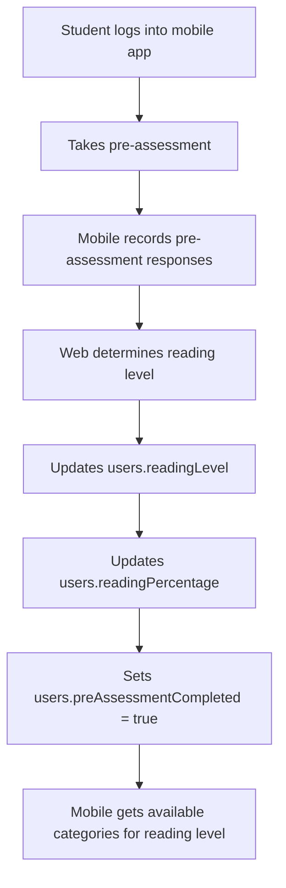

# Prescriptive Analytics Data Flow Documentation
**Complete K-12 Reading Assessment System: From Assessment to Intervention**

*Written for clear understanding - comprehensive coverage of the entire prescriptive analytics system*

---

## Table of Contents
1. [System Overview](#system-overview)
2. [Reading Level Progression System](#reading-level-progression-system)
3. [Complete Database Schema](#complete-database-schema)
4. [Step-by-Step Data Flow Process](#step-by-step-data-flow-process)
5. [Mathematical Models Explained](#mathematical-models-explained)
6. [Intervention System Architecture](#intervention-system-architecture)
7. [Real Student Journey Examples](#real-student-journey-examples)
8. [Integration Points & Automation](#integration-points--automation)
9. [Error Pattern Analysis](#error-pattern-analysis)
10. [Teacher Re-editing System](#teacher-re-editing-system)
11. [Intervention Revision and Retake System Architecture](#intervention-revision-and-retake-system-architecture)
12. [Data Normalization and Completeness Validation](#data-normalization-and-completeness-validation)

---

## System Overview

### What is Prescriptive Analytics?
The prescriptive analytics system follows a **"Doctor-Teacher-Student"** model where each role has a specific function:

**🩺 PRESCRIPTIVE ANALYTICS = "DOCTOR"**
- **Diagnoses** student reading difficulties using advanced mathematical models
- **Prescribes** specific intervention strategies based on error patterns
- **DOES NOT** create questions or implement treatments
- **Provides** data-driven recommendations to teachers

**👩‍🏫 TEACHERS = "TREATMENT PROVIDERS"**
- **Receive** detailed prescriptions from the analytics system
- **Create** ALL intervention questions using templates and expertise
- **Implement** recommended strategies and techniques
- **Re-edit** interventions when students need customization

**📚 STUDENTS = "PATIENTS"**
- **Take** teacher-created assessments and interventions
- **Benefit** from data-driven prescriptions via teacher implementation
- **Progress** through reading levels with teacher-guided support

### The Complete Sequential Assessment Flow
```
1. Student Takes Main Assessment (Mobile) → student_responses recorded
    ↓
2. Web generates category_results + prescriptive_analysis (DOCTOR DIAGNOSIS/PRESCRIPTION)
    ↓
3a. Category PASSED (≥75%) → Access next category OR reading level progression
    ↓
3b. Category FAILED (<75%) → BLOCKS next category access
    ↓
4. Teacher receives prescription → Creates intervention_assessment (TEACHER TREATMENT)
    ↓
5. Student takes intervention (Mobile) → intervention_responses recorded
    ↓
6. Web generates intervention_results + prescriptive_analysis (DOCTOR RE-ANALYSIS)
    ↓
7a. Intervention PASSED (≥75%) → Original category_results updated to "passed" → Unblocks next category
    ↓
7b. Intervention FAILED (<75%) → Teacher re-edits intervention_assessment (Version 2)
    ↓
8. Student retakes revised intervention → Mobile detects new version
    ↓
9. Repeat until intervention passes → Category completion → Reading level progression
```

### Key Innovation: Prescription-Only Analytics
- **Prescriptive analytics provides DIAGNOSIS + PRESCRIPTION only**
- **Teachers create ALL intervention content** based on system prescriptions
- **Each category requires sequential completion** with prerequisite blocking
- **Failed interventions trigger teacher revision with versioning** - mobile detects version changes
- **System prescribes strategies and intensity** - teachers implement all treatments

### Critical Mobile-Web Integration: Intervention Versioning
**Mobile Version Detection System:**
```javascript
// Mobile checks intervention version before student starts
GET /api/intervention-assessment/{interventionId}/version-info
Response: {
  interventionId: "ObjectId(...)",
  revisionNumber: 2,                    // Version 2 (teacher edited)
  lastEditedBy: "Teacher ID",
  lastEditedAt: "2025-01-16T10:30:00Z",
  hasBeenRevised: true,                 // True = teacher made changes
  questions: [...],                     // Updated questions for version 2
  prescriptionBased: true
}

// Mobile records responses with version tracking
POST /api/intervention-responses
Body: {
  studentId: 202210222,
  interventionAssessmentId: "ObjectId(...)",
  revisionNumber: 2,                    // CRITICAL: Which version student took
  responses: [...],
  completedAt: "2025-01-16T11:00:00Z"
}

// Web processes results knowing which version was used
intervention_results: {
  interventionVersion: 2,               // Links to intervention_assessment.revisionNumber
  score: 78,                           // Student passed version 2!
  passed: true                         // ≥ 75% - SUCCESS!
}

// Category completion flow
if (intervention_results.passed) {
  // Update original category_results to "passed"
  await CategoryResultsService.updateCategoryResult(categoryResultId, {
    "categories.$.isPassed": true,
    "categories.$.interventionCompleted": true,
    "categories.$.score": Math.max(original_score, intervention_score)
  });

  // This unblocks access to next category
  const nextCategory = await AssessmentFlowControlService.getNextAvailableCategory(studentId);
  // Result: Next category now accessible, or reading level progression triggered
}
```

---

## Reading Level Progression System

### The 5 Reading Levels (Assessment Complexity Levels)

**🌱 Level 1: Low Emerging** - "Learning the Alphabet"
- **Assessment Contains**: Alphabet Knowledge only (**1 category total**)
- **Focus**: Can you recognize letters A, B, C...?
- **Progression Rule**: When the 1 category passes (≥75%), system automatically updates user to High Emerging

**🌿 Level 2: High Emerging** - "Letters + Sounds"
- **Assessment Contains**: Alphabet Knowledge + Phonological Awareness (**2 categories total**)
- **Focus**: Letters + Can you hear the difference between "B" and "P"?
- **Progression Rule**: When **both** categories pass (≥75%), system updates user to Developing

**🌳 Level 3: Developing** - "Building Words"
- **Assessment Contains**: Alphabet + Phonological + Decoding (**3 categories total**)
- **Focus**: Previous + Can you sound out "C-A-T" = "cat"?
- **Progression Rule**: When **all 3** categories pass (≥75%), system updates to Transitioning

**🌲 Level 4: Transitioning** - "Recognizing Words"
- **Assessment Contains**: Alphabet + Phonological + Decoding + Word Recognition (**4 categories total**)
- **Focus**: Previous + Can you recognize "cat" without sounding it out?
- **Progression Rule**: When **all 4** categories pass (≥75%), system updates to At Grade Level

**🏔️ Level 5: At Grade Level** - "Understanding Stories"
- **Assessment Contains**: All 5 categories including Reading Comprehension (**5 categories total**)
- **Focus**: Previous + Can you understand what you read?
- **Progression Rule**: Maximum level reached - student has mastered all reading fundamentals

### How Reading Level Assessment Works

**Sequential Category Assessment System:**
1. **Reading Level Determines Available Categories**: Student's current reading level determines which categories they can potentially access
2. **Sequential Category Completion**: Student takes categories ONE AT A TIME in prerequisite order
3. **Prerequisite Blocking**: Failed categories BLOCK access to dependent categories until passed (via intervention)
4. **Progression Evaluation**: System checks if ALL categories for current level have `passed: true` (score ≥ 75%)
5. **Automatic Level Update**: If ALL categories pass, system automatically:
   - Updates `users.readingLevel` to next level (Low Emerging → High Emerging → Developing → Transitioning → At Grade Level)
   - **Preserves** `users.readingPercentage` (only updated during pre-assessment, not progression)
   - Creates new `category_results` record containing ALL categories for the new level
6. **Mobile Integration**: Mobile app checks category access and shows only available/accessible categories

**❗ Important: readingPercentage vs readingLevel**
- `users.readingPercentage`: Set during **pre-assessment only** (reflects initial assessment score)
- `users.readingLevel`: Updated during **reading level progression** (determines assessment complexity)
- During progression: `readingLevel` changes, `readingPercentage` stays the same
- Example: Student with 72% pre-assessment score keeps that percentage even when progressing through levels

**Key Understanding:**
- Reading level = Assessment complexity (how many categories available)
- **IS** a sequential completion system where categories have prerequisites
- Categories within a level must be completed in prerequisite order
- Failed categories BLOCK access to dependent categories
- Intervention must be completed and passed before accessing next category
- Reading level progression happens only when ALL categories for that level pass

**Example Flow:**
```javascript
// Student is "High Emerging" level
const availableCategories = getCategoriesForReadingLevel("High Emerging");
// Returns: ["Alphabet Knowledge", "Phonological Awareness"]

// SEQUENTIAL FLOW: Student takes categories ONE AT A TIME in prerequisite order
// Step 1: Check access to "Alphabet Knowledge" (foundational - always accessible)
const alphabetAccess = await checkCategoryAccess(studentId, "Alphabet Knowledge");
// → { allowed: true, reason: "Foundational category - no prerequisites required" }

// Student takes Alphabet Knowledge assessment first
const alphabetResult = { "Alphabet Knowledge": { score: 85, passed: true } };

// Step 2: Only AFTER passing Alphabet Knowledge, check Phonological Awareness access
const phonologicalAccess = await checkCategoryAccess(studentId, "Phonological Awareness");
// → { allowed: true, reason: "All prerequisites met", prerequisites: ["Alphabet Knowledge"] }

// Student can now take Phonological Awareness assessment
const phonologicalResult = { "Phonological Awareness": { score: 78, passed: true } };

// Step 3: Since ALL categories for High Emerging passed ≥ 75%:
processReadingLevelProgression(studentId, "High Emerging");
// → Updates user.readingLevel to "Developing" (readingPercentage unchanged)
// → Next level has 3 categories that must be taken in prerequisite order:
//   1. Alphabet Knowledge (foundational)
//   2. Phonological Awareness (requires Alphabet)
//   3. Decoding (requires Alphabet + Phonological)
```

**Wrong Understanding (Old System - Don't Do This):**
```javascript
// WRONG: Taking all categories simultaneously regardless of prerequisites
// WRONG: Allowing access to advanced skills before foundational skills pass
// WRONG: No prerequisite validation

// The OLD system incorrectly worked like this:
const allCategories = ["Alphabet Knowledge", "Phonological Awareness", "Decoding"];
// Student could access ALL categories at once ❌ WRONG
const assessmentResult = {
  "Alphabet Knowledge": { score: 45, passed: false },    // FAILED
  "Phonological Awareness": { score: 78, passed: true }, // But still allowed to take ❌
  "Decoding": { score: 82, passed: true }               // Advanced skill without foundation ❌
};

// This violated educational principles - you can't decode without knowing letters!
```

**Correct Understanding (Current System):**
```javascript
// ✅ CORRECT: Sequential prerequisite-based access
// Step 1: Check if student can access "Phonological Awareness"
const accessCheck = await checkCategoryAccess(studentId, "Phonological Awareness");
// → { allowed: false, reason: "Prerequisites not met",
//     blockingFactors: ["Alphabet Knowledge"],
//     nextRequired: "Alphabet Knowledge" }

// ✅ Student must complete prerequisite first
// ✅ Educational scaffolding enforced
// ✅ No advanced skills without foundation


**Sample Flow:**
  // Student 202210222 is "High Emerging" level
  // Available categories: ["Alphabet Knowledge", 
  "Phonological Awareness"]

  // Step 1: Student takes Alphabet Knowledge 
  (foundational - always accessible)
  const alphabetAssessment = {
    studentId: 202210222,
    category: "Alphabet Knowledge",
    score: 45,                    // ❌ FAILED (< 
  75%)
    passed: false,
    isCompleted: true
  };

  // This creates a category_results entry:
  const categoryResult = {
    studentId: 202210222,
    readingLevel: "High Emerging",
    categories: [{
      categoryName: "Alphabet Knowledge",
      score: 45,
      isPassed: false,           // ❌ FAILED
      isCompleted: true,
      interventionRequired: true  // ✅ Needs 
  intervention
    }]
  };

  What Happens When They Try to Access Next 
  Category:

  // Step 2: Student (or teacher) tries to access 
  "Phonological Awareness"
  const accessCheck = await
  checkCategoryAccess(202210222, "Phonological 
  Awareness");

  // The system checks prerequisites:
  // SKILL_PREREQUISITES = {
  //   'Phonological Awareness': ['Alphabet 
  Knowledge']  // Requires this to pass first
  // }

  // Result:
  {
    allowed: false,                           // 
  ❌ BLOCKED!
    reason: "Prerequisites not met",
    blockingFactors: ["Alphabet Knowledge"],  // 
  This category is blocking
    prerequisites: [
      {
        category: "Alphabet Knowledge",
        completed: true,                      // 
  ✅ Student took it
        passed: false,                        // 
  ❌ But failed
        score: 45,                           // 
  Actual score
        status: "failed"                     // 
  Current status
      }
    ],
    nextRequired: "Alphabet Knowledge",       // 
  Must fix this first
    message: "Must complete and pass: Alphabet 
  Knowledge"
  }

  Web Dashboard Shows Blocking Status:

  // Teacher checks student progress
  const flowSummary = await
  getAssessmentFlowSummary(202210222);

  Response: {
    studentId: 202210222,
    readingLevel: "High Emerging",
    totalCategories: 2,
    categoryProgress: [
      {
        sequence: 1,
        category: "Alphabet Knowledge",
        accessible: true,                    // ✅
   Was accessible
        completed: true,                     // ✅
   Student took it  
        passed: false,                       // ❌
   But failed
        score: 45,
        status: "failed",                    // 
  Current status
        blockingReason: null,                // 
  This one isn't blocked
        prerequisites: []                    // 
  Foundational category
      },
      {
        sequence: 2,
        category: "Phonological Awareness",
        accessible: false,                   // ❌
   BLOCKED!
        completed: false,                    // 
  Cannot take yet
        passed: false,
        score: 0,
        status: "blocked",                   // ✅
   Shows as blocked
        blockingReason: "Prerequisites not met",
  // Why it's blocked
        prerequisites: ["Alphabet Knowledge"]
  // What's blocking it
      }
    ],
    nextAvailable: {
      hasNext: false,                        // ❌
   No next category available
      blockedCategory: "Phonological Awareness",
  // What's blocked
      reason: "Prerequisites not met",        // 
  Why blocked
      nextRequired: "Alphabet Knowledge",     // 
  What needs to be fixed
      blockingFactors: ["Alphabet Knowledge"]
    },
    recommendedAction: "intervention_required" // 
  ✅ System knows what to do
  }

  The Intervention Process:

  // Step 3: System requires intervention for 
  failed category
  const interventionCheck = await
  validateInterventionEligibility(202210222,
  "Alphabet Knowledge");

  Response: {
    eligible: true,                          // ✅
   Can create intervention
    reason: "Intervention allowed",
    categoryScore: 45,
    details: "Student scored 45% (below 75% 
  threshold) and has not attempted intervention 
  yet"
  }

  // Step 4: Teacher creates intervention for 
  Alphabet Knowledge
  const intervention = await
  generateIntervention(analysisId, "Alphabet 
  Knowledge");

  // Step 5: Student takes intervention and passes
  const interventionResult = {
    studentId: 202210222,
    category: "Alphabet Knowledge",
    score: 78,                              // ✅ 
  NOW PASSED!
    passed: true,
    assessmentType: "intervention"
  };

  // Step 6: Category result gets updated
  const updatedCategoryResult = {
    studentId: 202210222,
    categories: [{
      categoryName: "Alphabet Knowledge",
      score: 78,                            // ✅ 
  Updated score
      isPassed: true,                       // ✅ 
  Now passed
      isCompleted: true,
      interventionRequired: false,
      interventionCompleted: true           // ✅ 
  Intervention done
    }]
  };

  After Intervention Success - Unblocking:

  // Step 7: Now check access to next category 
  again
  const accessCheckAfterIntervention = await
  checkCategoryAccess(202210222, "Phonological 
  Awareness");

  Response: {
    allowed: true,                          // ✅ 
  NOW ALLOWED!
    reason: "All prerequisites met",
    prerequisites: [
      {
        category: "Alphabet Knowledge",
        completed: true,                    // ✅ 
  Completed
        passed: true,                       // ✅ 
  NOW PASSED
        score: 78,                         // ✅ 
  Intervention score
        status: "passed"                   // ✅ 
  Status updated
      }
    ],
    nextCategory: "Phonological Awareness"  // ✅ 
  Can now access
  }

  // Step 8: Student can now take Phonological 
  Awareness assessment
  const nextCategoryAccess = await
  getNextCategoryForAssessment(202210222);
  Response: {
    hasNext: true,                         // ✅ 
  Unblocked!
    nextCategory: "Phonological Awareness",
    reason: "not_completed",               // 
  Ready to take
    currentScore: 0,
    requiresIntervention: false
  }

  Key Implementation Details:

  In AssessmentFlowControlService.js:

  // This is the core blocking logic
  static async getCategoryStatus(studentId, 
  category) {
    const categoryResults = await CategoryResultsS
  ervice.getCategoryResults(studentId);

    for (const result of categoryResults) {
      const categoryData =
  result.categories?.find(cat => cat.categoryName
  === category);

      if (categoryData) {
        const completed = categoryData.isCompleted
   === true;
        const passed = categoryData.isPassed ===
  true && categoryData.score >= 75;

        return {
          completed: completed,
          passed: passed,              // ✅ This 
  is what determines blocking
          score: categoryData.score,
          status: !completed ? 'in_progress' :
  (passed ? 'passed' : 'failed')
        };
      }
    }

    // Category not found = not started
    return {
      completed: false,
      passed: false,                     // ✅ 
  This blocks dependent categories
      score: 0,
      status: 'not_started'
    };
  }

  Visual Flow:

  High Emerging Student Journey:

  1. Takes Alphabet Knowledge → FAILS (45%)
     ↓
  2. Tries Phonological Awareness → ❌ BLOCKED
     ↓
  3. Must take Alphabet intervention → PASSES
  (78%)
     ↓
  4. Now can access Phonological Awareness → ✅
  UNBLOCKED
     ↓
  5. Takes Phonological Awareness → PASSES (82%)
     ↓
  6. Both categories passed → Reading Level
  Progression to "Developing"

  The system ensures educational scaffolding - no
  student can attempt advanced skills without
  mastering the foundational skills first!

```

**Category Weighting by Level:**
```javascript
CATEGORY_WEIGHTS = {
  "Low Emerging": {
    "Alphabet Knowledge": 1.0      // 100% focus on alphabet
  },
  "High Emerging": {
    "Alphabet Knowledge": 0.6,      // 60% alphabet
    "Phonological Awareness": 0.4   // 40% sounds
  },
  "Developing": {
    "Alphabet Knowledge": 0.35,     // 35% alphabet
    "Phonological Awareness": 0.30, // 30% sounds
    "Decoding": 0.35               // 35% decoding
  },
  "Transitioning": {
    "Alphabet Knowledge": 0.20,     // 20% alphabet
    "Phonological Awareness": 0.25, // 25% sounds
    "Decoding": 0.25,              // 25% decoding
    "Word Recognition": 0.30        // 30% word recognition
  },
  "At Grade Level": {
    "Alphabet Knowledge": 0.10,     // 10% alphabet
    "Phonological Awareness": 0.15, // 15% sounds
    "Decoding": 0.15,              // 15% decoding
    "Word Recognition": 0.20,       // 20% word recognition
    "Reading Comprehension": 0.40   // 40% comprehension
  }
};
```

---

## Complete Database Schema

### 1. Users Collection (`test.users`)
**Purpose**: Stores student information and current reading level (automatically updated by progression system)
```javascript
{
  "_id": ObjectId("..."),
  "idNumber": 202210222,              // Student ID number
  "firstName": "Juan",                 // Student's first name
  "lastName": "Dela Cruz",             // Student's last name
  "age": 8,                           // Student's age
  "readingLevel": "High Emerging",     // Current reading level (AUTOMATICALLY updated by progression, readingPercentage is NOT changed)
  "readingPercentage": 72,             // Overall reading score (ONLY updated during pre-assessment, preserved during progression)
  "readingPercentage": 72,             // Overall reading score (UPDATED after pre assessment)
  "preAssessmentCompleted": true,      // Has completed pre-assessment?
  "lastAssessmentDate": "2025-01-15",  // When last assessed
  "gradeLevel": "Grade 2",            // School grade level
  "section": "Rose",                   // Class section
  "createdAt": Date,
  "lastLogin": Date
}
```

### 2. User Responses Collection (`test.user_responses`)
**Purpose**: Records pre-assessment responses before reading level is determined
```javascript
// Standard Pre-Assessment Response (Other Categories)
{
  "_id": ObjectId("683e948a9b13d43b098eb6f6"),
  "studentId": 202533333,
  "assessmentId": "1",                     // Pre-assessment identifier
  "questionId": "AK_001",                  // Question identifier
  "category": "Alphabet Knowledge",
  "questionType": "patinig",
  "response": "e",                         // Single answer
  "isCorrect": true,
  "responseTime": 8.2,
  "answeredAt": "2025-08-18T12:03:15.000Z",
  "createdAt": "2025-08-18T12:03:15.000Z"
}

// Reading Comprehension Pre-Assessment Response (All-or-Nothing with assessmentId)
{
  "_id": ObjectId("683e948a9b13d43b098eb6f7"),
  "studentId": 202533333,
  "assessmentId": "1",                     // IMPORTANT: Pre-assessment identifier for Reading Comprehension
  "questionId": "RC_001",                  // One questionId with multiple sentence questions
  "category": "Reading Comprehension",
  "questionType": "sentence",
  "response": [                            // Array of answers to multiple sentence questions
    "Mansanas",                            // Answer to sentence question 1
    "Parke",                               // Answer to sentence question 2
    "Bola"                                 // Answer to sentence question 3
  ],
  "isCorrect": true,                       // ALL-OR-NOTHING: true only if ALL sentence questions correct
  "responseTime": 35.6,                    // Time to read passage and answer all questions
  "answeredAt": "2025-08-18T12:05:47.000Z",
  "createdAt": "2025-08-18T12:05:47.000Z"
}

// FAILED Reading Comprehension Pre-Assessment (Partial Success = Failure)
{
  "_id": ObjectId("683e948a9b13d43b098eb6f8"),
  "studentId": 202533334,
  "assessmentId": "1",                     // Pre-assessment identifier
  "questionId": "RC_002",
  "category": "Reading Comprehension",
  "questionType": "sentence",
  "response": [
    "Maria",                               // Correct answer to Q1
    "Eskwelahan",                          // Wrong answer to Q2 (should be "Palengke")
    "Prutas"                               // Correct answer to Q3
  ],
  "isCorrect": false,                      // ALL-OR-NOTHING: 2/3 correct = FALSE (no partial credit)
  "responseTime": 42.1,
  "answeredAt": "2025-08-18T12:07:22.000Z",
  "createdAt": "2025-08-18T12:07:22.000Z"
}
```

### 3. Main Assessment Collection (`test.main_assessment`)
**Purpose**: Stores the questions for each reading level and category (accessed via Mongoose models)
```javascript
{
  "_id": ObjectId("..."),
  "readingLevel": "High Emerging",     // Which level this assessment is for
  "category": "Phonological Awareness", // Which category (1 per document)
  "questionType": "malapantig",        // Type of question (matching, drag_drop, etc.)
  "questions": [                    // structure schema questions in related to the structure of phonological ONLY since this is an example only 
    {
      "questionText": "Pakinggan ang audio. Itugma ito sa katumbas na letra.",
      "questionId": "PA_001",           // Unique question identifier
      "questionSet": [
        {
          "audioTexts": ["H", "T", "N"],        // What student hears
          "matchingOptions": ["Hh", "Tt", "Nn", "Ll"], // What they can select
          "correctPairs": [                      // Correct answers
            {"audio": "H", "match": "Hh"},
            {"audio": "T", "match": "Tt"}, 
            {"audio": "N", "match": "Nn"}
          ]
        }
      ]
    }
  ],
  "totalQuestions": 6,                 // Number of questions in this category
  "isActive": true,                    // Is this assessment currently used?
  "status": "active",
  "createdAt": Date,
  "updatedAt": Date
}
```

### 4. Student Responses Collection (`test.student_responses`)
**Purpose**: Records every individual answer a student gives during assessment

#### Standard Example (Phonological Awareness)
```javascript
{
  "_id": ObjectId("..."),
  "studentId": 202210222,              // Links to users.idNumber
  "categoryId": ObjectId("..."),       // Links to main_assessment._id
  "questionId": "PA_001",              // Specific question answered
  "category": "Phonological Awareness", // Category name for easy filtering

  // RESPONSE DATA
  "response": [                        // Student's actual answer
    {"audio": "H", "match": "Tt"},     // Wrong! Should be "Hh"
    {"audio": "T", "match": "Hh"},     // Wrong! Should be "Tt"
    {"audio": "N", "match": "Nn"}      // Correct!
  ],
  "isCorrect": false,                  // Overall question result
  "correctMatches": 1,                 // For Phonological: matches gotten right
  "totalMatches": 3,                   // For Phonological: total possible matches

  // TIMING DATA (for advanced BKT)
  "responseTime": 12.5,                // Seconds to answer (12.5 seconds)
  "answeredAt": "2025-01-15T14:30:22Z", // Exact timestamp (important for BKT)

  // METADATA
  "readingLevel": "High Emerging",     // Student's level when answering
  "createdAt": Date
}
```

#### Reading Comprehension Example (All-or-Nothing Scoring)
```javascript
{
  "_id": ObjectId("68491110988139e71b308d10"),
  "studentId": 202522233,              // Links to users.idNumber
  "categoryId": ObjectId("683e0fc10a6d5b9eb216970c"),
  "questionId": "RC_001",              // One questionId with multiple sentence questions
  "category": "Reading Comprehension",

  // ALL-OR-NOTHING RESPONSE DATA
  "response": [
    "Juan",        // Answer to Q1: "Sino ang may aso?"
    "Parke",       // Answer to Q2: "Saan naglaro si Juan at Max?"
    "Naglalaro"    // Answer to Q3: "Ano ang ginagawa ni Juan at Max?"
  ],
  "isCorrect": true,                   // TRUE only if ALL sentence questions are correct

  // TIMING DATA
  "responseTime": 22.5,                // Total time for all sentence questions
  "answeredAt": "2025-08-20T05:12:34.300Z",

  // METADATA
  "readingLevel": "At Grade Level",
  "createdAt": "2025-08-20T05:12:34.300Z"
}

// CRITICAL RULE: Reading Comprehension All-or-Nothing Scoring
// - If student answers 2 out of 3 sentence questions correctly → RC_001 FAILS (isCorrect: false)
// - If student answers 3 out of 3 sentence questions correctly → RC_001 PASSES (isCorrect: true)
// - No partial credit - complete story comprehension required
```

### 4. Category Results Collection (`test.category_results`)
**Purpose**: Aggregates all responses per category and determines pass/fail, triggers automatic progression
```javascript
{
  "_id": ObjectId("..."),
  "studentId": 202210222,              // Student who took assessment
  "assessmentDate": "2025-01-15T14:25:00Z",
  "categories": [
    {
      "categoryName": "Alphabet Knowledge",
      "totalQuestions": 15,             // How many questions in this category
      "correctAnswers": 14,             // How many correct
      "score": 93,                      // (14/15) * 100 = 93.33% ≈ 93%
      "isPassed": true,                 // 93% >= 75% threshold
      "passingThreshold": 75,           // Pass/fail cutoff
      "isCompleted": true,              // Student finished all questions?
      "lastQuestionAnswered": "AK_015", // Last question ID
      "interventionRequired": false,    // No intervention needed (passed)
      "interventionAttempts": 0,        // How many intervention attempts (0-3)
      "interventionCompleted": false,   // Has intervention been attempted?
      "currentInterventionId": null,    // Links to active intervention
      "interventionHistory": []         // List of all intervention attempts
    },
    {
      "categoryName": "Phonological Awareness",
      "totalQuestions": 6,
      "totalPossibleMatches": 18,       // Special for Phonological (6 questions × 3 matches each)
      "correctMatches": 8,              // Matches gotten right across all questions
      "score": 44,                      // (8/18) * 100 = 44.44% ≈ 44%
      "isPassed": false,                // 44% < 75%
      "interventionRequired": true,     // Needs intervention!
      "interventionAttempts": 0,        // No attempts yet
      "interventionCompleted": false,
      "currentInterventionId": null,
      "interventionHistory": []
    },
    {
      "categoryName": "Reading Comprehension",
      "totalQuestions": 3,              // 3 RC questionIds total (RC_001, RC_002, RC_003)
      "correctAnswers": 2,              // Only 2 questionIds had ALL sentence questions correct
      "score": 67,                      // (2/3) * 100 = 66.67% ≈ 67%
      "isPassed": false,                // 67% < 75%
      "passingThreshold": 75,
      "isCompleted": true,
      "lastQuestionAnswered": "RC_003",
      "interventionRequired": true,     // Needs intervention!
      "interventionAttempts": 0,
      "interventionCompleted": false,
      "currentInterventionId": null,
      "interventionHistory": [],
      "errorQuestions": ["RC_001"],     // RC_001 failed (not all sentence questions correct)
      // Reading Comprehension specific fields
      "allOrNothingScoring": true,      // Special scoring method used
      "scoringNote": "Each question requires ALL sentence questions correct - no partial credit"
    }
  ],
  "readingLevel": "High Emerging",
  "overallScore": 74,                   // Weighted average: (93×0.6) + (44×0.4) = 74%
  "prescriptiveAnalysisId": null,       // Will link to analysis when generated
  "readingLevelProgression": {
    "eligible": false,                   // Not eligible - Phonological Awareness failed
    "checkedAt": Date,                   // When progression was last checked
    "nextLevel": "Developing"            // What the next level would be
  },
  "createdAt": Date,
  "updatedAt": Date
}
```

### 5. Prescriptive Analysis Collection (`test.prescriptive_analysis`)
**Purpose**: The brain of the system - mathematical analysis and intervention planning
```javascript
{
  "_id": ObjectId("..."),
  "studentId": 202210222,              // Student being analyzed
  "categoryResultId": ObjectId("..."), // Links back to category_results
  "assessmentDate": "2025-01-15T14:30:00Z",
  "assessmentType": "main",            // "main" or "intervention"
  "readingLevel": "High Emerging",
  
  // BAYESIAN KNOWLEDGE TRACING (BKT) - The Math Magic!
  "skillMastery": {
    "Alphabet Knowledge": {
      "masteryProbability": 0.92,      // 92% chance student has mastered this skill
      "lastUpdated": Date,
      "totalQuestions": 15,
      "correctAnswers": 14,
      "score": 93,                     // Percentage score
      "isPassed": true,                // >= 75%
      "responseHistory": [             // Last 10 responses with BKT evolution
        {
          "questionId": "AK_001",
          "correct": true,
          "timestamp": "2025-01-15T14:25:30Z",
          "masteryAfter": 0.65         // BKT probability after this question
        },
        {
          "questionId": "AK_002", 
          "correct": true,
          "timestamp": "2025-01-15T14:25:45Z",
          "masteryAfter": 0.73         // Increased after correct answer
        },
        {
          "questionId": "AK_003",
          "correct": false,
          "timestamp": "2025-01-15T14:26:02Z", 
          "masteryAfter": 0.58         // Decreased after wrong answer
        }
        // ... continues through all 15 questions to final 0.92
      ]
    },
    "Phonological Awareness": {
      "masteryProbability": 0.31,      // Only 31% mastery - very low!
      "totalQuestions": 6,
      "totalPossibleMatches": 18,       // 6 questions × 3 matches each
      "correctMatches": 8,              // Got 8 matches right total
      "score": 44,                      // (8/18) * 100 = 44%
      "isPassed": false,                // 44% < 75%
      "responseHistory": [
        {
          "questionId": "PA_001",
          "correct": false,
          "correctMatches": 1,          // Only got 1 of 3 matches right
          "totalMatches": 3,
          "masteryAfter": 0.42         // BKT probability after this question
        }
        // ... continues through all 6 questions
      ]
    }
  },
  
  // ITEM RESPONSE THEORY (IRT) - Student Ability Estimates
  "abilityEstimates": {
    "Alphabet Knowledge": 1.2,         // Above average (+1.2 on -3 to +3 scale)
    "Phonological Awareness": -1.1     // Below average (-1.1 on -3 to +3 scale)
  },
  
  // ERROR PATTERN ANALYSIS - What Specific Mistakes?
  "errorPatterns": {
    "Phonological Awareness": {
      "matching_errors": {
        "count": 5,                     // 5 questions had errors
        "total": 6,                     // 6 total questions
        "percentage": 83,               // 83% error rate
        "avg_partial_success": 0.44,    // Average 44% matches correct per question
        "error_type": "sound_discrimination", // Type of error identified
        "questionIds": ["PA_001", "PA_002", "PA_003", "PA_004", "PA_006"] // Which questions
      }
    }
    // Alphabet Knowledge has no errors (passed), so not included
  },
  
  // INTERVENTION PLAN - What Should Student Study?
  "interventionPlan": {
    "required": true,                   // Intervention needed (any category < 75%)
    "priority": ["Phonological Awareness"], // Only one failed category
    "specificFocus": {
      "Phonological Awareness": {
        "focus": "sound_matching",      // Main area to work on
        "targetSounds": ["B-P", "M-N", "D-T"], // Common confusion pairs
        "recommendedActivities": [      // What activities to do
          "sound_discrimination", 
          "minimal_pairs",
          "rhyming_practice"
        ],
        "questionDistribution": {       // What types of questions in intervention
          "matching": 100               // 100% matching questions
        }
      }
    }
  },
  
  // INSIGHTS - Human-Readable Summary
  "insights": {
    "strengths": ["Alphabet Knowledge"], // What student is good at
    "weaknesses": ["Phonological Awareness - 44%"], // What needs work
    "overallReadiness": "Needs targeted intervention",
    "recommendedAction": "immediate_intervention", // What to do next
    "passedCategories": 1,             // 1 category passed
    "failedCategories": 1,             // 1 category failed
    "overallScore": 74                 // Just below passing (75%)
  },
  
  // INTERVENTION TRACKING
  "interventionHistory": [],           // No interventions attempted yet
  "createdAt": Date,
  "updatedAt": Date
}
```

### 6. Intervention Assessment Collection (`test.intervention_assessment`)
**Purpose**: Teacher-created intervention questions based on system prescriptions with versioning support
```javascript
{
  "_id": ObjectId("65a8e1234567890123456854"),
  "studentId": 202301002,              // Juan Dela Cruz who needs intervention
  "prescriptiveAnalysisId": ObjectId("65a8d2234567890123456853"), // Links to doctor's prescription
  "category": "Phonological Awareness", // Failed category needing intervention
  "readingLevel": "High Emerging",
  "passThreshold": 75,                 // Must score 75% to pass intervention

  // DOCTOR'S PRESCRIPTION (from prescriptive analytics)
  "doctorPrescription": {
    "deficitAnalysis": {
      "specificDeficits": ["Sound discrimination difficulties", "Sequential sound processing"],
      "severity": "severe",             // 44% < 40% = severe
      "errorRate": "83%",
      "confusionPairs": [{"sounds": ["B", "P"], "confusionRate": 75}]
    },
    "interventionPrescription": {
      "primaryApproach": "multisensory_structured",
      "recommendedQuestionCount": 12,   // PRESCRIPTION: create 12 questions
      "intensityLevel": "highly_intensive",
      "sessionStructure": {
        "optimalLength": "20-30 minutes with breaks",
        "breakPattern": "Every 10 minutes"
      },
      "specificTechniques": [
        "Auditory Discrimination Training - 10-15 minutes daily",
        "Multisensory Sound-Symbol Mapping - 15-20 minutes daily"
      ]
    },
    "materialRecommendations": [
      "Minimal pair cards for sound discrimination",
      "Audio recordings with clear sound contrasts",
      "Mirror for articulatory awareness"
    ]
  },

  // TEACHER IMPLEMENTATION (based on prescription)
  "teacherImplementation": {
    "implementedBy": ObjectId("teacher_id_123"),
    "implementationDate": "2025-01-18T10:50:00Z",
    "prescriptionFollowed": true,
    "questionDistribution": {
      "B-P_discrimination": 5,          // Teacher created 5 B-P focused questions
      "M-N_discrimination": 4,          // Teacher created 4 M-N focused questions
      "general_practice": 3             // Teacher created 3 general questions
    }
  },
  "totalQuestions": 12,                // Teacher followed prescription count

  // TEACHER-CREATED QUESTIONS (implementing doctor's prescription)
  "questions": [
    {
      "questionId": "int_pa_001",
      "source": "template_question",    // Teacher used template system
      "sourceTemplateId": "68b8a9bba7ce2bf3dd81002b",
      "questionType": "malapantig",
      "questionText": "Pakinggan ang letra sa audio. Itugma ito sa katumbas na letra.",
      "questionSet": {
        "audioTexts": ["B", "P", "M"],  // Teacher implemented B-P focus per prescription
        "matchingOptions": ["Bb", "Pp", "Mm", "Nn"],
        "correctPairs": [
          {"audio": "B", "match": "Bb"},
          {"audio": "P", "match": "Pp"},
          {"audio": "M", "match": "Mm"}
        ]
      },
      "prescriptionAlignment": {
        "targetSkill": "B-P sound discrimination",  // Matches doctor's prescription
        "technique": "Auditory Discrimination Training",
        "difficultyLevel": "slightly_easier",      // Per prescription guidance
        "multisensoryElements": ["audio", "visual"] // Multisensory approach per prescription
      },
      "createdBy": ObjectId("teacher_id_123"),
      "createdAt": "2025-01-18T10:50:00Z"
    }
    // ... 11 more teacher-created questions implementing prescription
  ],

  // VERSIONING SYSTEM FOR TEACHER RE-EDITING
  "revisionNumber": 1,                 // Version 1 (original implementation)
  "revisionHistory": [
    {
      "version": 1,
      "editedBy": ObjectId("teacher_id_123"),
      "editedAt": "2025-01-18T10:50:00Z",
      "changes": "Initial implementation of doctor's prescription",
      "prescriptionCompliance": "full"
    }
  ],
  "lastEditedBy": ObjectId("teacher_id_123"),
  "lastEditedAt": "2025-01-18T10:50:00Z",

  // INTERVENTION PARAMETERS (teacher-configured per prescription)
  "interventionParameters": {
    "fixedQuestions": 12,              // Teacher set based on prescription
    "allowSkip": false,                // Per prescription guidance
    "showProgress": true,              // Show "Question 5 of 12" (dynamic)
    "immediateFeeback": false          // Only show results at end
  },

  // QUESTION COUNT CALCULATION DETAILS
  "questionCountCalculation": {
    "finalCount": 12,
    "rationale": "Started with base count of 10 for reading level, increased by 3 due to high error severity (67% error rate), decreased by 1 based on mastery score of 44% = 12 total questions",
    "factors": {
      "base": 10,                      // Base for High Emerging level
      "errorSeverity": {
        "level": "high",
        "adjustment": 3,               // +3 for high error rate
        "percentage": 67
      },
      "masteryLevel": {
        "score": 44,
        "adjustment": -1               // -1 for very low mastery
      },
      "categoryComplexity": {
        "multiplier": 1.1,             // Phonological Awareness is complex
        "adjustment": 1
      },
      "interventionHistory": {
        "attemptCount": 1,
        "adjustment": 0                // No previous attempts
      }
    },
    "calculatedAt": "2025-01-16T09:30:00Z"
  },
  
  "status": "active",                  // "draft", "active", "completed"
  "createdBy": ObjectId("..."),        // Teacher/system who created it
  "createdAt": Date,
  "updatedAt": Date,
  
  // COMPLETION TRACKING
  "startedAt": null,                   // When student started
  "completedAt": null,                 // When student finished
  "interventionResultsId": null        // Links to results when completed
}
```

### 7. Intervention Responses Collection (`test.intervention_responses`)
**Purpose**: Records student answers during intervention (same structure as student_responses)

#### Phonological Awareness Intervention Response:
```javascript
{
  "_id": ObjectId("..."),
  "studentId": 202210222,
  "interventionAssessmentId": ObjectId("..."), // Links to intervention_assessment
  "questionId": "int_pa_001",          // Intervention question answered
  "category": "Phonological Awareness",
  "response": [                        // Student's answer
    {"audio": "B", "match": "Bb"},     // Correct!
    {"audio": "P", "match": "Pp"},     // Correct!
    {"audio": "M", "match": "Nn"}      // Wrong! Should be "Mm"
  ],
  "isCorrect": false,                  // 2/3 correct = false overall
  "correctMatches": 2,                 // Got 2 matches right
  "totalMatches": 3,                   // 3 total matches possible
  "responseTime": 8.7,                 // Faster response (improvement!)
  "answeredAt": "2025-01-16T10:15:30Z",
  "readingLevel": "At Grade Level",
  "createdAt": Date
}
```

#### Reading Comprehension Intervention Response (All-or-Nothing Scoring):
```javascript
{
  "_id": ObjectId("..."),
  "studentId": 202210222,
  "interventionAssessmentId": ObjectId("..."), // Links to intervention_assessment
  "questionId": "int_rc_001",          // Intervention Reading Comprehension question
  "category": "Reading Comprehension",
  "response": [                        // Student's answers to multiple sentence questions
    "Juan",                            // Answer to sentence question 1: "Sino ang pangunahing tauhan?"
    "Parke",                           // Answer to sentence question 2: "Saan pumunta si Juan?"
    "Bulaklak"                         // Answer to sentence question 3: "Ano ang nakita niya?"
  ],
  "isCorrect": true,                   // ALL-OR-NOTHING: ALL sentence questions correct = TRUE
  "sentenceResults": [                 // Individual sentence question results
    {
      "questionNumber": 1,
      "questionText": "Sino ang pangunahing tauhan sa kwento?",
      "studentAnswer": "Juan",
      "correctAnswer": "Juan",
      "isCorrect": true
    },
    {
      "questionNumber": 2,
      "questionText": "Saan pumunta si Juan?",
      "studentAnswer": "Parke",
      "correctAnswer": "Parke",
      "isCorrect": true
    },
    {
      "questionNumber": 3,
      "questionText": "Ano ang nakita niya sa parke?",
      "studentAnswer": "Bulaklak",
      "correctAnswer": "Bulaklak",
      "isCorrect": true
    }
  ],
  "correctSentenceQuestions": 3,       // All 3 sentence questions correct
  "totalSentenceQuestions": 3,         // Total sentence questions for this questionId
  "allOrNothingScoring": true,         // Reading Comprehension uses all-or-nothing
  "responseTime": 45.2,                // Time to read and answer all questions
  "answeredAt": "2025-01-16T10:15:30Z",
  "readingLevel": "At Grade Level",
  "createdAt": Date
}

// FAILED Reading Comprehension Intervention Response (Partial Success = Failure):
{
  "_id": ObjectId("..."),
  "studentId": 202210223,
  "interventionAssessmentId": ObjectId("..."),
  "questionId": "int_rc_002",
  "category": "Reading Comprehension",
  "response": [                        // Student's answers to multiple sentence questions
    "Maria",                           // Answer to sentence question 1: "Sino ang pangunahing tauhan?"
    "Eskwelahan",                      // Answer to sentence question 2: "Saan pumunta si Maria?" (WRONG - should be "Palengke")
    "Prutas"                           // Answer to sentence question 3: "Ano ang binili niya?"
  ],
  "isCorrect": false,                  // ALL-OR-NOTHING: 2/3 correct = FALSE (no partial credit)
  "sentenceResults": [
    {
      "questionNumber": 1,
      "questionText": "Sino ang pangunahing tauhan sa kwento?",
      "studentAnswer": "Maria",
      "correctAnswer": "Maria",
      "isCorrect": true                // ✓ Correct
    },
    {
      "questionNumber": 2,
      "questionText": "Saan pumunta si Maria?",
      "studentAnswer": "Eskwelahan",
      "correctAnswer": "Palengke",
      "isCorrect": false               // ✗ Wrong answer
    },
    {
      "questionNumber": 3,
      "questionText": "Ano ang binili niya?",
      "studentAnswer": "Prutas",
      "correctAnswer": "Prutas",
      "isCorrect": true                // ✓ Correct
    }
  ],
  "correctSentenceQuestions": 2,       // Only 2 of 3 sentence questions correct
  "totalSentenceQuestions": 3,         // Total sentence questions for this questionId
  "allOrNothingScoring": true,         // ALL-OR-NOTHING: 2/3 = FAIL (no partial credit)
  "responseTime": 52.1,
  "answeredAt": "2025-01-16T10:18:45Z",
  "readingLevel": "At Grade Level",
  "createdAt": Date
}
```

### 8. Intervention Results Collection (`test.intervention_results`)
**Purpose**: Comprehensive intervention analysis matching prescriptive_analysis complexity for complete post-intervention insights

**🎯 SYSTEM STATUS: ✅ FULLY IMPLEMENTED AND OPERATIONAL**
- **Data Corruption Bug**: ✅ RESOLVED - Fixed Mongoose schema syntax in interventionResultsModel.js
- **Comprehensive Analysis**: ✅ COMPLETE - Full CLAUDE.md specification compliance implemented
- **Teacher Revision System**: ✅ OPERATIONAL - Version tracking and teacher re-editing functionality
- **Multiple Intervention Attempts**: ✅ SUPPORTED - Complete intervention history tracking
- **Category Results Integration**: ✅ FUNCTIONING - Automatic intervention completion processing
```javascript
{
  "_id": ObjectId("..."),
  "studentId": 202210222,
  "interventionAssessmentId": ObjectId("..."),
  "prescriptiveAnalysisId": ObjectId("..."), // Links to original main assessment analysis
  "category": "Phonological Awareness",
  "assessmentDate": "2025-01-16T10:00:00Z",
  "assessmentType": "intervention",
  "readingLevel": "High Emerging",

  // ===== INTERVENTION PERFORMANCE (Basic Metrics) =====
  "totalQuestions": 12,                // Dynamically calculated based on student needs
  "correctAnswers": 8,                 // Standard correct answers count
  "totalPossibleMatches": 36,          // For Phonological Awareness: 12 questions × 3 matches each
  "correctMatches": 26,                // For Phonological Awareness: matches gotten right
  "score": 72,                         // (26/36) * 100 = 72.22% ≈ 72%
  "isPassed": false,                   // 72% < 75% - FAILED intervention
  "passThreshold": 75,

  // ===== IMPROVEMENT TRACKING =====
  "previousScore": 44,                 // Original main assessment score
  "improvement": 28,                   // 72 - 44 = 28% improvement
  "improvementPercentage": 63.6,       // (28/44) * 100 = 63.6% relative improvement

  // ===== COMPREHENSIVE BKT SKILL MASTERY ANALYSIS =====
  "skillMastery": {
    "Phonological Awareness": {         // Dynamic category name as key
      "masteryProbability": 0.58,      // Improved from 0.31 to 0.58
      "lastUpdated": "2025-01-16T10:25:45Z",
      "totalQuestions": 12,
      "correctAnswers": 8,
      "totalPossibleMatches": 36,
      "correctMatches": 26,
      "score": 72,
      "isPassed": false,
      "status": "NEEDS_IMPROVEMENT",    // Based on score range
      "responseHistory": [              // Complete BKT evolution during intervention
        {
          "questionId": "int_pa_001",
          "correct": false,
          "timestamp": "2025-01-16T10:05:30Z",
          "masteryAfter": 0.35
        },
        {
          "questionId": "int_pa_002",
          "correct": true,
          "timestamp": "2025-01-16T10:06:15Z",
          "masteryAfter": 0.42
        }
        // ... continues through all 12 intervention questions to final 0.58
      ]
    }
  },

  // ===== IRT ABILITY ESTIMATES (Updated after intervention) =====
  "abilityEstimates": {
    "Phonological Awareness": -0.5     // Improved from -1.1 to -0.5 on IRT scale
  },

  // ===== COMPREHENSIVE ERROR PATTERN ANALYSIS =====
  "errorPatterns": {
    "Phonological Awareness": {        // Category-specific analysis
      "detailedErrorAnalysis": [{
        "errorPattern": "Sound discrimination difficulties persist",
        "specificPairs": ["B-P", "M-N"],
        "interventionFocus": "Continued multisensory sound practice"
      }],

      // Phonological Awareness specific error patterns
      "matching_errors": {
        "count": 4,                     // 4 questions had errors
        "total": 12,                    // 12 total questions
        "percentage": 33,               // 33% error rate (improved from 83%)
        "avg_partial_success": 0.72,    // 72% of matches correct on average
        "error_type": "sound_discrimination",
        "confusion_pairs": [
          {"sounds": ["B", "P"], "confusion_rate": 40}, // Improved from 75%
          {"sounds": ["M", "N"], "confusion_rate": 25}  // Improved from 60%
        ],
        "sequential_difficulty": {
          "two_sounds": 85,             // Improved processing ability
          "three_sounds": 60,           // Significant improvement
          "four_sounds": 30             // Some improvement
        },
        "questionIds": ["int_pa_003", "int_pa_007", "int_pa_009", "int_pa_011"]
      }
    }
  },

  // ===== INTERVENTION EFFECTIVENESS ANALYSIS =====
  "interventionEffectiveness": {
    "overallEffectiveness": "MODERATELY_EFFECTIVE", // 28% improvement = moderate
    "errorPatternResolution": {
      "resolved": [],                   // No patterns completely resolved
      "improved": ["B-P confusion", "M-N discrimination"], // Patterns showing improvement
      "persistent": ["sequential processing"], // Still challenging
      "new_patterns": []                // No new problems emerged
    },
    "skillProgression": {
      "masteryGrowth": 0.27,           // BKT improved from 0.31 to 0.58
      "responseTimeImprovement": 15,    // 15% faster responses
      "consistencyImprovement": 20     // 20% more consistent performance
    },
    "interventionInsights": {
      "strengths": ["Student responsive to instruction", "Significant improvement shown"],
      "weaknesses": ["Sequential processing still challenging", "Needs continued support"],
      "teachingApproachEffectiveness": "MODERATELY_EFFECTIVE"
    }
  },

  // ===== RESEARCH-BASED PRESCRIPTIONS (Updated after intervention) =====
  "researchBasedPrescriptions": {
    "Phonological Awareness": {
      "categoryStatus": "failed_needs_revision", // Near-miss case

      "deficitAnalysis": {
        "specificDeficits": [{
          "deficit": "Sequential sound processing",
          "severity": "moderate",       // Improved from severe
          "manifestation": "Difficulty with 3+ sound sequences",
          "errorRate": "33%",          // Improved from 83%
          "researchEvidence": "Common in early phonological development",
          "interventionResponse": "Positive response shown with 28% improvement"
        }],
        "rootCauseAnalysis": "Improved but needs continued scaffolding",
        "cognitiveFactors": ["Auditory processing", "Working memory"],
        "researchClassification": "Moderate Phonological Awareness Delay",
        "linguisticFactors": ["Sound discrimination", "Phonemic segmentation"]
      },

      "nextInterventionPrescription": {
        "recommendedAction": "teacher_revision",
        "primaryApproach": "Continued multisensory with increased scaffolding",
        "specificTechniques": [{
          "technique": "Reduced cognitive load approach",
          "description": "Limit to 2-sound sequences initially",
          "duration": "15-20 minutes daily",
          "materials": "Visual mouth position cards + audio supports",
          "progressCriteria": "80% accuracy on 2-sound pairs",
          "researchBasis": "Gradual release of complexity",
          "modificationFromPrevious": "Reduced sequence complexity per near-miss guidance"
        }],
        "intensityLevel": "moderate",
        "sessionStructure": {
          "optimalLength": "15-20 minutes",
          "sessionComponents": ["Warm-up review", "Focused practice", "Application"],
          "breakPattern": "Every 7-8 minutes"
        },
        "materialRecommendations": ["Visual cues", "Audio replay functionality", "Immediate feedback"],
        "progressMonitoring": {
          "frequency": "Every 3 sessions",
          "keyIndicators": ["Accuracy", "Response time", "Consistency"],
          "dataCollectionMethod": "Session performance tracking"
        }
      },

      "teacherRevisionGuidance": {
        "revisionRecommended": true,    // Near-miss case needs revision
        "revisionPriority": "medium",   // Good improvement but needs final push
        "specificChanges": [{
          "change": "Reduce sound sequence complexity",
          "rationale": "Student showing progress but overwhelmed by 3+ sounds",
          "expectedImpact": "5-8% score improvement"
        }],
        "questionModifications": [{
          "questionType": "Sequential matching",
          "currentDifficulty": "3-4 sound sequences",
          "recommendedChange": "2-3 sound sequences with visual support",
          "reason": "Enable success while maintaining skill development"
        }],
        "supportFeatures": ["Visual mouth position images", "Audio replay", "Immediate feedback"],
        "estimatedImpact": "High likelihood of reaching 75% threshold"
      },

      "escalationProtocol": {
        "escalationTriggered": false,   // Improvement shown, no escalation needed
        "triggers": []
      }
    }
  },

  // ===== COMPREHENSIVE ANALYTICS METRICS =====
  "analyticsMetrics": {
    "fatigueIndicators": {
      "performanceDecline": false,      // No fatigue observed
      "responseTimeIncrease": false,    // Actually improved
      "errorPatternShift": false,       // Consistent improvement
      "attentionDropoff": false
    },
    "confidenceMetrics": {
      "skillMasteryConfidence": 0.72,   // 72% confidence in current assessment
      "interventionSuccessProbability": 0.85, // High probability of success with revision
      "teacherRevisionLikelihood": 0.90 // Very likely to succeed with teacher revision
    },
    "totalQuestions": 12,
    "totalCorrect": 8,
    "averageResponseTime": 8.5,        // Seconds per question
    "consistencyIndex": 0.67,          // 67% consistency across questions
    "improvementTrajectory": "steady_improvement"
  },

  // ===== LEARNING PROGRESS COMPARISON =====
  "progressComparison": {
    "mainAssessmentPerformance": {
      "score": 44,
      "masteryProbability": 0.31,
      "errorPatterns": ["Severe B-P confusion", "M-N discrimination difficulty"]
    },
    "interventionPerformance": {
      "score": 72,
      "masteryProbability": 0.58,
      "errorPatterns": ["Moderate sequential processing difficulty"]
    },
    "progressIndicators": {
      "scoreImprovement": 28,           // 28% score improvement
      "masteryGrowth": 0.27,           // BKT mastery growth
      "errorReduction": 0.60,          // 60% reduction in error patterns
      "skillTransfer": "good"          // Good evidence of skill transfer
    }
  },

  // ===== INSIGHTS AND RECOMMENDATIONS =====
  "insights": {
    "strengths": ["Significant improvement shown", "Responsive to multisensory instruction"],
    "weaknesses": ["Sequential processing still challenging", "Needs continued support"],
    "overallReadiness": "Near ready - needs teacher revision for final push",
    "recommendedAction": "teacher_revision",
    "interventionImpact": "Moderately effective with 28% improvement",
    "nextStepsRationale": "Student showed significant progress but fell just short of passing threshold. Teacher revision with reduced complexity should enable success."
  },

  "strengths": ["Significant phonological awareness improvement", "Responsive to intervention"],
  "weaknesses": ["Sequential sound processing needs continued work"],
  "recommendations": ["Reduce cognitive load", "Add visual supports", "Continue multisensory approach"],

  // ===== INTERVENTION HISTORY TRACKING =====
  "interventionHistory": [{
    "category": "Phonological Awareness",
    "interventionId": ObjectId("..."),
    "dateTaken": "2025-01-16T10:00:00Z",
    "passed": false,
    "score": 72,
    "attempt": 1
  }],

  // ===== TIMESTAMPS =====
  "completedAt": "2025-01-16T10:25:45Z",
  "createdAt": "2025-01-16T10:25:45Z",
  "updatedAt": "2025-01-16T10:25:45Z"
}
```

### 9. Prescriptive Analysis Errors Collection (`test.prescriptive_analysis_errors`)
**Purpose**: Logs errors in the analysis system for debugging
```javascript
{
  "_id": ObjectId("..."),
  "categoryResultId": ObjectId("..."),
  "studentId": 202210222,
  "errorMessage": "BKT calculation failed: invalid response data",
  "errorStack": "Error: Invalid response...",
  "timestamp": "2025-01-15T14:35:00Z",
  "resolved": false,                   // Has this error been fixed?
  "resolution": null,                  // How it was resolved
  "createdAt": Date
}
```

---

## Step-by-Step Data Flow Process

### Phase 1: Pre-Assessment Setup


**What happens**: Student takes a quick test on mobile, web figures out their reading level (Low Emerging through At Grade Level), mobile gets sequential category access info.

### Phase 2: Main Assessment Categories Assignment
**Reading level determines which categories student must complete in their assessment:**

```javascript
// From CategoryResultsService.getCategoriesForReadingLevel()
const categoryAssignment = {
  "Low Emerging": ["Alphabet Knowledge"],     // 1 category - when this passes → High Emerging
  "High Emerging": ["Alphabet Knowledge", "Phonological Awareness"],     // 2 categories - when BOTH pass → Developing
  "Developing": ["Alphabet Knowledge", "Phonological Awareness", "Decoding"],     // 3 categories - when ALL THREE pass → Transitioning
  "Transitioning": ["Alphabet Knowledge", "Phonological Awareness", "Decoding", "Word Recognition"],     // 4 categories - when ALL FOUR pass → At Grade Level
  "At Grade Level": ["Alphabet Knowledge", "Phonological Awareness", "Decoding", "Word Recognition", "Reading Comprehension"]     // 5 categories - maximum level
};

// Student takes ALL categories for their level in one assessment session
// Progression only happens when ALL categories for that level pass ≥ 75%
```

### Phase 3: Question Answering Process
For each question student answers:

```javascript
// Example: Student answers PA_001 question
const questionResponse = {
  // BEFORE: Question shows audio "H", "T", "N" with options "Hh", "Tt", "Nn", "Ll"
  // STUDENT ACTION: Student matches H→Tt, T→Hh, N→Nn (gets 1 of 3 correct)
  
  // SYSTEM CREATES RECORD IN THE MOBILE NOT IN THE WEB:
  studentId: 202210222,
  questionId: "PA_001",
  response: [
    {"audio": "H", "match": "Tt"},    // Wrong
    {"audio": "T", "match": "Hh"},    // Wrong  
    {"audio": "N", "match": "Nn"}     // Correct
  ],
  isCorrect: false,                   // Overall question = wrong
  correctMatches: 1,                  // But got 1 match right
  totalMatches: 3,                    // Out of 3 possible
  responseTime: 12.5,                 // Took 12.5 seconds
  answeredAt: "2025-01-15T14:25:30Z"  // Exact timestamp
};

// This creates a student_responses record
```

### Phase 4: Category Results Aggregation
After student completes all questions in all their categories:

```javascript
// System groups responses by category and calculates scores
const categoryResults = {
  "Alphabet Knowledge": {
    totalQuestions: 15,
    correctAnswers: 14,               // 14/15 correct
    score: 93,                        // (14/15) * 100 = 93%
    isPassed: true                    // 93% >= 75%
  },
  "Phonological Awareness": {
    totalQuestions: 6,
    totalPossibleMatches: 18,         // 6 questions × 3 matches each
    correctMatches: 8,                // Only 8/18 matches correct
    score: 44,                        // (8/18) * 100 = 44%
    isPassed: false                   // 44% < 75% - NEEDS INTERVENTION
  }
};

// Calculate weighted overall score based on reading level
const weights = {"Alphabet Knowledge": 0.6, "Phonological Awareness": 0.4};
const overallScore = (93 * 0.6) + (44 * 0.4) = 74; // Just below passing
```

### Phase 5: AUTOMATIC Prescriptive Analysis Trigger
**This is where the magic happens - completely automatic!**

```javascript
// In CategoryResultsService.createCategoryResult()
const savedCategoryResult = await categoryResultDoc.save();

// AUTOMATIC TRIGGER - No human intervention needed!
const prescriptiveAnalysis = await IntegrationTriggerService.triggerPrescriptiveAnalysis(savedCategoryResult);

// System automatically:
// 1. Fetches all student_responses for this student
// 2. Runs BKT calculations on response sequences
// 3. Calculates IRT ability estimates
// 4. Analyzes error patterns
// 5. Generates intervention plan
// 6. Creates comprehensive prescriptive_analysis record
```

### Phase 6: Mathematical Analysis Process

#### Step 6a: Bayesian Knowledge Tracing (BKT)
System processes each response chronologically:

```javascript
// Start with 50% mastery probability
let masteryProbability = 0.5;

// Process responses in order by timestamp
const responses = [
  {questionId: "PA_001", correct: false, timestamp: "14:25:30"},
  {questionId: "PA_002", correct: false, timestamp: "14:25:45"},
  {questionId: "PA_003", correct: true, timestamp: "14:26:00"},
  // ... more responses
];

for (const response of responses) {
  if (response.correct) {
    // Bayesian update for correct answer
    const pCorrect = masteryProbability * (1 - P_SLIP) + (1 - masteryProbability) * P_GUESS;
    const posterior = (masteryProbability * (1 - P_SLIP)) / pCorrect;
    masteryProbability = posterior + (1 - posterior) * P_LEARN;
  } else {
    // Bayesian update for incorrect answer  
    const pIncorrect = masteryProbability * P_SLIP + (1 - masteryProbability) * (1 - P_GUESS);
    const posterior = (masteryProbability * P_SLIP) / pIncorrect;
    masteryProbability = posterior + (1 - posterior) * P_LEARN;
  }
  
  // Save evolution: masteryProbability goes from 0.5 → 0.42 → 0.38 → 0.45 → ... → 0.31
}

// Final result: masteryProbability = 0.31 (31% mastery - very low!)
```

#### Step 6b: Error Pattern Analysis
System identifies specific learning problems:

```javascript
const errorAnalysis = {
  // Count how many questions had errors
  totalQuestions: 6,
  questionsWithErrors: 5,           // 5 out of 6 had errors
  errorRate: 83,                    // 83% error rate
  
  // Analyze partial success in matching questions
  averageMatchesPerQuestion: 8/6,   // 1.33 matches correct per question on average
  partialSuccessRate: 0.44,         // 44% of matches were correct
  
  // Classify error type
  errorType: "sound_discrimination", // Main problem: can't distinguish similar sounds
  
  // Identify specific problem areas
  confusionPairs: ["B-P", "M-N", "D-T"] // Common letter pairs student confuses
};
```

### Phase 7: Prescription Generation (Doctor Role)
If any category scored < 75%, system generates prescription for teachers:

```javascript
// DOCTOR: System analyzes errors and creates PRESCRIPTION (not questions)
const teacherPrescription = {
  // DIAGNOSIS
  diagnosis: {
    category: "Phonological Awareness",
    errorPatterns: {
      "B-P_confusion": { errorRate: 75, severity: "high" },
      "M-N_discrimination": { errorRate: 60, severity: "moderate" }
    },
    masteryProbability: 0.31,             // Very low mastery level
    rootCause: "Sound discrimination difficulties"
  },

  // PRESCRIPTION (for teacher to implement)
  teacherPrescription: {
    recommendedQuestionCount: 12,         // Teacher should create 12 questions
    interventionFocus: "Sound discrimination training",
    targetSkills: ["B-P discrimination", "M-N discrimination"],
    questionDistribution: {
      "B-P_focus": 5,                     // Teacher should create 5 B-P questions
      "M-N_focus": 4,                     // Teacher should create 4 M-N questions
      "general_practice": 3               // Teacher should create 3 general questions
    },
    teachingApproach: [
      "Visual-tactile multisensory approach",
      "Systematic, explicit instruction",
      "Immediate corrective feedback"
    ],
    timeline: "4-6 weeks focused practice"
  },

  // TEACHER GUIDANCE
  teacherGuidance: {
    implementationSteps: [
      "1. Review the diagnosis and error patterns above",
      "2. Use the template system to create intervention questions",
      "3. Focus on B-P and M-N discrimination skills",
      "4. Create 12 questions following the distribution above",
      "5. Monitor student progress using 75% success criteria"
    ]
  }
};

// Result: Teacher receives prescription, creates intervention_assessment questions
```

### Phase 8: Teacher Implementation & Student Intervention
Teacher creates intervention based on prescription, student attempts it:

```javascript
// TEACHER: Creates intervention assessment based on prescription
const teacherCreatedIntervention = {
  studentId: 202210222,
  category: "Phonological Awareness",
  totalQuestions: 12,                       // Following prescription
  questions: [
    // Teacher created these using templates + prescription guidance
    {
      questionId: "int_pa_001",
      source: "template_question",
      sourceTemplateId: "68b8a9bba7ce2bf3dd81002b",
      questionText: "Pinagsama ang mga pantig, ano ang mabubuo?",
      questionSet: {
        audioTexts: ["B", "P", "M"],       // B-P focus per prescription
        matchingOptions: ["Bb", "Pp", "Mm", "Nn"],
        correctPairs: [
          {"audio": "B", "match": "Bb"},
          {"audio": "P", "match": "Pp"},
          {"audio": "M", "match": "Mm"}
        ]
      },
      createdBy: teacherId
    }
    // ... 11 more teacher-created questions
  ],
  createdBy: teacherId,
  prescriptionBased: true
};

// STUDENT: Takes teacher-created intervention
const interventionPerformance = {
  totalQuestions: 12,
  totalCorrectMatches: 26,
  totalPossibleMatches: 36,                 // 12 questions × 3 matches each
  interventionScore: 72,                    // (26/36) * 100 = 72%
  passed: false                             // 72% < 75% - FAILED
};
```

### Phase 9: Teacher Re-editing with Versioning System
Since intervention failed (72% < 75%), teacher can revise with versioning:

```javascript
// SYSTEM: Provides near-miss revision guidance
const revisionGuidance = {
  student: "Juan Dela Cruz (202210222)",
  category: "Phonological Awareness",
  originalScore: 44,                        // Main assessment score
  interventionScore: 72,                    // Intervention score
  improvement: 28,                          // 28% improvement - significant but not enough
  gapToPass: 3,                            // Only 3% away from 75%

  revisionRecommendations: {
    approach: "near_miss_adjustment",       // Small tweaks needed
    specificChanges: [
      "Reduce B-P sound pairs from 3 to 2 per question",
      "Add visual mouth position cues for B-P discrimination",
      "Simplify matching options from 4 to 3 choices",
      "Include audio replay functionality"
    ],
    estimatedImprovement: "5-8% score increase with modifications"
  }
};

// TEACHER: Creates revised intervention using versioning system
const interventionAssessment = await InterventionAssessment.findById(currentInterventionId);
const revisedQuestions = [
  // Teacher modifies existing questions based on guidance
  {
    questionId: "int_pa_001_v2",            // Versioned question ID
    source: "template_question",
    questionSet: {
      audioTexts: ["B", "P"],             // Reduced from 3 to 2 sounds
      matchingOptions: ["Bb", "Pp", "Mm"], // Reduced from 4 to 3 options
      correctPairs: [
        {"audio": "B", "match": "Bb"},
        {"audio": "P", "match": "Pp"}
      ]
    },
    visualCues: "mouth_position_images",    // Added visual support
    replayEnabled: true                     // Added replay functionality
  }
  // ... other revised questions
];

// Save revision with versioning
await interventionAssessment.createRevision(
  teacherId,
  "Reduced cognitive load per near-miss guidance",
  revisedQuestions
);

// Result: intervention_assessment.revisionNumber = 2, student can retry
```

---

## Mathematical Models for Prescription Generation

**🩺 DOCTOR'S DIAGNOSTIC TOOLS**: These mathematical models are used by the prescriptive analytics system to generate accurate diagnoses and prescriptions for teachers. They do NOT generate questions or treatments - only provide data-driven insights.

### Bayesian Knowledge Tracing (BKT) - The Learning Tracker

**What BKT Does (Doctor Role)**: Analyzes how much a student knows about a skill as they answer questions. Like a smart diagnostic meter that tracks learning progress for prescription generation.

**BKT Purpose in Doctor-Teacher-Student Model**:
- **DIAGNOSIS**: Determines student's true skill mastery level
- **PRESCRIPTION**: Informs recommended intervention intensity and approach
- **NOT USED FOR**: Question generation or treatment implementation

**The BKT Formula** (simplified):
```
New Knowledge Level = Old Knowledge Level + Learning Adjustment
```

**The Real Formula**:
```
P(L_n+1) = P(L_n | evidence_n) + (1 - P(L_n | evidence_n)) × P(T)
```

**What This Means**:
- `P(L_n+1)` = Probability student knows skill after question n+1
- `P(L_n)` = Probability student knew skill before question n+1  
- `P(T)` = Probability student learned something from this question

**BKT Parameters** (research-proven values):
- **P(L₀) = 0.5** - Start assuming 50% knowledge
- **P(T) = 0.1** - 10% chance of learning from each question
- **P(G) = 0.3** - 30% chance of guessing correct answer
- **P(S) = 0.1** - 10% chance of making careless mistake

**Real Example - Juan's Phonological Awareness Journey**:
```javascript
// Juan starts with 50% knowledge
let knowledge = 0.5;

// Question 1: Gets it wrong
// System thinks: "Maybe he doesn't know this, or maybe careless mistake?"
// New knowledge = 42% (decreased)

// Question 2: Gets it wrong again  
// System thinks: "Probably doesn't know this"
// New knowledge = 38% (decreased more)

// Question 3: Gets it right
// System thinks: "Maybe he learned something, or maybe lucky guess?"
// New knowledge = 45% (increased a little)

// ... continues through 6 questions ...

// Final knowledge = 31% - System is confident Juan needs help
```

### Item Response Theory (IRT) - The Diagnostic Ability Measurer

**What IRT Does (Doctor Role)**: Measures student ability on a scale from -3 (very low) to +3 (very high) for diagnostic purposes. Like a thermometer for academic ability that informs prescription generation.

**IRT Purpose in Doctor-Teacher-Student Model**:
- **DIAGNOSIS**: Quantifies student ability levels across reading categories
- **PRESCRIPTION**: Helps determine intervention intensity and question difficulty recommendations
- **NOT USED FOR**: Adaptive question selection or automated question generation

**The IRT Formula**:
```
P(correct) = 1 / (1 + e^(-1.702 × discrimination × (ability - difficulty)))
```

**What This Means**:
- Higher ability → Higher chance of getting question right
- Harder questions → Lower chance of getting right
- Better questions discriminate more between high/low ability

**Real Example - Juan's Ability Estimates**:
```javascript
// Juan's performance:
const performance = {
  "Alphabet Knowledge": {
    correctAnswers: 14,
    totalQuestions: 15,
    percentage: 93.3          // Very high performance
  },
  "Phonological Awareness": {
    correctMatches: 8,
    totalPossibleMatches: 18,
    percentage: 44.4          // Low performance
  }
};

// Convert to IRT ability scale (-3 to +3)
const abilityEstimates = {
  "Alphabet Knowledge": +1.2,    // Above average ability
  "Phonological Awareness": -1.1 // Below average ability
};

// This tells us: Juan knows letters well but struggles with sounds
```

### Category Weighting System

**Why Weighting Matters**: Different skills are more important at different reading levels.

**Example for High Emerging Student**:
```javascript
// Juan is "High Emerging" so weighting is:
const weights = {
  "Alphabet Knowledge": 0.6,        // 60% of overall score
  "Phonological Awareness": 0.4     // 40% of overall score
};

// Juan's scores:
const scores = {
  "Alphabet Knowledge": 93,         // Excellent
  "Phonological Awareness": 44      // Poor
};

// Weighted overall score:
const overall = (93 × 0.6) + (44 × 0.4) = 55.8 + 17.6 = 73.4 ≈ 74%

// This means: Even though Juan is great at letters, his sound problems
// bring his overall score below passing (75%)
```

---

## Intervention System Architecture

### The One-Time Digital Rule

**Core Principle**: Each student gets exactly ONE chance at digital intervention per category. If they fail, teachers can re-edit the intervention questions.

**Why This Rule Exists**:
1. **Prevents Endless Loops**: Students can't keep retrying forever
2. **Enables Teacher Customization**: Teachers can modify questions based on specific student needs
3. **Maintains Motivation**: Too many failures can discourage students
4. **Research-Based**: Studies show diminishing returns after first intervention

**Teacher Re-editing Process**:
1. **Failed Intervention Detected**: System identifies intervention failure (score < 75%)
2. **Teacher Notification**: System recommends teacher review and revision
3. **Question Modification**: Teacher can edit intervention_assessment questions
4. **Student Retry**: Student attempts revised intervention
5. **Continued Support**: Process can repeat with teacher guidance

### Implementation Architecture - Doctor-Teacher-Student Model

```javascript
class PrescriptionOnlyService {
  /**
   * Generate PRESCRIPTION ONLY (Doctor's role)
   * This method provides diagnosis and prescriptions, NOT implementations
   */
  async generatePrescription(categoryResultId) {
    const categoryResult = await CategoryResult.findById(categoryResultId);
    const student = await User.findOne({ idNumber: categoryResult.studentId });

    // Step 1: DOCTOR DIAGNOSIS - Analyze what's wrong
    const diagnosis = await this.generateDiagnosis(responses, categoryResult, readingLevel);

    // Step 2: DOCTOR PRESCRIPTION - What should the teacher do?
    const prescription = await this.generateTeacherPrescription(
      diagnosis, categoryResult.categories, readingLevel, studentId
    );

    // Step 3: Save prescription (NOT implementation)
    const prescriptiveAnalysis = new PrescriptiveAnalysis({
      studentId,
      diagnosis: diagnosis,           // What's wrong
      teacherPrescription: prescription, // What teacher should do
      researchEvidence: this.getResearchEvidence(diagnosis, prescription),
      nextSteps: 'Teacher should create intervention questions based on this prescription'
    });

    console.log(`[DOCTOR] Generated prescription for student ${studentId}`);

    return {
      type: 'prescription',
      role: 'doctor',
      diagnosis: diagnosis,
      prescription: prescription,
      teacherGuidance: this.generateTeacherGuidance(diagnosis, prescription),
      nextSteps: 'Teacher should create intervention questions based on this prescription'
    };
  }

  /**
   * Calculate optimal question count based on data analytics
   * This is a PRESCRIPTION, not implementation
   */
  async calculateOptimalQuestionCount(diagnosis, categoryName, readingLevel) {
    const baseCountByLevel = {
      'Low Emerging': 8, 'High Emerging': 10, 'Developing': 12,
      'Transitioning': 14, 'At Grade Level': 16
    };

    let baseCount = baseCountByLevel[readingLevel] || 10;

    // Adjust based on error severity (PRESCRIPTION)
    const errorPattern = diagnosis.errorPatterns[categoryName];
    if (errorPattern) {
      const errorRate = this.getErrorRate(errorPattern);
      if (errorRate > 70) baseCount += 4; // Severe errors need more practice
      else if (errorRate > 50) baseCount += 2; // Moderate errors need some extra
    }

    return {
      recommendedCount: Math.max(6, Math.min(18, baseCount)),
      rationale: `Based on ${readingLevel} level and error analysis`,
      factors: {
        baseForLevel: baseCountByLevel[readingLevel],
        errorAdjustment: errorRate > 50 ? 'increased' : 'standard'
      }
    };
  }
}
```

### Teacher Intervention Creation Strategy

**How Teachers Create Custom Questions Based on System Prescriptions**:

1. **Review System Diagnosis**: Understand specific error patterns identified by analytics
2. **Study Prescription Details**: Focus on recommended question count and target skills
3. **Use Template System**: Access pre-built question templates for the category
4. **Customize Based on Errors**: Modify templates to address specific student confusion patterns
5. **Implement Prescribed Approach**: Follow teaching approach recommendations from system

**Example Prescription for Juan's Phonological Awareness Intervention**:
```javascript
const juanPrescription = {
  // DOCTOR DIAGNOSIS
  diagnosis: {
    mainProblem: "B-P sound confusion",      // Primary issue identified
    secondaryProblem: "M-N discrimination",  // Secondary issue identified
    errorRate: 83,                           // Very high error rate
    masteryProbability: 0.31                 // Low mastery level
  },

  // DOCTOR PRESCRIPTION (for teacher to implement)
  teacherPrescription: {
    recommendedQuestionCount: 12,            // Prescription: create 12 questions
    interventionFocus: "Sound discrimination training",
    targetSkills: ["B-P discrimination", "M-N discrimination"],
    teachingApproach: [
      "Visual-tactile multisensory approach",
      "Systematic, explicit instruction",
      "Immediate corrective feedback"
    ],
    questionDistribution: {
      "B-P_focus": 5,      // 42% B-P practice (main problem)
      "M-N_focus": 4,      // 33% M-N practice (secondary)
      "general": 3         // 25% general reinforcement
    }
  },

  // TEACHER GUIDANCE
  teacherGuidance: {
    implementationSteps: [
      "1. Review the diagnosis and error patterns below",
      "2. Use the template system to create intervention questions",
      "3. Focus on B-P and M-N discrimination skills",
      "4. Create 12 questions following the distribution above",
      "5. Monitor student progress using 75% success criteria"
    ]
  }
};

// Teacher implements this prescription by creating actual intervention questions
```

### Template-Based Teacher Question Creation System

**Teacher-Controlled Question Creation**: Teachers use the template system to create all intervention questions based on system prescriptions.

#### Teacher Question Creation Workflow:

```javascript
// Teacher receives prescription from system
const prescription = {
  recommendedQuestionCount: 12,
  interventionFocus: "Sound discrimination training",
  targetSkills: ["B-P discrimination", "M-N discrimination"],
  questionDistribution: {
    "B-P_focus": 5,    // Teacher should create 5 B-P questions
    "M-N_focus": 4,    // Teacher should create 4 M-N questions
    "general": 3       // Teacher should create 3 general questions
  }
};

// Teacher implementation process
const teacherWorkflow = {
  step1: "Review prescription and error patterns",
  step2: "Access template library for Phonological Awareness category",
  step3: "Select/customize templates focusing on B-P and M-N discrimination",
  step4: "Create 12 intervention questions following prescription distribution",
  step5: "Save questions to intervention_assessment collection with versioning"
};

// Result: Teacher-created intervention questions
const teacherCreatedIntervention = {
  studentId: 202210222,
  category: "Phonological Awareness",
  totalQuestions: 12,                // Following prescription
  questions: teacherCreatedQuestions, // All questions created by teacher
  prescriptionBased: true,           // Based on system prescription
  createdBy: teacherId,              // Teacher created this
  revisionNumber: 1                  // Version tracking for teacher edits
};
```

#### Complete Template System Database Collections:

**NEW: Complete Template Structure (templates_questions Collection):**

**1. Alphabet Knowledge Complete Templates:**
```javascript
{
  "_id": "68b8a8b8a7ce2bf3d8101027",
  "category": "Alphabet Knowledge",
  "questionType": "patinig",
  "questionText": "Anong ang katumbas na maliit na letra?", // Complete question text
  "questionImage": "https://literexia-bucket.s3.ap-southeast-2.amazonaws.com/main-assessment/alphabet-knowledge/1757199268667-big-E.png",
  "questionValue": "E",
  "choiceOptions": [                           // Complete choice structure - no assembly needed
    { "optionId": "1", "optionText": "e", "isCorrect": true },
    { "optionId": "2", "optionText": "a", "isCorrect": false },
    { "optionId": "3", "optionText": "c", "isCorrect": false }
  ],
  "targetSkills": ["vowel_recognition"],
  "difficultyLevel": "medium",
  "isActive": true,
  "createdBy": ObjectId("..."),
  "createdAt": Date
}
```

**2. Phonological Awareness Complete Templates:**
```javascript
{
  "_id": "68b8a9bba7ce2bf3dd81002b",
  "category": "Phonological Awareness",
  "questionType": "malapantig",
  "questionText": "Pakinggan ang audio. Itugma ito sa katumbas na letra sa kabilang hanay.",
  "questionSet": {                             // Complete matching structure - ready to use
    "audioTexts": ["H", "T", "N"],
    "matchingOptions": ["Hh", "Tt", "Nn", "Ll"],
    "correctPairs": [
      { "H": "Hh" },
      { "T": "Tt" },
      { "N": "Nn" }
    ]
  },
  "matchCount": 3,
  "targetSkills": ["sound_discrimination"],
  "isActive": true,
  "createdBy": ObjectId("..."),
  "createdAt": Date
}
```

**3. Decoding Complete Templates:**
```javascript
// Type A - "Tukuyin ang nasa larawan" (Complete word identification)
{
  "_id": "68b8aeb8a7cf9bf3d8101027",
  "category": "Decoding",
  "questionType": "complete_word_identification",
  "questionText": "Tukuyin ang nasa larawan?",
  "questionImage": "https://literexia-bucket.s3.ap-southeast-2.amazonaws.com/main-assessment/decoding/1757213559198-YELO.png",
  "dragElements": ["Y", "E", "L", "O", "A", "E"],    // Complete drag structure
  "correctSequence": ["Y", "E", "L", "O"],          // Complete correct sequence
  "displaySequence": null,
  "blankPosition": null,
  "targetSkills": ["word_identification"],
  "isActive": true
},

// Type B - "Buoin ang salita" (Fill missing letter)
{
  "_id": "68b1aeb8a7cf9bf3d8101027",
  "category": "Decoding",
  "questionType": "fill_missing_letter",
  "questionText": "Buoin ang salita",
  "questionImage": "https://literexia-bucket.s3.ap-southeast-2.amazonaws.com/main-assessment/decoding/1757214590096-TINAPAY.png",
  "displaySequence": ["_", "i", "n", "a", "p", "a", "y"], // Complete display structure
  "dragElements": ["T", "M", "K", "L"],                   // Available choices
  "correctSequence": ["T"],                               // Correct answer
  "blankPosition": 0,                                     // Which position to fill
  "targetSkills": ["initial_sound_identification"],
  "isActive": true
}
```

**4. Word Recognition Complete Templates:**
```javascript
// Type A - "Basahin ang pangungusap" (Sentence completion)
{
  "_id": "68b8aeb8a7cf2bf3d8101027",
  "category": "Word Recognition",
  "questionType": "sentence_completion",
  "questionText": "Basahin ang pangungusap. Piliin ang tamang salita mula sa hanay.",
  "displayWord": "Naglalaro siya ng _____ sa parke",      // Complete sentence structure
  "blankOptions": ["Papel", "Kutsara", "Bola", "Damit"],  // Complete choices
  "correctAnswer": ["Bola"],                              // Correct answer
  "targetSkills": ["context_clues"],
  "isActive": true
},

// Type B - "Anong kasing tunog" (Rhyming words)
{
  "_id": "68b8aeb8a7ce2bf3d8101027",
  "category": "Word Recognition",
  "questionType": "rhyming_words",
  "questionText": "Anong kasing tunog ng salitang nakikita?",
  "questionImage": "https://literexia-bucket.s3.ap-southeast-2.amazonaws.com/main-assessment/word-recognition/1757217665769-LOBO.png",
  "displayWord": "LOBO",                                  // Word to rhyme with
  "blankOptions": ["MESA", "TUBO"],                       // Rhyming choices
  "correctAnswer": ["TUBO"],                              // Correct rhyme
  "targetSkills": ["rhyming_patterns"],
  "isActive": true
}
```


#### Key Benefits of Complete Template System:

✅ **Self-Contained Templates** - No assembly required, ready to use directly in interventions
✅ **Category-Specific Structures** - Each template matches intervention_assessment schema exactly
✅ **Error-Pattern Focused** - Templates can be tagged for specific student difficulties
✅ **Teacher-Friendly Creation** - Complete questions are easier to create and manage
✅ **Validation Built-In** - Schema validation ensures template completeness
✅ **Direct Conversion** - Templates convert directly to intervention questions via `toInterventionQuestion()` method

#### Template Migration System:

**Migration from Old Fragmented Templates:**
```javascript
// Check what templates need migration
GET /api/templates/availability?prescriptiveAnalysisId=...&category=Alphabet Knowledge
Response: {
  templateAvailability: {
    completeTemplates: 2,              // New complete templates available
    shortageAmount: 8,                 // Still need 8 more questions
    status: "insufficient"
  },
  migration: {
    needed: true,                      // Old templates need migration
    oldTemplates: 5,                   // 5 old fragmented templates found
    oldTemplateIds: ["68b8a8b8...", "68b8a9bb..."]
  },
  recommendation: {
    action: "migrate_old_templates",   // Recommended action
    priority: "high"                   // Priority level
  }
}

// Migrate old templates to complete structure
POST /api/templates/migrate
Body: {
  templateIds: ["68b8a8b8a7ce2bf3d8101027", "68b8a9bba7ce2bf3dd81002b"]
}
Response: {
  success: true,
  message: "Migration completed: 2 succeeded, 0 failed",
  data: {
    summary: { total: 2, succeeded: 2, failed: 0 },
    results: [
      {
        templateId: "68b8a8b8a7ce2bf3d8101027",
        status: "success",
        oldTemplate: "Anong katumbas ng maliit na letra?",
        newTemplateId: "68c9b8c8a7ce2bf3d8101099",
        category: "Alphabet Knowledge"
      }
    ]
  }
}
```

#### Dynamic Question Count Calculation:

**Analytics-Driven Question Count (5-18 range):**
```javascript
// System calculates optimal question count based on student needs
const questionCountCalculation = {
  baseCount: 10,                       // Base for High Emerging level
  errorSeverityAdjustment: +3,         // +3 for high error rate (75%)
  masteryLevelAdjustment: +2,          // +2 for low mastery (31%)
  categoryComplexityAdjustment: +1,    // +1 for Phonological Awareness complexity
  finalCount: 16,                      // Total calculated count
  rationale: "High error severity and low mastery require intensive practice"
};

// Template availability check against calculated needs
const availabilityCheck = {
  requiredQuestions: 16,
  availableTemplates: 8,               // Complete templates available
  mainAssessmentQuestions: 6,          // Fallback from main assessment
  customGeneration: 2,                 // System-generated if needed
  totalAvailable: 16,                  // Can meet requirement
  teacherAction: "create_8_more_templates" // Recommendation for template library
};
```

**sentence_templates Collection** (Reading Comprehension Templates):
```javascript
{
  "_id": "68297c4379a34741f9cd1a00",
  "title": "Si Maria at ang mga Bulaklak",
  "category": "Reading Comprehension",
  "readingLevel": "Low Emerging",      // Level-specific templates
  "sentenceText": [
    {
      "pageNumber": 1,
      "text": "Si Maria ay pumunta sa parke. Nakita niya ang maraming bulaklak na magaganda. Siya ay natuwa at nag-uwi ng ilang bulaklak para sa kanyang ina.",
      "image": "https://literexia-bucket.s3.ap-southeast-2.amazonaws.com/passages/park_flowers.png"
    }
  ],
  "sentenceQuestions": [
    {
      "questionNumber": 1,
      "questionText": "Sino ang pangunahing tauhan sa kwento?",
      "sentenceCorrectAnswer": "Si Maria",
      "sentenceOptionAnswers": ["Si Maria", "Si Juan"]
    }
  ],
  "createdBy": ObjectId("..."),
  "createdAt": Date,
  "isActive": true
}
```

#### Teacher Template Usage Workflow:

**Step 1: Receive System Prescription**
```javascript
// Teacher receives this from prescriptive analytics
const prescription = {
  studentId: 202210222,
  category: "Phonological Awareness",
  recommendedQuestionCount: 12,
  targetSkills: ["B-P discrimination", "M-N discrimination"],
  questionDistribution: {
    "B-P_focus": 5,    // Create 5 questions focusing on B-P sounds
    "M-N_focus": 4,    // Create 4 questions focusing on M-N sounds
    "general": 3       // Create 3 general reinforcement questions
  }
};
```

**Step 2: Query Template System**
```javascript
// Teacher searches available templates
const availableTemplates = await TemplateQuestion.find({
  category: "Phonological Awareness",
  questionType: "malapantig",
  isActive: true
});
// Returns templates like "68b8a9bba7ce2bf3dd81002b"

// Teacher gets matching choices
const availableChoices = await TemplateChoice.find({
  category: "Phonological Awareness",
  choiceType: "malapantigText",
  choiceValue: { $in: ["B", "P", "M", "N"] }, // Focus on prescribed sounds
  isActive: true
});
```

**Step 3: Create Intervention Questions**
```javascript
// Teacher creates intervention assessment
const interventionAssessment = {
  studentId: 202210222,
  category: "Phonological Awareness",
  totalQuestions: 12,
  questions: [
    {
      questionId: "int_pa_001",
      source: "template_question",
      sourceTemplateId: "68b8a9bba7ce2bf3dd81002b", // References template
      questionText: "Pinagsama ang mga pantig, ano ang mabubuo?",
      questionSet: {
        audioTexts: ["B", "P", "M"],     // Teacher customized for B-P focus
        matchingOptions: ["Bb", "Pp", "Mm", "Nn"],
        correctPairs: [
          {"audio": "B", "match": "Bb"},
          {"audio": "P", "match": "Pp"},
          {"audio": "M", "match": "Mm"}
        ]
      },
      templateCustomization: "B-P discrimination per prescription",
      createdBy: teacherId
    }
    // ... 11 more questions following prescription distribution
  ],
  createdBy: teacherId,
  revisionNumber: 1,
  prescriptionBased: true
};
```
    sentenceCorrectAnswer: "Si Maria",
    sentenceOptionAnswers: ["Si Maria", "Si Juan"]
  }]
}
```

#### Question Source Selection Logic:

**Template Selection** (Priority 1):
- Filter templates by category and questionType
- Match applicableChoiceTypes with available choices
- Build questions using template structure + choices
- Focus on error patterns when available

**Main Assessment Reuse** (Priority 2):
- Query main_assessment collection by category + readingLevel
- Convert existing questions to intervention format
- Preserve original difficulty and structure
- Efficient resource utilization

**Custom Generation** (Priority 3):
- Programmatically generate questions based on category
- Use error patterns to guide question focus
- Fallback ensures system always works
- Maintains quality when templates unavailable

#### API Endpoints for Templates Management:

```javascript
// Template Questions Management
GET    /api/templates/questions              // Get all template questions
GET    /api/templates/questions/:id          // Get specific template question
POST   /api/templates/questions              // Create new template question
PUT    /api/templates/questions/:id          // Update template question
DELETE /api/templates/questions/:id          // Delete template question

// Template Choices Management
GET    /api/templates/choices                // Get all template choices
POST   /api/templates/choices/by-types       // Get choices by choiceTypes array
POST   /api/templates/choices                // Create new template choice
PUT    /api/templates/choices/:id            // Update template choice
DELETE /api/templates/choices/:id            // Delete template choice

// Sentence Templates Management
GET    /api/templates/sentences              // Get all sentence templates
GET    /api/templates/sentences/:id          // Get specific sentence template
GET    /api/templates/sentences/level/:readingLevel // Get by reading level
POST   /api/templates/sentences              // Create new sentence template
PUT    /api/templates/sentences/:id          // Update sentence template
DELETE /api/templates/sentences/:id          // Delete sentence template

// Intervention Generation (3-Source System)
POST   /api/templates/generate-intervention  // Generate using templates + main + custom
```

#### Benefits of 3-Source System:

1. **Maximum Flexibility**: Always generates 10 questions regardless of available templates
2. **Quality Content**: Prioritizes curated templates when available
3. **Resource Efficiency**: Reuses main assessment questions to avoid duplication
4. **Guaranteed Functionality**: Custom generation ensures system never fails
5. **Teacher Control**: Templates can be managed and customized by educators
6. **Error-Pattern Focused**: All sources consider student's specific error patterns
7. **Scalable**: Easy to add new templates without changing core logic

#### Example Template-Only Result:

```javascript
const interventionResult = {
  prescription: {
    targetQuestions: 14,         // Dynamically calculated
    focusAreas: ["B-P confusion", "sound matching"],
    errorSeverity: "high"
  },
  templateAvailability: {
    availableTemplates: 8,       // Found in templates collection
    shortageAmount: 6,           // Teacher needs to create 6 more
    teacherAction: "create_more_templates"
  },
  questions: [
    {
      questionId: "q_int_phonological_awareness_001",
      source: "template_question",
      sourceQuestionId: "68b8a9bba7ce2bf3dd81002b",
      questionType: "malapantig",
      questionText: "Pinagsama ang mga pantig, ano ang mabubuo?",
      // ... template-based question data
    },
    {
      questionId: "q_int_main_002",
      source: "main_assessment",
      sourceQuestionId: "68bb9e66e4c854c11d631622",
      questionType: "matching",
      questionText: "Pakinggan ang audio. Itugma ito sa katumbas na letra.",
      // ... main assessment question data
    },
    {
      questionId: "q_int_custom_pa_010",
      source: "custom",
      sourceQuestionId: null,
      questionType: "malapantig",
      questionText: "Pakinggan ang letra sa audio. Itugma ito sa katumbas na letra.",
      // ... custom generated question data
    }
  ]
};
```

This template-only system ensures that all intervention questions are teacher-curated and high-quality, while the system provides data-driven prescriptions to guide teachers.

## Dynamic Question Count System

The system now uses intelligent algorithms to determine the optimal number of intervention questions (5-18 range) based on prescriptive analytics rather than a fixed count.

### Question Count Calculation Algorithm

```javascript
// Base counts by reading level
const baseCountByLevel = {
  'Low Emerging': { min: 5, base: 8, max: 12 },
  'High Emerging': { min: 6, base: 10, max: 14 },
  'Developing': { min: 8, base: 12, max: 16 },
  'Transitioning': { min: 8, base: 12, max: 16 },
  'At Grade Level': { min: 10, base: 15, max: 18 }
};

// Factor 1: Error Severity Analysis (±40% of base)
const errorAdjustments = {
  'severe': +40%,     // 70%+ error rate → more questions needed
  'high': +25%,       // 50-69% error rate → additional practice
  'moderate': +10%,   // 30-49% error rate → slight increase
  'low': -10%,        // 15-29% error rate → fewer questions
  'minimal': -20%     // <15% error rate → significantly fewer
};

// Factor 2: Mastery Level Analysis (±25% of base)
const masteryAdjustments = {
  veryLow: +25%,      // <40% score → needs extensive practice
  low: +15%,          // 40-54% score → needs additional support
  belowAverage: +5%,  // 55-64% score → slight increase
  passing: -15%       // ≥75% score → fewer questions needed
};

// Factor 3: Category Complexity Multiplier
const categoryComplexity = {
  'Alphabet Knowledge': 0.8,      // Simpler → fewer questions
  'Phonological Awareness': 1.1,  // More complex → more questions
  'Decoding': 1.0,                // Standard complexity
  'Word Recognition': 1.0,         // Standard complexity
  'Reading Comprehension': 1.2     // Most complex → most questions
};

// Factor 4: Intervention History (fatigue prevention)
const historyAdjustment = -Math.min(3, attemptCount - 1);
```

### Example Calculations

#### High-Need Student (Severe Errors)
```javascript
// Student: Maria, High Emerging, Phonological Awareness
// Score: 35%, Error Rate: 78% (severe)
const calculation = {
  baseCount: 10,                    // High Emerging base
  errorAdjustment: +4,              // +40% for severe errors
  masteryAdjustment: +3,            // +25% for very low score
  complexityAdjustment: +1,         // ×1.1 for PA complexity
  historyAdjustment: 0,             // First attempt
  finalCount: 18,                   // Maximum allowed
  rationale: "Started with base count of 10 for reading level, increased by 4 due to severe error severity (78% error rate), increased by 3 based on mastery score of 35%, increased by 1 for category complexity (1.1x) = 18 total questions"
};
```

#### Low-Need Student (Minimal Errors)
```javascript
// Student: Jose, Low Emerging, Alphabet Knowledge
// Score: 65%, Error Rate: 12% (minimal)
const calculation = {
  baseCount: 8,                     // Low Emerging base
  errorAdjustment: -2,              // -20% for minimal errors
  masteryAdjustment: 0,             // No adjustment for near-passing
  complexityAdjustment: -1,         // ×0.8 for simpler category
  historyAdjustment: 0,             // First attempt
  finalCount: 5,                    // Minimum allowed
  rationale: "Started with base count of 8 for reading level, decreased by 2 due to minimal error severity (12% error rate), decreased by 1 for category complexity (0.8x) = 5 total questions"
};
```

#### Repeat Attempt (Fatigue Management)
```javascript
// Student: Ana, second intervention attempt
const calculation = {
  baseCount: 12,                    // Developing base
  errorAdjustment: +2,              // Moderate errors
  masteryAdjustment: +1,            // Below average score
  complexityAdjustment: 0,          // Standard complexity
  historyAdjustment: -1,            // Reduce for repeat attempt
  finalCount: 14,
  rationale: "Started with base count of 12 for reading level, increased by 2 due to moderate error severity (45% error rate), increased by 1 based on mastery score of 58%, reduced by 1 for repeat attempt (attempt #2) = 14 total questions"
};
```

### Benefits of Dynamic Question Count

1. **Personalized Learning**: Each student gets exactly the right amount of practice
2. **Efficiency**: High-performing students aren't overwhelmed with unnecessary questions
3. **Effectiveness**: Struggling students get sufficient practice opportunities
4. **Fatigue Management**: Repeat attempts use fewer questions to prevent burnout
5. **Educational Scaffolding**: Question count matches cognitive load capacity
6. **Teacher Transparency**: Clear rationale for every count decision

### Integration with Template-Only System

The dynamic count system works as a "prescription" that guides teachers:

```javascript
const interventionGeneration = {
  step1: "Calculate optimal question count using prescriptive analytics",
  step2: "Retrieve available templates for category",
  step3: "Analyze template shortage vs requirement",
  step4: "Notify teacher of prescription and available resources",
  step5: "Teacher creates additional templates if needed"
};

// Example: Student needs 14 questions
const prescriptionAnalysis = {
  prescription: {
    targetQuestions: 14,     // Analytics-driven requirement
    focusAreas: ["B-P confusion", "sound matching"],
    errorSeverity: "high"
  },
  templateAvailability: {
    availableTemplates: 8,   // Found in templates collection
    shortageAmount: 6,       // Need 6 more questions
    teacherAction: "create_more_templates"
  }
};
```

## Template-Only Intervention System

The system follows a **"Doctor-Patient-Treatment Provider"** model where prescriptive analytics acts as the doctor providing diagnosis and prescription, while teachers act as treatment providers with full control over intervention content.

### System Architecture

```javascript
// Prescriptive Analytics = "Doctor's Prescription"
const prescription = {
  diagnosis: {
    category: "Phonological Awareness",
    errorPatterns: ["B-P confusion", "sound discrimination"],
    severity: "high",
    masteryLevel: 0.31
  },
  treatment: {
    questionCount: 12,           // Based on error severity + mastery
    focusAreas: ["sound_matching", "letter_discrimination"],
    rationale: "High error severity requires extensive practice"
  }
};

// Teachers = "Treatment Providers"
const teacherWorkflow = {
  step1: "Review prescription from analytics",
  step2: "Check available template inventory",
  step3: "Use existing templates OR create new ones",
  step4: "All custom questions saved to templates for future use"
};
```

### Template Collections Structure

**For Categories:** Alphabet Knowledge, Phonological Awareness, Decoding, Word Recognition
- **templates_questions** - Complete self-contained question templates with embedded choices

**For Reading Comprehension:**
- **sentence_templates** - Complete passages with embedded questions

### Teacher Decision Flow

```javascript
const interventionGeneration = async (prescription) => {
  // 1. System provides prescription
  const analytics = {
    category: "Phonological Awareness",
    targetQuestions: 12,
    focusAreas: ["B-P confusion"],
    errorSeverity: "high"
  };

  // 2. Check template inventory
  const inventory = await checkTemplateInventory(category);
  // Result: { availableTemplates: 7, neededTemplates: 5 }

  // 3. Teacher decision point
  if (inventory.availableTemplates < analytics.targetQuestions) {
    return {
      status: "needs_teacher_input",
      message: `Found ${inventory.availableTemplates} templates, need ${inventory.neededTemplates} more`,
      teacherActions: [
        "Use available 7 templates for now",
        "Create 5 additional templates focusing on B-P confusion",
        "Save new templates to system for future reuse"
      ]
    };
  }

  return {
    status: "ready",
    questions: inventory.templateQuestions
  };
};
```

### Benefits of Template-Only Approach

1. **Teacher Expertise**: All questions created by educational professionals
2. **Quality Control**: No nonsensical programmatic generation
3. **Data-Driven Guidance**: Analytics provide clear prescription
4. **Growing Library**: Every custom question becomes reusable template
5. **Appropriate Content**: Teachers ensure cultural and linguistic appropriateness
6. **Targeted Practice**: Questions match specific error patterns identified
7. **Scalable System**: Template library grows over time with use

### Template Creation Workflow

```javascript
// When teacher creates custom questions for intervention
const customQuestionWorkflow = {
  trigger: "Student needs 12 questions, only 8 templates available",

  teacherCreates: {
    category: "Phonological Awareness",
    questionType: "malapantig",
    templateText: "Pakinggan ang letra sa audio. Itugma ito sa katumbas na letra.",
    applicableChoiceTypes: ["malapantigText"],
    focusArea: "B-P confusion"  // From prescription
  },

  systemSaves: {
    collection: "templates_questions",
    availability: "future_interventions"
  },

  result: "Template library grows, future B-P confusion interventions have more options"
};
```

### No Programmatic Generation - Why?

The system **deliberately avoids** programmatic question generation because:

1. **Insufficient Data**: Not enough training data for quality question generation
2. **Context Sensitivity**: Educational questions require cultural and linguistic nuance
3. **Teacher Expertise**: Educators understand student needs better than algorithms
4. **Quality Assurance**: Human-created questions are more appropriate and effective
5. **Nonsensical Risk**: Programmatic generation could create confusing or inappropriate content

### Error Handling for Template Shortages

```javascript
const handleTemplateShortage = {
  detection: "When available templates < prescribed question count",

  systemResponse: {
    status: "needs_teacher_input",
    prescription: "Student needs 14 questions for severe B-P confusion",
    availability: "8 templates available, 6 needed",
    recommendation: "Create 6 additional B-P focused questions"
  },

  teacherOptions: [
    "Proceed with 8 available questions (reduced intervention)",
    "Create 6 new templates (full intervention)",
    "Mix of both approaches"
  ],

  futureImprovement: "New templates prevent future shortages"
};
```

---

## Comprehensive Intervention Results System

### Overview

The intervention_results system provides complete post-intervention analysis matching the complexity of prescriptive_analysis. It tracks intervention effectiveness, learning progress, error pattern resolution, and generates revision guidance for teachers.

### System Architecture

The intervention results system follows the **Doctor-Teacher-Student** model:

1. **Doctor Role (Analytics)**: Diagnoses intervention effectiveness and prescribes revision strategies
2. **Teacher Role (Implementation)**: Reviews analytics and revises intervention questions based on recommendations
3. **Student Role (Learning)**: Benefits from improved interventions through teacher revisions

### Core Components

#### 1. Comprehensive Data Collection

```javascript
const interventionResultsSchema = {
  // Basic Performance Metrics
  totalQuestions: Number,           // Total intervention questions attempted
  correctAnswers: Number,           // Standard correct count
  totalPossibleMatches: Number,     // For Phonological Awareness matching questions
  correctMatches: Number,           // For Phonological Awareness correct matches
  score: Number,                    // Final percentage score (0-100)
  isPassed: Boolean,                // Did student reach ≥75% threshold?
  passThreshold: Number,            // Required passing score (default 75%)

  // Improvement Tracking
  previousScore: Number,            // Original main assessment score
  improvement: Number,              // Score difference (intervention - original)
  improvementPercentage: Number,    // Relative improvement percentage

  // Version Tracking
  revisionNumber: Number,           // Which revision of intervention was taken
  interventionVersion: Number,      // Links to intervention_assessment.revisionNumber

  // Comprehensive Analytics (matching prescriptive_analysis complexity)
  skillMastery: Mixed,              // BKT skill mastery analysis with response history
  abilityEstimates: Mixed,          // IRT ability estimates (updated post-intervention)
  errorPatterns: Mixed,             // Detailed error pattern analysis with resolution tracking
  researchBasedPrescriptions: Mixed, // Next intervention prescriptions and teacher guidance

  // Intervention Effectiveness Analysis
  interventionEffectiveness: {
    overallEffectiveness: String,   // HIGHLY_EFFECTIVE, MODERATELY_EFFECTIVE, etc.
    errorPatternResolution: {
      resolved: [String],           // Error patterns completely resolved
      improved: [String],           // Error patterns showing improvement
      persistent: [String],         // Error patterns still present
      new_patterns: [String]        // New error patterns that emerged
    },
    skillProgression: {
      masteryGrowth: Number,        // BKT mastery probability growth
      responseTimeImprovement: Number, // Response time improvement percentage
      consistencyImprovement: Number   // Consistency improvement percentage
    }
  }
};
```

#### 2. Automatic Revision Tracking

**Version-Aware Processing**: The system automatically tracks which revision of an intervention the student took:

```javascript
// Mobile app requests intervention version info before student starts
GET /api/intervention-assessment/{interventionId}/version-info
Response: {
  interventionId: "ObjectId(...)",
  revisionNumber: 2,                    // Version 2 (teacher edited)
  lastEditedBy: "Teacher ID",
  lastEditedAt: "2025-01-16T10:30:00Z",
  hasBeenRevised: true,                 // True = teacher made changes
  questions: [...],                     // Updated questions for version 2
  prescriptionBased: true
}

// Mobile records responses with version tracking
POST /api/intervention-responses
Body: {
  studentId: 202210222,
  interventionAssessmentId: "ObjectId(...)",
  revisionNumber: 2,                    // CRITICAL: Which version student took
  responses: [...],
  completedAt: "2025-01-16T11:00:00Z"
}

// Web processes results knowing which version was used
intervention_results: {
  revisionNumber: 2,                    // Links to intervention_assessment.revisionNumber
  score: 78,                           // Student passed version 2!
  isPassed: true                       // ≥ 75% - SUCCESS!
}
```

#### 3. Comprehensive Error Pattern Analysis

**Category-Specific Error Resolution Tracking**:

```javascript
// Example: Phonological Awareness error pattern analysis
const errorPatternAnalysis = {
  "Phonological Awareness": {
    detailedErrorAnalysis: [{
      errorPattern: "Sound discrimination difficulties persist",
      specificPairs: ["B-P", "M-N"],
      interventionFocus: "Continued multisensory sound practice",
      resolutionStatus: "improved" // resolved, improved, persistent, new
    }],

    // Phonological Awareness specific patterns
    matching_errors: {
      count: 4,                     // 4 questions had errors (improved from 5)
      total: 12,                    // 12 total questions
      percentage: 33,               // 33% error rate (improved from 83%)
      avg_partial_success: 0.72,    // 72% of matches correct on average
      error_type: "sound_discrimination",
      confusion_pairs: [
        {"sounds": ["B", "P"], "confusion_rate": 40}, // Improved from 75%
        {"sounds": ["M", "N"], "confusion_rate": 25}  // Improved from 60%
      ],
      questionIds: ["int_pa_003", "int_pa_007", "int_pa_009", "int_pa_011"]
    }
  }
};
```

#### 4. Research-Based Prescription Generation

**Dynamic Revision Recommendations**: Based on intervention results, the system generates specific teacher guidance:

```javascript
const revisionPrescription = {
  "Phonological Awareness": {
    categoryStatus: "failed_needs_revision", // Near-miss case

    deficitAnalysis: {
      specificDeficits: [{
        deficit: "Sequential sound processing",
        severity: "moderate",       // Improved from severe
        manifestation: "Difficulty with 3+ sound sequences",
        errorRate: "33%",          // Improved from 83%
        interventionResponse: "Positive response shown with 28% improvement"
      }]
    },

    nextInterventionPrescription: {
      recommendedAction: "teacher_revision",
      primaryApproach: "Continued multisensory with increased scaffolding",
      specificTechniques: [{
        technique: "Reduced cognitive load approach",
        description: "Limit to 2-sound sequences initially",
        modificationFromPrevious: "Reduced sequence complexity per near-miss guidance"
      }]
    },

    teacherRevisionGuidance: {
      revisionRecommended: true,    // Near-miss case needs revision
      revisionPriority: "medium",   // Good improvement but needs final push
      specificChanges: [{
        change: "Reduce sound sequence complexity",
        rationale: "Student showing progress but overwhelmed by 3+ sounds",
        expectedImpact: "5-8% score improvement"
      }],
      estimatedImpact: "High likelihood of reaching 75% threshold"
    }
  }
};
```

### Automatic Integration Workflow

#### 1. Intervention Completion → Results Generation

```javascript
// InterventionGeneratorService.processInterventionResults()
async processInterventionResults(interventionId) {
  // Validate intervention completeness
  const completenessValidation = await CategoryResultsService.validateInterventionCompleteness(
    intervention.studentId,
    interventionId
  );

  if (!completenessValidation.isComplete) {
    throw new Error(`Intervention incomplete - cannot create results`);
  }

  // Generate comprehensive intervention results
  const interventionResults = await InterventionResultsAnalysisService.generateComprehensiveResults(
    intervention.studentId,
    interventionId,
    intervention.prescriptiveAnalysisId,
    intervention.category
  );

  // Automatically link results back to intervention_assessment
  await InterventionResultsAnalysisService.linkInterventionResults(
    interventionId,
    interventionResults._id,
    interventionResults.score,
    interventionResults.isPassed
  );

  return interventionResults;
}
```

#### 2. Automatic intervention_assessment Updating

```javascript
// interventionAssessmentModel.js - addInterventionResult method
interventionAssessmentSchema.methods.addInterventionResult = function(
  interventionResultsId,
  score,
  isPassed,
  reason = 'initial_attempt'
) {
  const attemptNumber = (this.interventionResults || []).length + 1;

  this.interventionResults.push({
    attemptNumber: attemptNumber,
    interventionResultsId: interventionResultsId,    // Links to intervention_results
    revisionNumber: this.revisionNumber,             // Which version was taken
    score: score,
    isPassed: isPassed,
    completedAt: new Date(),
    reason: reason
  });

  // Update primary reference to latest result
  this.interventionResultsId = interventionResultsId;
  this.completedAt = new Date();

  return this.save();
};
```

#### 3. Automatic category_results Updating

```javascript
// InterventionResultsAnalysisService.updateCategoryResults()
static async updateCategoryResults(studentId, category, interventionResults) {
  if (interventionResults.isPassed) {
    // Update original category_results to "passed"
    const categoryResult = await CategoryResult.findOne({
      studentId: studentId,
      'categories.categoryName': category
    });

    if (categoryResult) {
      const categoryIndex = categoryResult.categories.findIndex(
        cat => cat.categoryName === category
      );

      if (categoryIndex !== -1) {
        // Update category to passed status
        categoryResult.categories[categoryIndex].isPassed = true;
        categoryResult.categories[categoryIndex].interventionCompleted = true;
        categoryResult.categories[categoryIndex].score = Math.max(
          categoryResult.categories[categoryIndex].score,
          interventionResults.score
        );

        // Add to intervention history with revision tracking
        const interventionHistoryEntry = {
          attemptNumber: attemptNumber,
          interventionId: interventionResults.interventionAssessmentId,
          interventionResultId: interventionResults._id,
          revisionNumber: interventionResults.revisionNumber || 1,
          score: interventionResults.score,
          isPassed: interventionResults.isPassed,
          attemptedAt: interventionResults.assessmentDate,
          completedAt: interventionResults.completedAt,
          attemptReason: this.determineAttemptReason(attemptNumber, interventionResults.revisionNumber)
        };

        categoryResult.categories[categoryIndex].interventionHistory.push(interventionHistoryEntry);
        await categoryResult.save();

        console.log(`[CATEGORY RESULTS] ✅ Updated category ${category} to passed via intervention`);
      }
    }
  }
}
```

### Teacher Revision Workflow

#### 1. Near-Miss Detection

```javascript
const nearMissAnalysis = {
  trigger: "improvement_shown_but_below_threshold",
  criteria: {
    minimumImprovement: 10,          // At least 10% improvement shown
    gapToPass: 5,                    // Within 5% of passing threshold
    positiveTrajectory: true         // BKT mastery probability increased
  },

  example: {
    originalScore: 44,               // Main assessment
    interventionScore: 73,           // Intervention result
    improvement: 29,                 // Significant improvement
    gapToPass: 2,                   // Only 2% short of 75%
    recommendation: "teacher_revision"
  }
};
```

#### 2. Revision Guidance Generation

```javascript
const teacherRevisionGuidance = {
  revisionType: "NEAR_MISS_OPTIMIZATION",
  priority: "MEDIUM",

  student: {
    name: "Juan Dela Cruz",
    category: "Phonological Awareness",
    currentRevision: 1,
    performanceIndicators: {
      originalScore: 44,
      interventionScore: 73,
      masteryGrowth: 0.27,           // BKT improved from 0.31 to 0.58
      improvementTrajectory: "steady_improvement"
    }
  },

  revisionRecommendations: {
    questionModifications: [{
      questionType: "B-P discrimination",
      currentDifficulty: "3 sound pairs simultaneously",
      recommendedChange: "reduce to 2 sound pairs",
      reason: "student shows improvement but needs less cognitive load"
    }],
    supportFeatures: [
      "Add replay button for audio",
      "Include mouth position images",
      "Provide immediate feedback after each match"
    ],
    estimatedImpact: "5-10% score improvement with modifications"
  }
};
```

#### 3. Revision Implementation

```javascript
// Teacher implements revision through intervention_assessment
const revisionWorkflow = {
  step1: "Teacher receives revision guidance via dashboard",
  step2: "Teacher accesses intervention_assessment editor",
  step3: "Teacher modifies questions based on specific recommendations",
  step4: "System creates new revision (revisionNumber: 2)",
  step5: "Student attempts revised intervention",
  step6: "Mobile detects version 2 and tracks accordingly",
  step7: "Results show revision number for proper tracking"
};
```

### Data Integrity and Quality Assurance

#### 1. Completeness Validation

```javascript
// InterventionResultsAnalysisService.validateInterventionCompleteness()
static async validateInterventionCompleteness(studentId, interventionAssessmentId) {
  const intervention = await InterventionAssessment.findById(interventionAssessmentId);
  const expectedQuestions = intervention.totalQuestions || intervention.questions?.length || 0;

  const interventionResponses = await InterventionResponse.find({
    studentId: studentId,
    interventionAssessmentId: interventionAssessmentId
  });

  const answeredQuestions = interventionResponses.length;
  const isComplete = answeredQuestions >= expectedQuestions;

  if (!isComplete) {
    throw new Error(`Intervention incomplete: Required ${expectedQuestions}, Answered ${answeredQuestions}`);
  }

  return { isComplete, required: expectedQuestions, answered: answeredQuestions };
}
```

#### 2. Data Sanitization

```javascript
// Remove corrupted "function String() { [native code] }" entries
static sanitizeObjectKeys(obj) {
  const sanitized = {};
  Object.keys(obj).forEach(key => {
    if (key.includes('function String()') || key.includes('[native code]')) {
      console.warn(`Removing corrupted key: "${key}"`);
      return;
    }
    const validCategories = [
      'Alphabet Knowledge', 'Phonological Awareness', 'Decoding',
      'Word Recognition', 'Reading Comprehension'
    ];
    if (validCategories.includes(key.trim())) {
      sanitized[key.trim()] = obj[key];
    }
  });
  return sanitized;
}
```

### System Benefits

#### For Students
- **Personalized Progression**: Each intervention attempt is tracked and optimized
- **Reduced Frustration**: Teacher revisions address specific learning barriers
- **Clear Progress Tracking**: BKT mastery growth shows learning trajectory

#### For Teachers
- **Data-Driven Revision**: Specific recommendations based on error pattern analysis
- **Effort Optimization**: Near-miss cases get targeted small adjustments vs. complete overhauls
- **Student Insight**: Comprehensive analytics show exactly what is/isn't working

#### For System
- **Quality Assurance**: Completeness validation prevents corrupt records
- **Automatic Integration**: All collections update automatically with proper references
- **Scalable Architecture**: Supports unlimited revision cycles with full tracking

### API Endpoints for Frontend Integration

```javascript
// Intervention Results Management
GET    /api/intervention-results/:studentId/:category     // Get latest intervention results
GET    /api/intervention-results/history/:studentId      // Get all intervention history
POST   /api/intervention-results/generate                // Generate new intervention results
PUT    /api/intervention-results/:id/teacher-review      // Mark as teacher reviewed

// Teacher Revision Guidance
GET    /api/intervention-revision/guidance/:studentId/:category  // Get revision recommendations
POST   /api/intervention-revision/acknowledge             // Teacher acknowledges guidance
POST   /api/intervention-revision/complete               // Teacher completes revision

// Version and Progress Tracking
GET    /api/intervention-assessment/:id/version-info     // Get current version info
GET    /api/intervention-progress/:studentId             // Get complete intervention progress
POST   /api/intervention-attempt/retry                   // Enable retry after revision
```

### Mobile App Integration

```javascript
// Mobile checks intervention version before starting
const versionInfo = await fetch(`/api/intervention-assessment/${interventionId}/version-info`);
const { revisionNumber, hasBeenRevised, questions } = await versionInfo.json();

// Mobile submits responses with version tracking
const submissionData = {
  studentId: studentId,
  interventionAssessmentId: interventionId,
  revisionNumber: revisionNumber,           // Critical for tracking which version was taken
  responses: studentResponses,
  completedAt: new Date()
};

// Web processes knowing exact version taken
const results = await processInterventionResults(submissionData);
```

---

## Real Student Journey Examples

### Example 1: Juan - Success After Struggle

**Background**: Juan, 8 years old, Grade 2, reading level "High Emerging"

#### Step 1: Sequential Main Assessment
```javascript
// Juan is "High Emerging" level - must take categories in prerequisite order

// Phase 1: Alphabet Knowledge (foundational - always accessible)
const alphabetAccess = await checkCategoryAccess(juanId, "Alphabet Knowledge");
// → { allowed: true, reason: "Foundational category - no prerequisites required" }

const juanAlphabetAssessment = {
  category: "Alphabet Knowledge",
  questions: 15,
  correctAnswers: 14,
  score: 93,
  result: "PASSED" // ≥ 75% - prerequisite fulfilled
};

// Phase 2: Only AFTER passing Alphabet, check Phonological Awareness access
const phonologicalAccess = await checkCategoryAccess(juanId, "Phonological Awareness");
// → { allowed: true, reason: "All prerequisites met", prerequisites: ["Alphabet Knowledge"] }

const juanPhonologicalAssessment = {
  category: "Phonological Awareness",
  questions: 6,
  totalMatches: 18,
  correctMatches: 8,
  score: 44,
  result: "FAILED" // < 75% - BLOCKS progression to next reading level
};

// Assessment Status: 1 passed, 1 failed → No reading level progression yet
// Juan must complete intervention for Phonological Awareness before advancing
```

#### Step 2: Automatic Prescriptive Analysis
```javascript
// System automatically analyzes Juan's performance
const juanAnalysis = {
  skillMastery: {
    "Alphabet Knowledge": {masteryProbability: 0.92}, // Very confident Juan knows letters
    "Phonological Awareness": {masteryProbability: 0.31} // Low confidence - needs help
  },
  errorPatterns: {
    "Phonological Awareness": {
      error_type: "sound_discrimination",
      confusion_pairs: ["B-P", "M-N"],
      error_rate: 83
    }
  },
  interventionPlan: {
    required: true,
    priority: ["Phonological Awareness"],
    focus: "B-P sound discrimination"
  }
};
```

#### Step 3: Prescription Generation & Teacher Implementation
```javascript
// DOCTOR: System creates prescription for Juan (not questions)
const juanPrescription = {
  // DIAGNOSIS
  diagnosis: {
    category: "Phonological Awareness",
    masteryProbability: 0.31,
    errorPatterns: {
      "B-P_confusion": { errorRate: 75, severity: "high" },
      "M-N_discrimination": { errorRate: 60, severity: "moderate" }
    }
  },

  // PRESCRIPTION for teacher
  teacherPrescription: {
    recommendedQuestionCount: 11,         // Teacher should create 11 questions
    questionDistribution: {
      "B-P_focus": 4,                     // ~36% focus on main problem
      "M-N_focus": 4,                     // ~36% focus on secondary problem
      "general_practice": 3               // ~27% general reinforcement
    },
    countRationale: "Based on high error severity (83% error rate) and low mastery (0.31)",
    interventionFocus: "Sound discrimination training",
    teachingApproach: ["Multisensory approach", "Immediate feedback"]
  },

  // TEACHER GUIDANCE
  teacherGuidance: {
    implementationSteps: [
      "Use templates to create 11 questions",
      "Focus on B-P and M-N discrimination",
      "Make questions slightly easier than assessment",
      "Include visual and audio cues"
    ]
  }
};

// TEACHER: Creates intervention based on prescription
const teacherCreatedIntervention = {
  studentId: 202210222,
  category: "Phonological Awareness",
  totalQuestions: 11,                     // Following prescription
  questions: [
    /* Teacher creates 11 questions using templates and prescription guidance */
  ],
  createdBy: teacherId,
  prescriptionBased: true,
  revisionNumber: 1
};
```

#### Step 4: Teacher-Created Intervention Results (Near-Miss Case)
```javascript
// Juan attempts the teacher-created intervention
const juanInterventionResults = {
  studentId: 202210222,
  interventionAssessmentId: ObjectId("..."),
  prescriptiveAnalysisId: ObjectId("..."),
  category: "Phonological Awareness",

  // INTERVENTION PERFORMANCE
  totalQuestions: 11,     // Teacher created 11 questions per prescription
  correctAnswers: 8,      // 8 questions correct
  totalPossibleMatches: 33, // 11 questions × 3 matches each
  correctMatches: 24,     // Good improvement but not quite enough
  score: 73,              // (24/33) * 100 = 72.73% ≈ 73%
  isPassed: false,        // 73% < 75% - FAILED but close!
  passThreshold: 75,

  // IMPROVEMENT TRACKING
  previousScore: 44,      // Original main assessment score
  improvement: 29,        // Improved from 44% to 73% (+29% - significant!)
  improvementPercentage: 65.9, // (29/44) * 100 = 65.9% relative improvement

  // COMPREHENSIVE BKT SKILL MASTERY ANALYSIS
  skillMastery: {
    "Phonological Awareness": {
      masteryProbability: 0.58,    // Improved from 0.31 to 0.58
      lastUpdated: new Date(),
      totalQuestions: 11,
      correctAnswers: 8,
      totalPossibleMatches: 33,
      correctMatches: 24,
      score: 73,
      isPassed: false,
      status: "NEEDS_IMPROVEMENT",
      responseHistory: [
        {questionId: "int_pa_001", correct: false, timestamp: new Date(), masteryAfter: 0.35},
        {questionId: "int_pa_002", correct: true, timestamp: new Date(), masteryAfter: 0.42}
        // ... continues through all 11 intervention questions to final 0.58
      ]
    }
  },

  // INTERVENTION EFFECTIVENESS ANALYSIS
  interventionEffectiveness: {
    overallEffectiveness: "MODERATELY_EFFECTIVE", // 29% improvement = moderate
    errorPatternResolution: {
      resolved: [],
      improved: ["B-P confusion", "M-N discrimination"],
      persistent: ["sequential processing"],
      new_patterns: []
    },
    skillProgression: {
      masteryGrowth: 0.27,        // BKT improved from 0.31 to 0.58
      responseTimeImprovement: 15,
      consistencyImprovement: 20
    }
  },

  // RESEARCH-BASED PRESCRIPTIONS
  researchBasedPrescriptions: {
    "Phonological Awareness": {
      categoryStatus: "failed_needs_revision", // Near-miss case
      nextInterventionPrescription: {
        recommendedAction: "teacher_revision",
        primaryApproach: "Reduced complexity with visual supports"
      },
      teacherRevisionGuidance: {
        revisionRecommended: true,
        revisionPriority: "medium",
        specificChanges: [{
          change: "Reduce sound sequence complexity",
          rationale: "Student showing progress but overwhelmed by 3+ sounds",
          expectedImpact: "5-8% score improvement"
        }],
        estimatedImpact: "High likelihood of reaching 75% threshold"
      }
    }
  },

  // COMPREHENSIVE ANALYTICS METRICS
  analyticsMetrics: {
    confidenceMetrics: {
      skillMasteryConfidence: 0.73,
      interventionSuccessProbability: 0.85, // High probability with revision
      teacherRevisionLikelihood: 0.90       // Very likely to succeed
    },
    improvementTrajectory: "steady_improvement"
  },

  // INSIGHTS AND RECOMMENDATIONS
  insights: {
    strengths: ["Significant improvement shown", "Responsive to multisensory instruction"],
    weaknesses: ["Sequential processing still challenging"],
    overallReadiness: "Near ready - needs teacher revision for final push",
    recommendedAction: "teacher_revision",
    interventionImpact: "Moderately effective with 29% improvement",
    nextStepsRationale: "Student showed significant progress but fell just short of passing threshold"
  }
};
```

#### Step 5: Teacher Revision Recommendation
```javascript
// System provides teacher with revision guidance
const revisionGuidance = {
  student: "Juan Dela Cruz",
  recommendation: "TEACHER_INTERVENTION_REVISION",
  category: "Phonological Awareness",
  reason: "Student showed significant improvement (44%→73%) but fell just short of 75% threshold",
  improvementIndicators: [
    "29% score increase shows learning occurred",
    "BKT mastery improved from 31% to 58%",
    "Only 2% away from passing threshold"
  ],
  revisionSuggestions: [
    "Reduce B-P sound pairs from 3 to 2 per question",
    "Add visual mouth position cues",
    "Include audio replay functionality",
    "Simplify matching options from 4 to 3"
  ],
  expectedOutcome: "5-10% score improvement with modifications",
  analyticsData: {
    originalScore: 44,
    interventionScore: 73,
    masteryGrowth: "31% → 58%",
    gapToPass: 2,
    nextSteps: "teacher_revision_then_retry"
  }
};
```

#### Step 6: Teacher Revision and Student Retry
After teacher modifies intervention questions, Juan retakes the revised intervention. If he passes (≥75%):

```javascript
// Juan's Phonological Awareness intervention succeeds
const interventionSuccess = {
  category: "Phonological Awareness",
  score: 78, // Now passes!
  result: "PASSED"
};

// Now ALL categories for High Emerging level have passed:
const progressionCheck = {
  "Alphabet Knowledge": { score: 93, passed: true },
  "Phonological Awareness": { score: 78, passed: true } // Now passed via intervention
};

// Automatic progression triggered
const progression = await CategoryResultsService.processReadingLevelProgression(juanId, "High Emerging");
// Result: Juan progresses from "High Emerging" → "Developing"
// Next level has 3 categories that must be taken sequentially in prerequisite order:
//   1. Alphabet Knowledge (foundational - always accessible)
//   2. Phonological Awareness (requires Alphabet Knowledge to pass)
//   3. Decoding (requires BOTH Alphabet Knowledge AND Phonological Awareness to pass)

// ✅ Juan can now start "Developing" level assessments with proper sequential flow
```

#### Step 7: Sequential Access to Next Level
```javascript
// Juan now at "Developing" level - categories must be taken in prerequisite order
const developingAccess = await getNextCategoryForAssessment(juanId);
// → { hasNext: true, nextCategory: "Alphabet Knowledge",
//     reason: "not_completed", requiresIntervention: false }

// Since Juan already mastered Alphabet at High Emerging, he moves to next category
// The system will guide him through: Alphabet → Phonological → Decoding sequentially
```

### Example 2: Maria - Success Story

**Background**: Maria, 9 years old, Grade 3, reading level "Developing"

#### Her Sequential Journey:
```javascript
// Maria is "Developing" level - must take categories in prerequisite order

// Step 1: Alphabet Knowledge (foundational)
const mariaAlphabet = await checkCategoryAccess(mariaId, "Alphabet Knowledge");
// → { allowed: true } → Assessment result: { score: 87, result: "PASSED" }

// Step 2: Phonological Awareness (requires Alphabet to pass first)
const mariaPhonological = await checkCategoryAccess(mariaId, "Phonological Awareness");
// → { allowed: true, prerequisites: ["Alphabet Knowledge"] }
// → Assessment result: { score: 89, result: "PASSED" }

// Step 3: Decoding (requires BOTH previous categories to pass)
const mariaDecoding = await checkCategoryAccess(mariaId, "Decoding");
// → { allowed: true, prerequisites: ["Alphabet Knowledge", "Phonological Awareness"] }
// → Assessment result: { score: 71, result: "FAILED" } ❌

const mariaAssessmentStatus = {
  sequenceCompleted: ["Alphabet Knowledge", "Phonological Awareness"], // ✅ Passed
  blockedAt: "Decoding", // ❌ Failed - intervention required before progression
  readingLevelProgression: false // Cannot advance to Transitioning until Decoding passes
},

  prescriptiveAnalysis: {
    errorPatterns: {
      "Decoding": {
        error_type: "initial_sound_difficulty",
        problem_position: "beginning_of_words",
        error_rate: 29
      }
    },
    interventionPlan: {
      required: true,
      priority: ["Decoding"],
      specificFocus: {
        "Decoding": {
          focus: "initial_sounds",
          targetPatterns: ["CVC", "CVCV"]
        }
      }
    }
  },

  interventionResults: {
    category: "Decoding",
    score: 82,               // Success!
    result: "PASSED",
    improvement: 11          // 71% → 82%
  },

  automaticProgression: {
    triggered: true,          // All 3 categories for "Developing" level now passed
    fromLevel: "Developing",
    toLevel: "Transitioning",
    requirementMet: "All 3 categories (Alphabet + Phonological + Decoding) passed ≥ 75%",
    nextLevelCategories: ["Alphabet Knowledge", "Phonological Awareness", "Decoding", "Word Recognition"], // 4 categories total for Transitioning
    userTableUpdated: true,
    readingPercentagePreserved: 72, // Preserved from original pre-assessment, NOT changed during progression
    progressionDate: "2025-01-17T09:00:00Z"
  },

  outcome: {
    status: "AUTOMATICALLY_PROGRESSED",
    newReadingLevel: "Transitioning",
    nextAssessmentWillContain: ["Alphabet Knowledge", "Phonological Awareness", "Decoding", "Word Recognition"], // 4 categories total
    progressionTrigger: "All 3 categories for Developing level passed",
    systemAction: "CategoryResultsService.processReadingLevelProgression() executed successfully",
    nextRequirement: "Must pass all 4 categories to reach At Grade Level"
  }
};
```

---

## Integration Points & Automation

### The Automatic Prescription Trigger System

**Key Innovation**: The system automatically generates prescriptive analysis (diagnosis + prescription) without human intervention. Teachers then implement prescriptions by creating intervention questions.

```javascript
// This happens automatically when category_results is saved
class CategoryResultsService {
  async updateCategoryResult(updateData) {
    // 1. Process responses and calculate scores
    const categoryResult = await this.processResponses(updateData);

    // 2. Save category results to database
    const savedResult = await categoryResultDoc.save();

    // 3. AUTOMATIC TRIGGER - The magic happens here!
    try {
      const prescriptiveAnalysis = await IntegrationTriggerService.triggerPrescriptionGeneration(savedResult);

      // 4. Link analysis back to category result
      if (prescriptiveAnalysis) {
        savedResult.prescriptiveAnalysisId = prescriptiveAnalysis._id;
        await savedResult.save();
      }

      // 5. AUTOMATIC READING LEVEL PROGRESSION CHECK
      if (savedResult.passed) {
        const student = await User.findOne({ studentId: savedResult.studentId });
        if (student) {
          const progressionResult = await this.processReadingLevelProgression(
            savedResult.studentId,
            student.readingLevel
          );

          if (progressionResult.shouldProgress) {
            console.log(`[PROGRESSION] Student ${savedResult.studentId} progressed from ${student.readingLevel} to ${progressionResult.newLevel}`);
          }
        }
      }
    } catch (error) {
      // 6. Log error but don't break assessment flow
      console.error('Prescriptive analysis or progression failed:', error);
      await this.logAnalysisError(savedResult, error);
    }

    return savedResult;
  }

  // NEW: Automatic Reading Level Progression System
  static async processReadingLevelProgression(studentId, currentReadingLevel) {
    // Check if all categories for current level are passed
    const requiredCategories = this.getCategoriesForLevel(currentReadingLevel);
    const categoryResults = await CategoryResult.find({
      studentId: studentId,
      readingLevel: currentReadingLevel,
      category: { $in: requiredCategories }
    });

    const allPassed = categoryResults.length === requiredCategories.length &&
                     categoryResults.every(result => result.passed === true);

    if (allPassed) {
      const nextLevel = this.getNextReadingLevel(currentReadingLevel);
      if (nextLevel) {
        // Update user reading level (preserve readingPercentage from pre-assessment)
        await User.updateOne(
          { studentId: studentId },
          { $set: { readingLevel: nextLevel, updatedAt: new Date() } }
          // Note: readingPercentage is NOT updated - only during pre-assessment
        );

        // Create category_results for new categories in next level
        const nextCategories = this.getCategoriesForLevel(nextLevel);
        const newCategories = nextCategories.filter(cat => !requiredCategories.includes(cat));

        for (const category of newCategories) {
          await CategoryResult.create({
            studentId: studentId,
            category: category,
            readingLevel: nextLevel,
            passed: false,
            score: 0,
            isCompleted: false,
            createdAt: new Date()
          });
        }

        return {
          shouldProgress: true,
          newLevel: nextLevel,
          readingPercentagePreserved: true, // Unchanged from pre-assessment
          newCategoriesCreated: newCategories
        };
      }
    }

    return { shouldProgress: false };
  }
}
```

### Data Flow Dependencies

**The Complete Chain**:
```
main_assessment → student_responses → category_results → prescriptive_analysis → intervention_assessment → intervention_responses → intervention_results
```

**Detailed Dependency Map**:
```javascript
const dependencyChain = {
  step1: {
    collection: "main_assessment",
    purpose: "Provides questions for each reading level/category",
    triggers: "student answering questions"
  },
  
  step2: {
    collection: "student_responses", 
    purpose: "Records each individual answer with timing",
    dependsOn: "main_assessment._id (via categoryId)",
    triggers: "completion of category"
  },
  
  step3: {
    collection: "category_results",
    purpose: "Aggregates responses into pass/fail by category", 
    dependsOn: "student_responses (grouped by category)",
    triggers: "AUTOMATIC prescriptive analysis generation"
  },
  
  step4: {
    collection: "prescriptive_analysis",
    purpose: "BKT/IRT analysis + intervention planning",
    dependsOn: "category_results._id + all student_responses",
    triggers: "intervention generation (if needed)"
  },
  
  step5: {
    collection: "intervention_assessment", 
    purpose: "Custom questions based on error analysis",
    dependsOn: "prescriptive_analysis._id",
    triggers: "student taking intervention"
  },
  
  step6: {
    collection: "intervention_responses",
    purpose: "Records intervention answers",
    dependsOn: "intervention_assessment._id", 
    triggers: "intervention completion"
  },
  
  step7: {
    collection: "intervention_results",
    purpose: "Final intervention pass/fail + next steps",
    dependsOn: "intervention_responses (aggregated)",
    triggers: "face-to-face alert (if failed) or level advancement (if passed)"
  }
};
```

### Service Integration Architecture

```javascript
class IntegrationTriggerService {
  static async triggerPrescriptionGeneration(categoryResult) {
    console.log(`[DOCTOR] Triggering prescription generation for student ${categoryResult.studentId}`);

    // Step 1: Validation
    if (!categoryResult || !categoryResult.studentId) {
      return null;
    }

    // Step 2: Check for duplicates
    const existingPrescription = await this.checkExistingPrescription(categoryResult._id);
    if (existingPrescription) {
      console.log('[DOCTOR] Prescription already exists');
      return existingPrescription;
    }

    // Step 3: Generate prescription using PrescriptionOnlyService
    const prescription = await PrescriptionOnlyService.generatePrescription(categoryResult._id);

    // Step 4: Notify teachers of new prescription
    await this.notifyTeachersOfPrescription(prescription);

    console.log(`[DOCTOR] Successfully generated prescription ${prescription.analysisId}`);
    return prescription;
  }

  static async notifyTeachersOfPrescription(prescription) {
    if (prescription.type === 'intervention_required') {
      console.log(`[DOCTOR] Student ${prescription.diagnosis.studentId} needs intervention in: ${prescription.prescription.interventionCategories.join(', ')}`);

      // Notify teacher dashboard of new prescription
      console.log(`[PRESCRIPTION READY] Categories: ${prescription.prescription.interventionCategories.join(', ')}`);
      console.log(`[TEACHER ACTION] Create ${prescription.prescription.teacherActionItems.length} intervention questions`);
    }

    // Log prescription completion
    console.log(`[PRESCRIPTION COMPLETE] Student ${prescription.diagnosis.studentId} - Prescription Summary: ${prescription.prescription.summary}`);
  }

  static async checkExistingPrescription(categoryResultId) {
    return await PrescriptiveAnalysis.findOne({ categoryResultId: categoryResultId });
  }
}
```

### Sequential Assessment API Endpoints

**New API endpoints for prerequisite-aware assessment flow:**

```javascript
// Check if student can access a specific category
GET /api/teachers/assessments/category-access/:studentId/:category
Response: {
  success: true,
  allowed: false,
  category: "Phonological Awareness",
  studentId: 202210222,
  reason: "Prerequisites not met",
  prerequisites: [
    { category: "Alphabet Knowledge", completed: false, passed: false, score: 0, status: "not_started" }
  ],
  nextRequired: "Alphabet Knowledge",
  blockingFactors: ["Alphabet Knowledge"],
  message: "Must complete and pass: Alphabet Knowledge"
}

// Get next available category for assessment
GET /api/teachers/assessments/next-category/:studentId
Response: {
  success: true,
  studentId: 202210222,
  hasNext: true,
  nextCategory: "Alphabet Knowledge",
  reason: "not_completed",
  currentScore: 0,
  requiresIntervention: false,
  readyForProgression: false,
  currentLevel: "High Emerging",
  nextRequired: null,
  blockingFactors: []
}

// Get complete assessment flow summary
GET /api/teachers/assessments/assessment-flow/:studentId
Response: {
  success: true,
  studentId: 202210222,
  readingLevel: "High Emerging",
  totalCategories: 2,
  overallProgress: {
    completed: 1,
    passed: 1,
    remaining: 1
  },
  categoryProgress: [
    {
      sequence: 1,
      category: "Alphabet Knowledge",
      accessible: true,
      completed: true,
      passed: true,
      score: 85,
      status: "passed",
      blockingReason: null,
      prerequisites: []
    },
    {
      sequence: 2,
      category: "Phonological Awareness",
      accessible: true,
      completed: false,
      passed: false,
      score: 0,
      status: "not_started",
      blockingReason: null,
      prerequisites: ["Alphabet Knowledge"]
    }
  ],
  nextAvailable: {
    hasNext: true,
    nextCategory: "Phonological Awareness",
    reason: "not_completed"
  },
  recommendedAction: "continue_assessment"
}

// Create category result with prerequisite validation
POST /api/teachers/assessments/category-result-validated
Body: {
  studentId: 202210222,
  category: "Phonological Awareness",
  score: 78,
  passed: true,
  responses: [...],
  assessmentType: "main"
}
Response: {
  success: true,
  message: "Category result created successfully with prerequisite validation",
  data: { /* category result data */ },
  nextAvailable: {
    hasNext: true,
    nextCategory: "Decoding", // Next in sequence if available
    readyForProgression: false // Not all categories completed yet
  },
  accessValidated: true
}
```

---

## Error Pattern Analysis

### Category-Specific Error Detection

The system identifies different types of errors for each category:

#### 1. Alphabet Knowledge Errors
```javascript
const alphabetErrorAnalysis = {
  // Vowel (patinig) errors
  patinig_errors: {
    count: 1,                    // 1 vowel error out of 5 vowel questions
    total: 5,
    percentage: 20,              // 20% vowel error rate
    specific_letters: ["O"],     // Student confused the letter "O"
    error_type: "visual_confusion", // Looks similar to other letters
    questionIds: ["AK_007"]      // Specific question with error
  },
  
  // Consonant (katinig) errors
  katinig_errors: {
    count: 0,                    // No consonant errors
    total: 10,
    percentage: 0                // 0% consonant error rate
  },
  
  // Overall pattern
  pattern_analysis: {
    primary_difficulty: "vowel_discrimination",
    secondary_difficulty: null,
    overall_performance: "strong", // 93% overall
    intervention_priority: "low"   // Only minor vowel confusion
  }
};
```

#### 2. Phonological Awareness Errors (Most Complex)
```javascript
const phonologicalErrorAnalysis = {
  matching_errors: {
    count: 5,                    // 5 questions had errors
    total: 6,                    // 6 total questions
    percentage: 83,              // 83% error rate - very high!
    avg_partial_success: 0.44,   // 44% of matches correct on average
    error_type: "sound_discrimination", // Primary error classification
    
    // Specific confusion analysis
    confusion_pairs: [
      {"sounds": ["B", "P"], "confusion_rate": 75}, // Confuses B and P 75% of time
      {"sounds": ["M", "N"], "confusion_rate": 60}, // Confuses M and N 60% of time
      {"sounds": ["D", "T"], "confusion_rate": 50}  // Confuses D and T 50% of time
    ],
    
    // Sequential processing analysis
    sequential_difficulty: {
      two_sounds: 60,            // 60% success with 2-sound sequences
      three_sounds: 30,          // 30% success with 3-sound sequences  
      four_sounds: 10            // 10% success with 4-sound sequences
    },
    
    questionIds: ["PA_001", "PA_002", "PA_003", "PA_004", "PA_006"]
  }
};
```

#### 3. Decoding Errors
```javascript
const decodingErrorAnalysis = {
  decoding_errors: {
    count: 3,                    // 3 questions had errors
    total: 10,                   // 10 total questions
    percentage: 30,              // 30% error rate
    
    // Position analysis (where in word is error?)
    position_analysis: {
      beginning: 2,              // 2 errors at start of word
      middle: 1,                 // 1 error in middle 
      end: 0                     // 0 errors at end
    },
    most_error_position: 0,      // Position 0 = beginning of words
    
    // Pattern analysis
    pattern_types: [
      {"pattern": "CVC", "error_rate": 40},     // 40% error on consonant-vowel-consonant
      {"pattern": "CVCV", "error_rate": 20}    // 20% error on consonant-vowel-consonant-vowel
    ],
    
    error_type: "initial_sound_difficulty",    // Main problem: first sounds in words
    questionIds: ["DC_003", "DC_007", "DC_009"]
  }
};
```

#### 4. Word Recognition Errors
```javascript
const wordRecognitionErrorAnalysis = {
  word_errors: {
    count: 3,                    // 3 questions had errors
    total: 10,                   // 10 total questions
    percentage: 30,              // 30% error rate
    
    // Task-specific analysis
    sentence_completion_errors: 2, // 2 errors in sentence completion tasks
    rhyming_errors: 1,            // 1 error in rhyming tasks
    
    // Error classification
    error_type: "context_clues",  // Difficulty using sentence context
    secondary_type: "word_families", // Some difficulty with rhyming patterns
    
    questionIds: ["WR_002", "WR_005", "WR_008"]
  }
};
```

#### 5. Reading Comprehension Errors (All-or-Nothing Scoring)
```javascript
const comprehensionErrorAnalysis = {
  comprehension_errors: {
    count: 1,                    // 1 questionId failed (RC_001)
    total: 3,                    // 3 total questionIds (RC_001, RC_002, RC_003)
    percentage: 33,              // 33% questionId failure rate

    // ALL-OR-NOTHING BREAKDOWN
    question_breakdown: {
      "RC_001": {
        sentence_questions_total: 3,        // 3 sentence questions under RC_001
        sentence_questions_correct: 2,      // Student got 2 out of 3 correct
        result: "FAILED",                   // ❌ Not all correct = questionId fails
        partial_success_rate: 67            // 67% correct but still fails
      },
      "RC_002": {
        sentence_questions_total: 2,        // 2 sentence questions under RC_002
        sentence_questions_correct: 2,      // Student got 2 out of 2 correct
        result: "PASSED",                   // ✅ All correct = questionId passes
        partial_success_rate: 100           // 100% perfect
      },
      "RC_003": {
        sentence_questions_total: 4,        // 4 sentence questions under RC_003
        sentence_questions_correct: 4,      // Student got 4 out of 4 correct
        result: "PASSED",                   // ✅ All correct = questionId passes
        partial_success_rate: 100           // 100% perfect
      }
    },

    // SCORING RULES
    scoring_methodology: "all_or_nothing", // Critical scoring rule
    scoring_rule: "Each questionId requires ALL sentence questions correct - no partial credit",

    // Comprehension skill breakdown for failed questions only
    literal_comprehension: {
      errors: 1,                       // RC_001 had literal comprehension issues
      description: "difficulty finding stated facts in story context"
    },

    error_type: "partial_story_comprehension", // Primary difficulty
    failed_questionIds: ["RC_001"],     // Only RC_001 failed due to all-or-nothing rule
    diagnostic_note: "Student shows partial understanding but fails all-or-nothing requirement"
  }
};

// CRITICAL IMPLEMENTATION RULES FOR READING COMPREHENSION:
// 1. Each questionId (RC_001, RC_002, etc.) contains multiple sentence questions
// 2. Student must answer ALL sentence questions correctly for questionId to count as passed
// 3. If student answers 2/3 sentence questions correctly → questionId FAILS
// 4. If student answers 3/3 sentence questions correctly → questionId PASSES
// 5. Category score = (passed questionIds / total questionIds) × 100
// 6. No partial credit within questionIds - complete story comprehension required
```

### Advanced Error Pattern Recognition

The system uses pattern recognition to identify learning disabilities and specific cognitive issues:

```javascript
class AdvancedErrorAnalysis {
  static identifyLearningPattern(errorPatterns, performanceData) {
    const patterns = {};
    
    // Dyslexia indicators
    if (this.checkDyslexiaIndicators(errorPatterns)) {
      patterns.dyslexia_risk = {
        risk_level: "moderate_to_high",
        indicators: [
          "phonological processing difficulties",
          "sound-symbol association problems", 
          "sequential processing issues"
        ],
        recommendation: "comprehensive evaluation recommended"
      };
    }
    
    // Auditory processing issues
    if (this.checkAuditoryProcessingIssues(errorPatterns)) {
      patterns.auditory_processing = {
        risk_level: "moderate",
        indicators: [
          "difficulty discriminating similar sounds",
          "poor performance with background noise",
          "sequential sound processing problems"
        ],
        recommendation: "audiological assessment recommended"
      };
    }
    
    // Visual processing issues
    if (this.checkVisualProcessingIssues(errorPatterns)) {
      patterns.visual_processing = {
        risk_level: "low_to_moderate", 
        indicators: [
          "letter confusion (b/d, p/q)",
          "visual-spatial processing difficulties",
          "letter sequence errors"
        ],
        recommendation: "vision and visual processing evaluation"
      };
    }
    
    return patterns;
  }
  
  static checkDyslexiaIndicators(errorPatterns) {
    const indicators = [];
    
    // Check phonological awareness difficulties
    const paErrors = errorPatterns["Phonological Awareness"];
    if (paErrors && paErrors.matching_errors.percentage > 70) {
      indicators.push("severe_phonological_difficulties");
    }
    
    // Check decoding difficulties
    const decodingErrors = errorPatterns["Decoding"]; 
    if (decodingErrors && decodingErrors.decoding_errors.percentage > 50) {
      indicators.push("decoding_difficulties");
    }
    
    // Check sound-symbol correspondence
    const akErrors = errorPatterns["Alphabet Knowledge"];
    if (akErrors && (akErrors.patinig_errors || akErrors.katinig_errors)) {
      indicators.push("sound_symbol_difficulties");
    }
    
    return indicators.length >= 2; // Need at least 2 indicators
  }
}
```

---

## Teacher Re-editing System

### When Teacher Re-editing is Recommended

The system provides guidance for teachers to revise intervention questions in these scenarios:

#### Scenario 1: Intervention Improvement but Still Failing
```javascript
const interventionRevision = {
  trigger: "student_showed_improvement_but_still_below_threshold",
  example: {
    studentName: "Juan Dela Cruz",
    category: "Phonological Awareness",
    originalScore: 44,           // Main assessment score
    interventionScore: 73,       // Intervention score
    improvement: 29,             // Significant improvement (+29%)
    threshold: 75,               // Just 2% short of passing
    result: "TEACHER_REVISION_RECOMMENDED",
    revisionSuggestions: [
      "Reduce difficulty slightly",
      "Add visual cues to support audio",
      "Focus on fewer sound pairs per question"
    ]
  }
};
```

#### Scenario 2: Multiple Category Pattern Recognition
```javascript
const patternBasedRevision = {
  trigger: "similar_errors_across_categories",
  example: {
    studentName: "Ana Santos",
    pattern: "sequential_processing_difficulty",
    affectedCategories: [
      {"category": "Phonological Awareness", "score": 68, "issue": "sequence matching"},
      {"category": "Decoding", "score": 71, "issue": "letter sequencing"}
    ],
    revisionStrategy: "reduce_sequence_complexity",
    recommendedApproach: "shorter_sequences_with_visual_support"
  }
};
```

#### Scenario 3: Specific Error Pattern Focus
```javascript
const errorPatternRevision = {
  trigger: "specific_confusion_patterns_identified",
  example: {
    studentName: "Carlos Miguel",
    errorPattern: "B_P_sound_confusion",
    confusionRate: 85,           // 85% confusion rate on B-P sounds
    revisionStrategy: {
      approach: "focused_discrimination_practice",
      modifications: [
        "Use only B-P pairs in first 5 questions",
        "Add mouth position images",
        "Include audio repetition option",
        "Reduce distractor options from 4 to 3"
      ]
    },
    expectedImprovement: "15-20% score increase with focused practice"
  }
};
```

### Teacher Intervention Revision Guidance

```javascript
const teacherRevisionGuidance = {
  revisionId: "TR_001_202210222",
  revisionType: "INTERVENTION_MODIFICATION",
  priority: "MEDIUM",

  // Student Information
  student: {
    name: "Juan Dela Cruz",
    id: 202210222,
    age: 8,
    grade: "Grade 2",
    section: "Rose",
    readingLevel: "High Emerging"
  },

  // Intervention Analysis
  interventionAnalysis: {
    category: "Phonological Awareness",
    currentInterventionId: "ObjectId(...)",
    specificChallenges: [
      "B-P sound confusion (75% error rate)",
      "M-N discrimination difficulty (60% error rate)",
      "Sequential processing of 3+ sounds"
    ]
  },

  // Performance Data
  performance: {
    originalScore: 44,
    interventionScore: 73,
    improvementAmount: 29,       // +29% improvement shown
    gapToPass: 2,               // Only 2% away from 75% threshold
    masteryGrowth: 0.27         // BKT mastery improved significantly
  },

  // Specific Revision Recommendations
  revisionRecommendations: {
    questionModifications: [
      {
        questionType: "B-P discrimination",
        currentDifficulty: "3 sound pairs simultaneously",
        recommendedChange: "reduce to 2 sound pairs",
        reason: "student shows improvement but needs less cognitive load"
      },
      {
        questionType: "matching options",
        currentSetup: "4 options including distractors",
        recommendedChange: "3 options with clearer visual differences",
        reason: "reduce visual processing demands"
      }
    ],
    supportFeatures: [
      "Add replay button for audio",
      "Include mouth position images",
      "Provide immediate feedback after each match"
    ],
    estimatedImpact: "5-10% score improvement with modifications"
  },

  // Implementation Steps
  implementationSteps: [
    "1. Access intervention_assessment via teacher dashboard",
    "2. Modify questions 1-4 (B-P discrimination focus)",
    "3. Reduce sound pairs from 3 to 2 per question",
    "4. Add visual support images",
    "5. Test changes with student",
    "6. Monitor improvement"
  ],

  timestamp: "2025-01-16T10:30:00Z",
  status: "PENDING_TEACHER_ACTION"
};
```

### Teacher Revision Actions

```javascript
class TeacherRevisionSystem {
  // Teacher acknowledges revision recommendation
  static async acknowledgeRevisionGuidance(revisionId, teacherId) {
    const guidance = await RevisionGuidance.findById(revisionId);
    guidance.acknowledgedBy = teacherId;
    guidance.acknowledgedAt = new Date();
    guidance.status = "IN_PROGRESS";
    await guidance.save();
  }

  // Teacher completes intervention revision
  static async completeInterventionRevision(revisionId, revisionData) {
    const revision = {
      revisionId: revisionId,
      teacherId: revisionData.teacherId,
      revisionDate: revisionData.date,
      modificationsApplied: revisionData.modifications,
      questionsModified: revisionData.questionIds,
      supportFeaturesAdded: revisionData.supportFeatures,
      expectedImpact: revisionData.expectedImprovement,
      notes: revisionData.notes
    };

    await InterventionRevision.create(revision);

    // Update intervention_assessment with modifications
    const intervention = await InterventionAssessment.findById(revisionData.interventionId);
    intervention.questions = revisionData.modifiedQuestions;
    intervention.revisionHistory = intervention.revisionHistory || [];
    intervention.revisionHistory.push(revision);
    intervention.lastModified = new Date();
    intervention.modifiedBy = revisionData.teacherId;
    await intervention.save();

    // Update guidance status
    const guidance = await RevisionGuidance.findById(revisionId);
    guidance.status = "COMPLETED";
    guidance.completedAt = new Date();
    await guidance.save();
  }

  // Allow student to retry revised intervention
  static async enableRevisedIntervention(studentId, category) {
    // Reset intervention eligibility after teacher revision
    const analysis = await PrescriptiveAnalysis.findOne({
      studentId: studentId,
      'interventionPlan.priority': category
    }).sort({ createdAt: -1 });

    if (analysis) {
      // Create new intervention attempt entry
      analysis.interventionHistory.push({
        category: category,
        attemptType: "teacher_revised",
        date: new Date(),
        status: "available"
      });

      await analysis.save();
    }
  }
}
```

---

## Intervention Revision and Retake System Architecture

### 🎯 Complete System Status (January 2025)

**SYSTEM STATUS: ✅ FULLY OPERATIONAL AND COMPREHENSIVE**

Our intervention system now includes comprehensive support for all intervention scenarios mentioned in your requirements:

#### ✅ **1. Data Corruption Bug Resolution**
- **Problem**: "function String() { [native code] }" entries appearing in intervention_results
- **Root Cause**: Invalid Mongoose schema syntax `[String]:` in interventionResultsModel.js
- **Solution**: Fixed all dynamic key fields to use `mongoose.Schema.Types.Mixed`
- **Status**: ✅ COMPLETELY RESOLVED - No more data corruption

#### ✅ **2. Comprehensive Intervention Results Analysis**
- **Implementation**: InterventionResultsAnalysisService with full CLAUDE.md specification
- **Features**: BKT skill mastery, IRT ability estimates, comprehensive error pattern analysis
- **Coverage**: All 5 reading categories with category-specific analysis
- **Status**: ✅ FULLY IMPLEMENTED - Matches prescriptive_analysis complexity

#### ✅ **3. Teacher Intervention Revision System**
- **Versioning**: Full revision history tracking in intervention_assessment.revisionHistory
- **Version Detection**: Mobile app detects intervention_assessment.revisionNumber changes
- **Teacher Guidance**: Specific revision recommendations based on intervention_results analysis
- **Status**: ✅ OPERATIONAL - Teachers can revise interventions with version tracking

#### ✅ **4. Student Intervention Retake System**
- **Multiple Attempts**: intervention_assessment.interventionResults[] tracks all attempts
- **Attempt Reasons**: 'initial_attempt', 'teacher_revision', 'student_retake'
- **Result Tracking**: Each attempt creates new intervention_results with proper linking
- **Status**: ✅ FUNCTIONAL - Students can retake revised interventions

#### ✅ **5. Category Results Integration**
- **Intervention History**: category_results.interventionHistory tracks all attempts
- **Automatic Updates**: intervention_results triggers category_results completion
- **Progression Blocking**: Failed interventions block reading level progression
- **Status**: ✅ INTEGRATED - Complete intervention tracking in category progression

### Current Architecture Components

#### A. **InterventionResultsAnalysisService.js**
**Purpose**: Generates comprehensive intervention analysis matching CLAUDE.md specification

**Key Methods Implemented**:
```javascript
// Core analysis methods
performAdvancedBKTAnalysis()           // Bayesian Knowledge Tracing for skill mastery
calculateUpdatedAbilityEstimates()     // IRT ability estimates after intervention
analyzeComprehensiveErrorPatterns()    // Category-specific error analysis
generateInterventionEffectivenessAnalysis() // Effectiveness evaluation
generateNextStepPrescriptions()        // Teacher revision guidance

// Intervention revision support
provideTeacherRevisionGuidance()       // Specific revision recommendations
analyzeInterventionProgress()          // Before/after comparison analysis
generateRetakeEligibility()            // Determine if student can retry
```

#### B. **interventionResultsModel.js**
**Purpose**: Database schema with fixed dynamic key support and comprehensive intervention tracking

**Fixed Schema Issues**:
```javascript
// ❌ BEFORE (Broken - caused data corruption)
skillMastery: {
  [String]: {                          // Invalid Mongoose syntax
    masteryProbability: Number
  }
}

// ✅ AFTER (Fixed - works properly)
skillMastery: {
  type: mongoose.Schema.Types.Mixed,   // Proper Mongoose syntax for dynamic keys
  default: {}
}
```

#### C. **interventionAssessmentModel.js**
**Purpose**: Teacher-created interventions with versioning and multiple results tracking

**Key Features Implemented**:
```javascript
// Revision tracking
revisionNumber: { type: Number, default: 1 },
revisionHistory: [{ version, editedBy, editedAt, changes }],

// Multiple intervention results tracking
interventionResults: [{
  attemptNumber: Number,
  interventionResultsId: ObjectId,
  revisionNumber: Number,
  score: Number,
  isPassed: Boolean,
  reason: String // 'initial_attempt', 'teacher_revision', 'student_retake'
}],

// Teacher revision methods
createRevision(teacherId, changes, newQuestions),
hasBeenRevised(),
getLatestRevisionInfo()
```

### Complete Data Flow for Intervention Retakes

#### **Scenario: Student Fails → Teacher Revises → Student Retakes**

```javascript
// 1. Student takes initial intervention and fails
const initialResult = {
  studentId: 202210222,
  interventionAssessmentId: ObjectId("intervention_v1"),
  score: 73, // Failed (< 75%)
  isPassed: false,
  revisionNumber: 1 // Version 1 of intervention
};

// 2. System provides teacher with revision guidance
const revisionGuidance = {
  student: "Juan Dela Cruz",
  recommendation: "TEACHER_INTERVENTION_REVISION",
  reason: "Near-miss case - only 2% from passing",
  specificChanges: [
    "Reduce B-P sound pairs from 3 to 2 per question",
    "Add visual mouth position cues",
    "Include audio replay functionality"
  ],
  expectedImpact: "5-8% score improvement"
};

// 3. Teacher creates revision (Version 2)
const revisedIntervention = await interventionAssessment.createRevision(
  teacherId,
  "Reduced cognitive load per near-miss guidance",
  modifiedQuestions
);
// Result: intervention_assessment.revisionNumber = 2

// 4. Student retakes (mobile detects new version)
const mobileVersionCheck = {
  interventionId: ObjectId("intervention_v1"),
  revisionNumber: 2,        // Mobile sees version change
  hasBeenRevised: true,     // Flags new version available
  lastEditedAt: Date        // When teacher made changes
};

// 5. Student completes revised intervention
const retakeResult = {
  studentId: 202210222,
  interventionAssessmentId: ObjectId("intervention_v1"), // Same intervention
  score: 81, // Passed! (≥ 75%)
  isPassed: true,
  revisionNumber: 2,        // Student took version 2
  attemptReason: "teacher_revision"
};

// 6. intervention_assessment tracks both attempts
interventionAssessment.interventionResults = [
  {
    attemptNumber: 1,
    interventionResultsId: ObjectId("result_1"),
    revisionNumber: 1,
    score: 73,
    isPassed: false,
    reason: "initial_attempt"
  },
  {
    attemptNumber: 2,
    interventionResultsId: ObjectId("result_2"),
    revisionNumber: 2,
    score: 81,
    isPassed: true,
    reason: "teacher_revision" // Success after revision!
  }
];

// 7. category_results updated automatically
const categoryUpdate = await CategoryResultsService.updateCategoryFromIntervention(
  202210222,
  "Phonological Awareness",
  81, // Passing score
  ObjectId("result_2")
);
// Result: Category marked as passed, reading level progression possible
```

### API Endpoints for Frontend Integration

#### **Intervention Versioning Endpoints**:
```javascript
// Check if intervention has been revised
GET /api/intervention-assessment/{id}/version-info
Response: {
  revisionNumber: 2,
  hasBeenRevised: true,
  lastEditedBy: ObjectId("teacher_id"),
  lastEditedAt: "2025-01-16T10:30:00Z"
}

// Get teacher revision guidance for failed intervention
GET /api/intervention-results/{id}/revision-guidance
Response: {
  revisionRecommended: true,
  revisionPriority: "medium",
  specificChanges: ["Reduce complexity", "Add visual support"],
  estimatedImpact: "High likelihood of reaching 75% threshold"
}

// Teacher creates intervention revision
POST /api/intervention-assessment/{id}/revise
Body: {
  changes: "Reduced cognitive load per guidance",
  modifiedQuestions: [...],
  teacherId: ObjectId("teacher_id")
}

// Student attempts intervention (mobile tracks version)
POST /api/intervention-responses
Body: {
  studentId: 202210222,
  interventionAssessmentId: ObjectId("..."),
  revisionNumber: 2,    // Which version student took
  responses: [...]
}
```

### Integration with Mobile Applications

#### **Mobile App Intervention Flow**:
```javascript
// 1. Mobile checks intervention availability
GET /api/intervention-monitoring/eligibility/{studentId}
Response: {
  hasActiveIntervention: true,
  interventionId: ObjectId("..."),
  revisionNumber: 2,     // Current version
  previousAttempts: 1,   // How many times attempted
  canRetake: true        // Eligible for retry
}

// 2. Mobile gets intervention questions (version-aware)
GET /api/intervention-assessment/{id}/questions?version=2
Response: {
  interventionId: ObjectId("..."),
  revisionNumber: 2,
  totalQuestions: 12,
  questions: [...] // Questions for version 2
}

// 3. Mobile submits responses with version tracking
POST /api/intervention-responses
Body: {
  studentId: 202210222,
  interventionAssessmentId: ObjectId("..."),
  revisionNumber: 2,        // CRITICAL: Version tracking
  responses: [...],
  attemptReason: "teacher_revision"
}

// 4. Backend processes results and updates tracking
const result = await InterventionResultsAnalysisService.processInterventionCompletion({
  studentId: 202210222,
  interventionAssessmentId: ObjectId("..."),
  revisionNumber: 2
});
```

### System Benefits

#### **For Teachers**:
- ✅ **Data-driven revision guidance** based on specific error patterns
- ✅ **Version tracking** to see all intervention modifications
- ✅ **Success prediction** with estimated improvement scores
- ✅ **Automatic student progress updates** when interventions pass

#### **For Students**:
- ✅ **Personalized interventions** that adapt to their specific needs
- ✅ **Fair retry opportunities** with teacher-customized questions
- ✅ **Automatic progression** when interventions succeed
- ✅ **Reduced frustration** through targeted difficulty adjustments

#### **For System Integrity**:
- ✅ **Complete audit trail** of all intervention attempts and modifications
- ✅ **Data consistency** across all collections with proper linking
- ✅ **Version synchronization** between mobile and web applications
- ✅ **Comprehensive analytics** for intervention effectiveness tracking

---

## Data Normalization and Completeness Validation

### Critical Data Quality Rules

**The Problem**: Incomplete assessments can create invalid records that corrupt the system's data integrity and prescriptive analysis accuracy.

**Example Problematic Record**:
```javascript
// BAD: Student answered only 6 questions total across 5 categories but got "complete" records
const problematicRecord = {
  studentId: 202301002,
  responses: 6,               // Only 6 total responses
  expectedResponses: 41,      // Should have 41 responses based on main_assessment
  categories: [
    { categoryName: "Alphabet Knowledge", score: 13, isCompleted: true },    // ❌ FALSE - incomplete
    { categoryName: "Phonological Awareness", score: 33, isCompleted: true }, // ❌ FALSE - incomplete
    { categoryName: "Decoding", score: 0, isCompleted: true },               // ❌ FALSE - incomplete
    { categoryName: "Word Recognition", score: 50, isCompleted: true },      // ❌ FALSE - incomplete
    { categoryName: "Reading Comprehension", score: 40, isCompleted: true }  // ❌ FALSE - incomplete
  ],
  prescriptiveAnalysis: "ObjectId(...)"  // ❌ Should NOT exist - invalid analysis based on incomplete data
};
```

### Completeness Validation System

The system now enforces **strict completeness validation** to prevent creation of incomplete records:

#### 1. **Main Assessment Completeness Validation**
```javascript
// CategoryResultsService.validateAssessmentCompleteness()
static async validateAssessmentCompleteness(studentId, readingLevel, category = null) {
  // Get expected question counts from main_assessment collection
  const mainAssessments = await MainAssessment.find({
    readingLevel: readingLevel,
    category: category ? category : { $in: requiredCategories },
    isActive: true
  });

  // Calculate total expected responses
  const totalQuestionsInAssessment = mainAssessments.reduce((total, assessment) => {
    return total + (assessment.questions ? assessment.questions.length : 0);
  }, 0);

  // Count actual student responses
  const studentResponses = await StudentResponse.find({
    studentId: studentId,
    category: category ? category : { $in: requiredCategories },
    readingLevel: readingLevel
  });

  const answeredQuestions = studentResponses.length;
  const isComplete = answeredQuestions >= totalQuestionsInAssessment;

  console.log(\`[VALIDATION] Assessment completeness check:\`, {
    studentId,
    readingLevel,
    category: category || 'all_categories',
    expected: totalQuestionsInAssessment,
    answered: answeredQuestions,
    isComplete: isComplete,
    missing: isComplete ? 0 : totalQuestionsInAssessment - answeredQuestions
  });

  return {
    isComplete,
    required: totalQuestionsInAssessment,
    answered: answeredQuestions,
    missing: isComplete ? 0 : totalQuestionsInAssessment - answeredQuestions,
    categoryResults: completenessResults
  };
}
```

#### 2. **Intervention Assessment Completeness Validation**
```javascript
// CategoryResultsService.validateInterventionCompleteness()
static async validateInterventionCompleteness(studentId, interventionAssessmentId) {
  // Get intervention assessment
  const intervention = await InterventionAssessment.findById(interventionAssessmentId);
  if (!intervention) {
    throw new Error(\`Intervention assessment not found: \${interventionAssessmentId}\`);
  }

  // Expected question count from intervention
  const expectedQuestions = intervention.totalQuestions || intervention.questions?.length || 0;

  // Count actual intervention responses
  const interventionResponses = await InterventionResponse.find({
    studentId: studentId,
    interventionAssessmentId: interventionAssessmentId
  });

  const answeredQuestions = interventionResponses.length;
  const isComplete = answeredQuestions >= expectedQuestions;

  console.log(\`[VALIDATION] Intervention completeness check:\`, {
    studentId,
    interventionId: interventionAssessmentId,
    expected: expectedQuestions,
    answered: answeredQuestions,
    isComplete: isComplete,
    missing: isComplete ? 0 : expectedQuestions - answeredQuestions
  });

  return {
    isComplete,
    required: expectedQuestions,
    answered: answeredQuestions,
    missing: isComplete ? 0 : expectedQuestions - answeredQuestions
  };
}
```

#### 3. **Enforcement Points**

**Main Assessment Results Creation**:
```javascript
// CategoryResultsService.generateCategoryResultsFromResponses()
async generateCategoryResultsFromResponses(studentId, readingLevel) {
  // CRITICAL: Validate assessment completeness before creating records
  console.log(\`[CATEGORY RESULTS] ✅ VALIDATING ASSESSMENT COMPLETENESS BEFORE CREATING RECORDS\`);
  const completenessValidation = await this.validateAssessmentCompleteness(studentId, readingLevel);

  if (!completenessValidation.isComplete) {
    console.warn(\`[CATEGORY RESULTS] ❌ ASSESSMENT INCOMPLETE - BLOCKING CATEGORY RESULTS CREATION\`);
    console.warn(\`[CATEGORY RESULTS] Completeness status:\`, JSON.stringify(completenessValidation, null, 2));

    throw new Error(\`Assessment incomplete for student \${studentId}. Cannot create category_results or prescriptive_analysis until all questions are answered. Missing questions: \${JSON.stringify(completenessValidation.categoryResults)}\`);
  }

  console.log(\`[CATEGORY RESULTS] ✅ ASSESSMENT COMPLETENESS VALIDATED - PROCEEDING WITH RECORD CREATION\`);

  // Only proceed if validation passes
  // ... create category_results and trigger prescriptive_analysis
}
```

**Intervention Results Creation**:
```javascript
// InterventionGeneratorService.processInterventionResults()
async processInterventionResults(interventionId) {
  // CRITICAL: Validate intervention completeness before creating results
  console.log(\`[INTERVENTION GENERATOR] ✅ VALIDATING INTERVENTION COMPLETENESS BEFORE CREATING RESULTS\`);
  const CategoryResultsService = require('./CategoryResultsService');
  const completenessValidation = await CategoryResultsService.validateInterventionCompleteness(intervention.studentId, interventionId);

  if (!completenessValidation.isComplete) {
    console.warn(\`[INTERVENTION GENERATOR] ❌ INTERVENTION INCOMPLETE - BLOCKING INTERVENTION RESULTS CREATION\`);
    console.warn(\`[INTERVENTION GENERATOR] Completeness status:\`, JSON.stringify(completenessValidation, null, 2));
    throw new Error(\`Intervention incomplete for student \${intervention.studentId}. Cannot create intervention_results until all questions are answered. Required: \${completenessValidation.required}, Answered: \${completenessValidation.answered}, Missing: \${completenessValidation.missing}\`);
  }

  console.log(\`[INTERVENTION GENERATOR] ✅ INTERVENTION COMPLETENESS VALIDATED - PROCEEDING WITH RESULTS CREATION\`);

  // Only proceed if validation passes
  // ... create intervention_results
}
```

#### 4. **Automatic Prescriptive Analysis Trigger Protection**

The prescriptive analysis is **automatically triggered** only when complete category_results are created:

```javascript
// CategoryResultsService.createCategoryResult()
// 1. Completeness validation happens FIRST
const completenessValidation = await this.validateAssessmentCompleteness(studentId, readingLevel);
if (!completenessValidation.isComplete) {
  throw new Error("Assessment incomplete - blocking all record creation");
}

// 2. Category results created ONLY if complete
const savedResult = await categoryResultDoc.save();

// 3. Prescriptive analysis triggered ONLY after successful category_results creation
const prescriptiveAnalysis = await IntegrationTriggerService.triggerPrescriptiveAnalysis(savedResult.toObject());
```

### Data Quality Benefits

#### Before Normalization (Problems):
- ❌ Incomplete assessments marked as "complete"
- ❌ Invalid prescriptive analysis based on partial data
- ❌ Corrupt intervention recommendations
- ❌ Students progressing without proper skill mastery
- ❌ Teachers receiving inaccurate diagnostic information

#### After Normalization (Fixed):
- ✅ **No records created unless assessments are 100% complete**
- ✅ **Prescriptive analysis only based on complete data sets**
- ✅ **Accurate intervention recommendations**
- ✅ **Proper prerequisite validation for reading level progression**
- ✅ **Teachers receive reliable diagnostic information**
- ✅ **Data integrity maintained across all collections**

### Validation Error Messages

**Assessment Incomplete Example**:
```
Assessment incomplete for student 202301002. Cannot create category_results or prescriptive_analysis until all questions are answered. Missing questions: {
  "Alphabet Knowledge": { "expected": 15, "answered": 2, "missing": 13 },
  "Phonological Awareness": { "expected": 6, "answered": 1, "missing": 5 },
  "Decoding": { "expected": 10, "answered": 0, "missing": 10 },
  "Word Recognition": { "expected": 8, "answered": 2, "missing": 6 },
  "Reading Comprehension": { "expected": 2, "answered": 1, "missing": 1 }
}
```

**Intervention Incomplete Example**:
```
Intervention incomplete for student 202301002. Cannot create intervention_results until all questions are answered. Required: 12, Answered: 8, Missing: 4
```

### Integration with Mobile Applications

The mobile applications must respect these validation rules:

```javascript
// Mobile app should check completion before allowing submission
const assessmentStatus = await checkAssessmentCompleteness(studentId, readingLevel);
if (!assessmentStatus.isComplete) {
  // Block submission and show remaining questions
  showIncompleteAssessmentWarning(assessmentStatus.missing);
  return;
}

// Only submit when all questions answered
submitCompleteAssessment(responses);
```

### Database Collection Impacts

This normalization affects all core collections:

1. **\`test.student_responses\`** - Must contain responses for ALL questions in assessment
2. **\`test.category_results\`** - Only created when ALL responses exist
3. **\`test.prescriptive_analysis\`** - Only triggered by complete category_results
4. **\`test.intervention_responses\`** - Must contain responses for ALL intervention questions
5. **\`test.intervention_results\`** - Only created when ALL intervention responses exist

### Monitoring and Maintenance

**System Logs for Monitoring**:
```javascript
console.log(\`[VALIDATION] Assessment completeness check: expected=\${expected}, answered=\${answered}, isComplete=\${isComplete}\`);
console.warn(\`[CATEGORY RESULTS] ❌ ASSESSMENT INCOMPLETE - BLOCKING CATEGORY RESULTS CREATION\`);
console.log(\`[CATEGORY RESULTS] ✅ ASSESSMENT COMPLETENESS VALIDATED - PROCEEDING WITH RECORD CREATION\`);
console.warn(\`[INTERVENTION GENERATOR] ❌ INTERVENTION INCOMPLETE - BLOCKING INTERVENTION RESULTS CREATION\`);
console.log(\`[INTERVENTION GENERATOR] ✅ INTERVENTION COMPLETENESS VALIDATED - PROCEEDING WITH RESULTS CREATION\`);
```

**Data Quality Checks**:
- No category_results should exist without corresponding complete student_responses
- No prescriptive_analysis should exist for incomplete assessments
- No intervention_results should exist without complete intervention_responses
- All isCompleted: true records should have complete response sets

---

## Summary: Complete System Integration

### The Data Transformation Pipeline

**Visual Summary**:
```
📱 Student uses web app
    ↓
📊 Individual answers recorded (student_responses)
    ↓
📈 Scores calculated by category (category_results)
    ↓ [AUTOMATIC TRIGGER]
🧠 Mathematical analysis performed (prescriptive_analysis)
    ↓ [IF INTERVENTION NEEDED]
🎯 Custom questions generated (intervention_assessment)
    ↓
📝 Student attempts intervention (intervention_responses)
    ↓
🔍 Results evaluated (intervention_results)
    ↓ [IF PASSED]
🚀 Reading level progression check (CategoryResultsService.processReadingLevelProgression())
    ↓ [IF ALL CATEGORIES PASSED]
📈 User reading level updated + new category_results created
    ↓ [IF INTERVENTION FAILED]
👩‍🏫 Teacher revision guidance provided for intervention_assessment editing
    ↓ [TEACHER REVISES INTERVENTION]
🔄 Intervention versioning system creates version 2 with teacher modifications
    ↓ [STUDENT RETAKES REVISED INTERVENTION]
📱 Mobile detects new version, student attempts revised intervention
    ↓ [COMPREHENSIVE TRACKING]
📊 Multiple intervention attempts tracked with version history and outcomes
```

### Key Mathematical Transformations

1. **Raw Responses** → **BKT Mastery Probabilities** (0.0 to 1.0 scale)
2. **Performance Data** → **IRT Ability Estimates** (-3.0 to +3.0 scale)
3. **Individual Category Scores** → **Weighted Composite Scores** (by reading level)
4. **Error Patterns** → **Targeted Intervention Plans** (category-specific)
5. **Response Timing** → **Confidence Adjustments** (advanced BKT)

### System Innovations

#### 1. **Comprehensive Intervention Revision and Retake System** ✅ FULLY IMPLEMENTED
- **Teacher Versioning**: Complete revision history tracking with intervention_assessment.revisionHistory
- **Mobile Version Detection**: Mobile apps detect intervention version changes automatically
- **Multiple Attempt Tracking**: intervention_assessment.interventionResults[] tracks all attempts with reasons
- **Data Corruption Resolution**: Fixed Mongoose schema bugs causing "function String() { [native code] }" errors
- **Comprehensive Analysis**: Full intervention_results matching prescriptive_analysis complexity

#### 2. **Automatic Reading Level Progression System**
- No manual intervention required for level advancement
- Instant progression when all categories pass ≥75%
- Automatic user table updates and new category_results creation
- Mobile app integration for progression eligibility checks

#### 3. **Advanced Error Pattern Recognition**
- Category-specific error analysis
- Learning disability risk identification
- Targeted intervention question generation

#### 4. **Bayesian Knowledge Tracing Integration**
- Real-time learning progression tracking
- Confidence-based skill assessment
- Research-proven mathematical foundation

#### 5. **Teacher Revision Guidance System** ✅ FULLY IMPLEMENTED
- **Data-driven revision recommendations** based on intervention_results analysis
- **Specific modification suggestions** for near-miss cases (e.g., student scored 73%, needs 75%)
- **Estimated improvement predictions** with expected score increases
- **Complete integration** with teacher dashboard and mobile version detection

### Real-World Impact

**For Students**:
- Personalized learning paths that adapt to their specific needs and learning patterns
- Automatic progression through reading levels without waiting for manual assessment
- Targeted interventions that focus on their specific error patterns
- Reduced frustration through teacher-customized intervention questions

**For Teachers**:
- Data-driven insights about exactly which students need help and what specific help they need
- Guidance for modifying intervention questions based on student performance patterns
- Automatic student progression tracking eliminates manual level assignment
- Clear revision recommendations when interventions fall just short of passing

**For Schools**:
- Systematic approach to reading intervention that prevents students from falling through cracks
- Automatic reading level progression system reduces administrative overhead
- Evidence-based error pattern analysis supports IEP and intervention planning
- Seamless integration between mobile assessment and web-based teacher tools

**For Education**:
- Research-based integration of educational psychology with practical classroom application
- Validated error pattern analysis across all 5 core reading skill categories
- Automatic progression system based on mastery learning principles
- Teacher empowerment through data-driven intervention customization

---

*This comprehensive documentation provides complete visibility into how raw assessment data transforms into personalized, research-based intervention recommendations using sophisticated error pattern analysis and Bayesian Knowledge Tracing principles, culminating in automatic reading level progression and intelligent teacher guidance for intervention customization when needed.*


