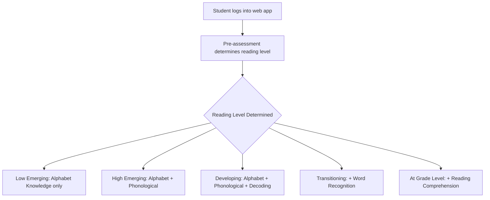

# Prescriptive Analytics Data Flow Documentation
**Complete Step-by-Step Process: Main Assessment → Student Responses → Category Results → Prescriptive Analysis**

---

## Table of Contents
1. [Database Schema Overview](#database-schema-overview)
2. [Step-by-Step Data Flow Process](#step-by-step-data-flow-process)
3. [BKT/IRT Mathematical Processing](#bktirt-mathematical-processing)
4. [Integration Points & Triggers](#integration-points--triggers)
5. [Sample Data Transformations](#sample-data-transformations)
6. [Error Pattern Analysis](#error-pattern-analysis)
7. [Intervention Generation Logic](#intervention-generation-logic)

---

## Database Schema Overview

### 1. Main Assessment Collection (`main_assessment`)
```javascript
{
  "_id": ObjectId("..."),
  "readingLevel": "High Emerging", // Determines which categories are available
  "category": "Phonological Awareness", // Single category per assessment
  "questionType": "matching", // "matching", "fill_blank", "drag_drop", etc.
  "questions": [
    {
      "questionText": "Pakinggan ang audio. Itugma ito sa katumbas na letra.",
      "questionId": "PA_001", // Unique identifier for tracking
      "questionSet": [
        {
          "audioTexts": ["H", "T", "N"],
          "matchingOptions": ["Hh", "Tt", "Nn"],
          "correctPairs": [
            {"H": "Hh"}, {"T": "Tt"}, {"N": "Nn"}
          ]
        }
      ]
    }
  ],
  "isActive": true,
  "status": "active",
  "createdAt": Date,
  "updatedAt": Date
}
```

### 2. Student Responses Collection (`student_responses`)
```javascript
{
  "_id": ObjectId("..."),
  "studentId": 202533333, // INT - Links to users.idNumber
  "categoryId": ObjectId("..."), // Links to main_assessment._id
  "questionId": "AK_001", // Links to specific question
  "category": "Alphabet Knowledge", // Category name for easy filtering
  "response": ["2"], // Student's actual answer(s)
  "isCorrect": true, // Boolean result of answer evaluation
  "responseTime": 7.4, // Seconds taken to answer (for advanced BKT)
  "answeredAt": Date, // Timestamp for chronological BKT processing
  "createdAt": Date,
  "readingLevel": "High Emerging" // Student's current reading level
}
```

### 3. Category Results Collection (`category_results`)
```javascript
{
  "_id": ObjectId("..."),
  "studentId": 202533333, // INT - Student identifier
  "assessmentDate": Date,
  "categories": [
    {
      "categoryName": "Alphabet Knowledge",
      "totalQuestions": 15,
      "correctAnswers": 10,
      "score": 67, // Percentage: (correctAnswers / totalQuestions) * 100
      "isPassed": false, // score >= 75%
      "passingThreshold": 75,
      "isCompleted": true,
      "lastQuestionAnswered": "AK_015",
      "interventionRequired": true, // true if isPassed = false
      "interventionAttempts": 0, // Tracks one-time intervention rule
      "interventionCompleted": false,
      "currentInterventionId": null,
      "interventionHistory": [] // Tracks all intervention attempts
    }
  ],
  "readingLevel": "High Emerging",
  "overallScore": 70, // Weighted average across all categories
  "prescriptiveAnalysisId": null // Links to generated analysis
}
```

### 4. Prescriptive Analysis Collection (`prescriptive_analysis`)
```javascript
{
  "_id": ObjectId("..."),
  "studentId": 202533333, // INT - Student identifier
  "categoryResultId": ObjectId("..."), // Links to category_results
  "assessmentDate": Date,
  "assessmentType": "main", // "main" or "intervention"
  "readingLevel": "High Emerging",
  
  // BKT tracking for each category with complete metrics
  "skillMastery": {
    "Alphabet Knowledge": {
      "masteryProbability": 0.92, // BKT calculated probability (0-1)
      "lastUpdated": Date,
      "totalQuestions": 15,
      "correctAnswers": 14,
      "score": 93,
      "isPassed": true, // >= 75%
      "responseHistory": [ // Last 10 responses for BKT reference
        {
          "questionId": "AK_001",
          "correct": true,
          "timestamp": Date,
          "masteryAfter": 0.85 // BKT probability after this response
        }
      ]
    },
    "Phonological Awareness": {
      "masteryProbability": 0.45,
      "totalQuestions": 6,
      "totalPossibleMatches": 15, // For matching questions
      "correctMatches": 7,
      "score": 47,
      "isPassed": false
    }
  },
  
  // IRT ability estimates (-3 to +3 scale)
  "abilityEstimates": {
    "Alphabet Knowledge": 1.2, // Above average
    "Phonological Awareness": -0.8 // Below average
  },
  
  // Detailed error pattern analysis
  "errorPatterns": {
    "Alphabet Knowledge": {
      "patinig_errors": {
        "count": 1,
        "total": 5,
        "percentage": 20,
        "specific_letters": ["O"],
        "error_type": "visual_confusion",
        "questionIds": ["AK_007"]
      }
    },
    "Phonological Awareness": {
      "matching_errors": {
        "count": 4,
        "total": 6,
        "percentage": 67,
        "avg_partial_success": 0.47,
        "error_type": "sound_discrimination",
        "questionIds": ["PA_002", "PA_003", "PA_004", "PA_006"]
      }
    }
  },
  
  // Intervention recommendations (no time estimates - one-time rule)
  "interventionPlan": {
    "required": true, // Any category below 75%
    "priority": ["Phonological Awareness", "Decoding"], // Ordered by need
    "specificFocus": {
      "Phonological Awareness": {
        "focus": "sound_matching",
        "targetSounds": ["B-P", "M-N", "D-T"],
        "recommendedActivities": ["sound_discrimination", "minimal_pairs"],
        "questionDistribution": {
          "matching": 100 // All matching type questions
        }
      }
    }
  },
  
  // Performance insights
  "insights": {
    "strengths": ["Reading Comprehension", "Word Recognition", "Alphabet Knowledge"],
    "weaknesses": ["Phonological Awareness - 47%", "Decoding - 70%"],
    "overallReadiness": "Needs targeted intervention",
    "recommendedAction": "immediate_intervention", // enum values
    "passedCategories": 3,
    "failedCategories": 2,
    "overallScore": 74 // Weighted average based on reading level
  },
  
  // Intervention tracking for one-time rule enforcement
  "interventionHistory": [
    {
      "category": "Phonological Awareness",
      "interventionId": ObjectId("..."),
      "dateTaken": Date,
      "passed": false,
      "score": 60,
      "attempt": 1 // For tracking multiple attempts (face-to-face escalation)
    }
  ],
  
  "createdAt": Date,
  "updatedAt": Date
}
```

---

## Step-by-Step Data Flow Process

### Phase 1: Assessment Initialization (Web Application)


**Reading Level Categories Available:**
- **Low Emerging**: Alphabet Knowledge (1 category)
- **High Emerging**: Alphabet Knowledge + Phonological Awareness (2 categories)
- **Developing**: Alphabet Knowledge + Phonological Awareness + Decoding (3 categories)
- **Transitioning**: Above + Word Recognition (4 categories)
- **At Grade Level**: Above + Reading Comprehension (5 categories)

### Phase 2: Main Assessment Execution
```javascript
// Example flow for High Emerging student (2 categories)
const assessmentFlow = {
  studentId: 202533333,
  readingLevel: "High Emerging",
  categories: [
    {
      name: "Alphabet Knowledge",
      questions: 15, // Patinig (vowels) and Katinig (consonants)
      types: ["patinig", "katinig"]
    },
    {
      name: "Phonological Awareness", 
      questions: 6, // Audio-to-letter matching
      types: ["matching"],
      specialScoring: "totalMatches/correctMatches" // Not just correct/incorrect
    }
  ]
}
```

### Phase 3: Student Response Collection
For each question answered, a `student_responses` record is created:

```javascript
// Example: Student answers Alphabet Knowledge question
{
  "studentId": 202533333,
  "questionId": "AK_001",
  "category": "Alphabet Knowledge",
  "response": ["2"], // Student selected option 2
  "isCorrect": true, // Evaluated against correct answer
  "responseTime": 7.4, // 7.4 seconds to answer
  "answeredAt": "2025-08-18T12:15:25.500Z", // Chronological ordering for BKT
  "readingLevel": "High Emerging"
}
```

### Phase 4: Category Results Aggregation
After all questions in a category are completed:

```javascript
// CategoryResultsService.createCategoryResult() processes responses
const categoryAggregation = {
  // 1. Group responses by category
  alphabetResponses: responses.filter(r => r.category === "Alphabet Knowledge"),
  phonologicalResponses: responses.filter(r => r.category === "Phonological Awareness"),
  
  // 2. Calculate scores per category
  alphabetScore: (correctAnswers / totalQuestions) * 100,
  phonologicalScore: (correctMatches / totalMatches) * 100, // Special PA scoring
  
  // 3. Determine pass/fail (75% threshold)
  alphabetPassed: alphabetScore >= 75,
  phonologicalPassed: phonologicalScore >= 75,
  
  // 4. Calculate weighted overall score based on reading level
  overallScore: calculateWeightedScore(categoryScores, readingLevel)
}
```

### Phase 5: Prescriptive Analysis Generation (AUTOMATIC)
**Key Trigger Point**: As soon as `category_results` is saved, the system automatically triggers prescriptive analysis:

```javascript
// In CategoryResultsService.createCategoryResult()
const savedResult = await categoryResultDoc.save();

// AUTOMATIC TRIGGER - No manual intervention required
const prescriptiveAnalysis = await IntegrationTriggerService.triggerPrescriptiveAnalysis(savedResult);
```

---

## BKT/IRT Mathematical Processing

### Bayesian Knowledge Tracing (BKT) Implementation

**Core Formula**: `P(L_n+1) = P(L_n | evidence_n) + (1 - P(L_n | evidence_n)) × P(T)`

**Parameters (Research-based values)**:
- **P(L₀) = 0.5** - Initial mastery probability
- **P(T) = 0.1** - Learning probability  
- **P(G) = 0.3** - Guessing probability
- **P(S) = 0.1** - Slipping probability

#### BKT Processing Steps:

1. **Initialize Mastery**: Each category starts with P(L₀) = 0.5
2. **Chronological Processing**: Responses sorted by `answeredAt` timestamp
3. **Bayesian Update**: For each response, update mastery probability

```javascript
// Example BKT calculation for a student response sequence
const bktSequence = [
  { questionId: "AK_001", correct: true, timestamp: "12:15:25" },
  { questionId: "AK_002", correct: false, timestamp: "12:15:32" },
  { questionId: "AK_003", correct: true, timestamp: "12:15:38" }
];

let mastery = 0.5; // Initial probability

// Process each response chronologically
for (const response of bktSequence) {
  if (response.correct) {
    // P(mastery | correct) = P(correct | mastery) * P(mastery) / P(correct)
    const pCorrect = mastery * (1 - P_SLIP) + (1 - mastery) * P_GUESS;
    const posteriorMastery = (mastery * (1 - P_SLIP)) / pCorrect;
  } else {
    // P(mastery | incorrect) calculation
    const pIncorrect = mastery * P_SLIP + (1 - mastery) * (1 - P_GUESS);
    const posteriorMastery = (mastery * P_SLIP) / pIncorrect;
  }
  
  // Apply learning: P(L_n+1) = posterior + (1 - posterior) * P(T)
  mastery = posteriorMastery + (1 - posteriorMastery) * P_LEARN;
}

// Final mastery probability stored in prescriptive_analysis
```

### Item Response Theory (IRT) Implementation

**2-Parameter Logistic Model**: `P(X_ij = 1|θ_j, a_i, b_i) = 1 / (1 + e^(-1.702×a_i×(θ_j - b_i)))`

#### IRT Processing Steps:

1. **Calculate Proportion Correct**: For each category
2. **Convert to Ability Scale**: Transform to -3 to +3 range using logit
3. **Special Phonological Awareness Handling**: Use correctMatches/totalMatches

```javascript
// Example IRT ability estimation
const categoryPerformance = {
  "Alphabet Knowledge": {
    correctAnswers: 14,
    totalQuestions: 15,
    proportionCorrect: 14/15 = 0.933
  },
  "Phonological Awareness": {
    correctMatches: 7,
    totalMatches: 15,
    proportionCorrect: 7/15 = 0.467
  }
};

// Convert to IRT ability estimates
const abilityEstimates = {
  "Alphabet Knowledge": Math.log(0.933 / (1 - 0.933)) = 2.647 → bounded to 2.647,
  "Phonological Awareness": Math.log(0.467 / (1 - 0.467)) = -0.133 → bounded to -0.133
};
```

### Category Weighting by Reading Level

**Weighted Score Calculation**:
```javascript
const CATEGORY_WEIGHTS = {
  "High Emerging": {
    "Alphabet Knowledge": 0.6,      // 60%
    "Phonological Awareness": 0.4   // 40%
  },
  "Developing": {
    "Alphabet Knowledge": 0.35,     // 35%
    "Phonological Awareness": 0.30, // 30%  
    "Decoding": 0.35                // 35%
  }
  // ... other reading levels
};

// Example weighted score calculation for High Emerging
const scores = {
  "Alphabet Knowledge": 93,
  "Phonological Awareness": 47
};

const weightedScore = (93 * 0.6) + (47 * 0.4) = 55.8 + 18.8 = 74.6 ≈ 75
```

---

## Integration Points & Triggers

### Automatic Trigger System

**1. Primary Trigger**: Category Results Creation
```javascript
// In CategoryResultsService.createCategoryResult()
try {
  const savedResult = await categoryResultDoc.save();
  
  // AUTOMATIC PRESCRIPTIVE ANALYSIS GENERATION
  const prescriptiveAnalysis = await IntegrationTriggerService.triggerPrescriptiveAnalysis(savedResult);
  
  if (prescriptiveAnalysis) {
    // Link analysis back to category result
    savedResult.prescriptiveAnalysisId = prescriptiveAnalysis._id;
  }
} catch (error) {
  // Analytics failure doesn't break assessment flow
  console.error('Prescriptive analysis generation failed:', error);
}
```

**2. Data Dependency Chain**:
```
main_assessment (questions) 
    ↓ (student answers)
student_responses (individual answers with timing)
    ↓ (aggregated by category)
category_results (scores and pass/fail status)
    ↓ (AUTOMATIC TRIGGER)
prescriptive_analysis (BKT/IRT analysis + intervention planning)
    ↓ (if intervention needed)
intervention_assessment (one-time intervention questions)
    ↓ (after intervention completion)
intervention_results (pass/fail outcome)
    ↓ (if failed: face-to-face escalation)
```

### Service Integration Architecture

```javascript
// Complete integration flow
class IntegrationTriggerService {
  static async triggerPrescriptiveAnalysis(categoryResult) {
    // 1. Validate category result exists and has required data
    if (!categoryResult || !categoryResult.studentId) return null;
    
    // 2. Check for existing analysis to avoid duplicates
    const existingAnalysis = await this.checkExistingAnalysis(categoryResult._id);
    if (existingAnalysis) return existingAnalysis;
    
    // 3. Generate comprehensive prescriptive analysis
    const analysis = await PrescriptiveAnalyticsService.generatePrescriptiveAnalysis(categoryResult._id);
    
    // 4. Optional: Trigger additional processes (notifications, etc.)
    await this.postAnalysisProcessing(analysis);
    
    return analysis;
  }
}
```

---

## Sample Data Transformations

### Example: High Emerging Student Complete Flow

**Step 1: Raw Assessment Data**
```javascript
// main_assessment questions for High Emerging
const assessmentQuestions = {
  "Alphabet Knowledge": [
    { questionId: "AK_001", type: "patinig", letter: "A" },
    { questionId: "AK_002", type: "katinig", letter: "B" }
    // ... 13 more questions
  ],
  "Phonological Awareness": [
    { questionId: "PA_001", type: "matching", pairs: [{"H":"Hh"}, {"T":"Tt"}] },
    { questionId: "PA_002", type: "matching", pairs: [{"L":"Ll"}, {"P":"Pp"}] }
    // ... 4 more questions
  ]
};
```

**Step 2: Student Response Collection**
```javascript
const studentResponses = [
  // Alphabet Knowledge responses
  { studentId: 202533333, questionId: "AK_001", isCorrect: true, responseTime: 7.4 },
  { studentId: 202533333, questionId: "AK_002", isCorrect: true, responseTime: 6.8 },
  { studentId: 202533333, questionId: "AK_003", isCorrect: false, responseTime: 12.1 },
  // ... 12 more AK responses
  
  // Phonological Awareness responses (special scoring)
  { studentId: 202533333, questionId: "PA_001", correctMatches: 2, totalMatches: 3, isCorrect: false },
  { studentId: 202533333, questionId: "PA_002", correctMatches: 1, totalMatches: 2, isCorrect: false },
  // ... 4 more PA responses
];
```

**Step 3: Category Results Aggregation**
```javascript
const categoryResults = {
  studentId: 202533333,
  readingLevel: "High Emerging",
  categories: [
    {
      categoryName: "Alphabet Knowledge",
      totalQuestions: 15,
      correctAnswers: 14,     // 14 out of 15 correct
      score: 93,              // (14/15) * 100 = 93.33% ≈ 93%
      isPassed: true,         // 93% >= 75%
      interventionRequired: false
    },
    {
      categoryName: "Phonological Awareness", 
      totalQuestions: 6,
      totalPossibleMatches: 15,
      correctMatches: 7,      // 7 out of 15 total matches
      score: 47,              // (7/15) * 100 = 46.67% ≈ 47%
      isPassed: false,        // 47% < 75%
      interventionRequired: true
    }
  ],
  overallScore: 74 // Weighted: (93 * 0.6) + (47 * 0.4) = 55.8 + 18.8 = 74.6 ≈ 75
};
```

**Step 4: Prescriptive Analysis Generation (BKT/IRT)**
```javascript
const prescriptiveAnalysis = {
  studentId: 202533333,
  readingLevel: "High Emerging",
  
  // BKT skill mastery tracking
  skillMastery: {
    "Alphabet Knowledge": {
      masteryProbability: 0.92, // High mastery - consistent correct responses
      score: 93,
      isPassed: true,
      responseHistory: [
        { questionId: "AK_001", correct: true, masteryAfter: 0.775 },
        { questionId: "AK_002", correct: true, masteryAfter: 0.856 },
        { questionId: "AK_003", correct: false, masteryAfter: 0.683 },
        // ... BKT probability evolution through all 15 questions
        { questionId: "AK_015", correct: true, masteryAfter: 0.92 }
      ]
    },
    "Phonological Awareness": {
      masteryProbability: 0.45, // Low mastery - many errors
      score: 47,
      isPassed: false,
      totalPossibleMatches: 15,
      correctMatches: 7
    }
  },
  
  // IRT ability estimates
  abilityEstimates: {
    "Alphabet Knowledge": 1.2,   // Above average (positive θ)
    "Phonological Awareness": -0.8  // Below average (negative θ)
  },
  
  // Error pattern analysis
  errorPatterns: {
    "Phonological Awareness": {
      matching_errors: {
        count: 4,           // 4 questions with errors
        total: 6,           // 6 total questions
        percentage: 67,     // 67% error rate
        error_type: "sound_discrimination",
        avg_partial_success: 0.47 // Average correct matches per question
      }
    }
  },
  
  // Intervention planning
  interventionPlan: {
    required: true,
    priority: ["Phonological Awareness"], // Only failed category
    specificFocus: {
      "Phonological Awareness": {
        focus: "sound_matching",
        targetSounds: ["B-P", "M-N", "D-T"], // Common confusion pairs
        recommendedActivities: ["sound_discrimination", "minimal_pairs"],
        questionDistribution: { matching: 100 } // 100% matching questions
      }
    }
  },
  
  // Performance insights
  insights: {
    strengths: ["Alphabet Knowledge"], // Passed categories
    weaknesses: ["Phonological Awareness - 47%"], // Failed categories with scores
    overallReadiness: "Needs targeted intervention",
    recommendedAction: "immediate_intervention", // Generate intervention
    passedCategories: 1,
    failedCategories: 1,
    overallScore: 74 // Just below passing overall
  }
};
```

---

## Error Pattern Analysis

### Category-Specific Error Detection

**1. Alphabet Knowledge Errors**
```javascript
// Analyzes patinig (vowel) vs katinig (consonant) error patterns
const alphabetErrorAnalysis = {
  patinig_errors: {
    count: 1,                    // 1 vowel error
    total: 5,                    // 5 vowel questions total
    percentage: 20,              // 20% error rate for vowels
    specific_letters: ["O"],     // Student confused letter "O"
    error_type: "visual_confusion", // Type of error identified
    questionIds: ["AK_007"]      // Specific questions with errors
  },
  katinig_errors: {
    // Similar structure for consonant errors
    count: 0,                    // No consonant errors
    // ... (no errors means no pattern)
  }
};
```

**2. Phonological Awareness Errors**
```javascript
// Special handling for matching questions with partial credit
const phonologicalErrorAnalysis = {
  matching_errors: {
    count: 4,                    // 4 questions with errors
    total: 6,                    // 6 total questions
    percentage: 67,              // 67% error rate
    avg_partial_success: 0.47,   // Average 47% matches correct per question
    error_type: "sound_discrimination", // Primary error type
    questionIds: ["PA_002", "PA_003", "PA_004", "PA_006"]
  }
};
```

**3. Advanced Error Pattern Recognition**
```javascript
// System identifies specific learning difficulties
const errorPatternInsights = {
  primaryDifficulty: "sound_discrimination", // Main problem area
  secondaryIssues: ["sequencing", "visual_confusion"],
  interventionFocus: [
    "minimal_pairs",           // B-P, D-T sound discrimination
    "phoneme_isolation",       // Individual sound recognition
    "auditory_processing"      // Listening skills improvement
  ],
  difficultyLevel: "moderate", // Based on error percentage and patterns
  estimatedSessions: 1        // One-time intervention rule
};
```

---

## Intervention Generation Logic

### One-Time Intervention Rule Implementation

**Core Logic**: Each student gets exactly ONE digital intervention attempt per failed category. If they fail the intervention, they must receive face-to-face support.

```javascript
class InterventionGenerator {
  async generateIntervention(prescriptiveAnalysisId, category) {
    // 1. Check intervention history for one-time rule enforcement
    const analysis = await PrescriptiveAnalysis.findById(prescriptiveAnalysisId);
    const interventionHistory = analysis.interventionHistory || [];
    
    // Enforce one-time rule
    const previousAttempt = interventionHistory.find(h => h.category === category);
    if (previousAttempt) {
      throw new Error(`Intervention already attempted for ${category}. Face-to-face support required.`);
    }
    
    // 2. Generate exactly 10 questions based on error patterns
    const errorPatterns = analysis.errorPatterns[category];
    const focusPlan = analysis.interventionPlan.specificFocus[category];
    
    const interventionQuestions = this.generateAdaptiveQuestions(
      category,
      analysis.readingLevel,
      errorPatterns,
      focusPlan,
      analysis.abilityEstimates[category]
    );
    
    // 3. Create intervention assessment with fixed parameters
    return {
      studentId: analysis.studentId,
      prescriptiveAnalysisId,
      category,
      totalQuestions: 10,           // Always exactly 10 questions
      passThreshold: 75,            // 75% required to pass
      questions: interventionQuestions,
      interventionParameters: {
        fixedQuestions: 10,         // No adaptation during intervention
        allowSkip: false,           // Must answer all questions
        showProgress: true,         // Show question progress
        immediateFeeback: false     // Results only at end
      }
    };
  }
}
```

### Face-to-Face Escalation Trigger

**When Face-to-Face is Required**:
1. **Second Intervention Attempt**: Student already had one intervention for this category
2. **Intervention Failure**: Student scored <75% on the one-time intervention
3. **Multiple Category Failures**: Student failed interventions in multiple categories

```javascript
// Face-to-face escalation detection
const faceToFaceRequired = {
  // Scenario 1: Second attempt blocked
  checkSecondAttempt: (interventionHistory, category) => {
    return interventionHistory.some(h => h.category === category);
  },
  
  // Scenario 2: Intervention failure  
  checkInterventionFailure: (interventionResult) => {
    return interventionResult.score < 75;
  },
  
  // Scenario 3: Multiple failures
  checkMultipleFailures: (interventionHistory) => {
    const failedCategories = interventionHistory.filter(h => !h.passed);
    return failedCategories.length >= 2;
  }
};

// Teacher dashboard alert system
const escalationAlert = {
  studentId: 202533333,
  alertType: "face_to_face_required",
  reason: "intervention_failed", // or "multiple_failures", "second_attempt"
  category: "Phonological Awareness",
  interventionScore: 68, // Failed score
  recommendedAction: "immediate_teacher_intervention",
  analyticsData: {
    errorPatterns: "sound_discrimination",
    recommendedApproach: "direct_instruction_with_audio_support",
    estimatedTime: "15-20 minutes guided practice"
  }
};
```

### Advanced BKT with Response Time

**Time-Aware Learning Adjustment**:
```javascript
// Enhanced BKT considers response speed for learning probability
const timeAwareBKT = {
  updateMasteryWithTime: (currentMastery, isCorrect, responseTime, expectedTime) => {
    // Base BKT calculation
    const baseMastery = standardBKTUpdate(currentMastery, isCorrect);
    
    // Time factor calculation
    const timeRatio = responseTime / expectedTime;
    let timeFactor = 1.0;
    
    if (isCorrect) {
      if (timeRatio < 0.5) timeFactor = 1.8;      // Very fast correct = high learning
      else if (timeRatio < 0.8) timeFactor = 1.4;  // Fast correct = good learning
      else if (timeRatio > 2.0) timeFactor = 0.6;  // Very slow = minimal learning
    } else {
      if (timeRatio < 0.5) timeFactor = 0.5;      // Very fast incorrect = guessing
      else if (timeRatio > 2.0) timeFactor = 0.8; // Very slow = confusion
    }
    
    // Adjust learning probability and recalculate
    const adjustedParams = { ...BKT_PARAMETERS, P_LEARN: BKT_PARAMETERS.P_LEARN * timeFactor };
    return this.recalculateWithAdjustedParams(currentMastery, isCorrect, adjustedParams);
  }
};
```

---

## Summary: The Complete Data Transformation Pipeline

**Data Flow Summary**:
```
📝 main_assessment (structured questions by reading level)
    ↓ [Student interaction in web app]
📊 student_responses (individual answers with timing data)  
    ↓ [Automatic aggregation and scoring]
📈 category_results (pass/fail by category + overall weighted score)
    ↓ [AUTOMATIC TRIGGER - No manual step required]
🧠 prescriptive_analysis (BKT/IRT mathematical analysis + intervention planning)
    ↓ [If intervention needed - one-time rule]  
🎯 intervention_assessment (exactly 10 targeted questions)
    ↓ [Student attempts intervention]
📊 intervention_results (pass/fail outcome)
    ↓ [If failed - face-to-face escalation required]
🤝 teacher_dashboard_alert (face-to-face support needed)
```

**Key Mathematical Transformations**:
1. **Raw Responses** → **BKT Mastery Probabilities** (0-1 scale)
2. **Response Patterns** → **IRT Ability Estimates** (-3 to +3 scale)
3. **Individual Scores** → **Weighted Composite Scores** (reading level based)
4. **Error Patterns** → **Targeted Intervention Plans** (category-specific focus)
5. **Response Timing** → **Learning Confidence Factors** (advanced BKT)

This complete data flow represents the **"novelty of your application"** - the seamless integration of cutting-edge educational psychology research (BKT/IRT) with practical intervention planning and the innovative one-time digital intervention rule that escalates to human teacher support when needed, all while maintaining continuous mathematical modeling of student learning progression.

---

*This documentation provides complete visibility into how your prescriptive analytics system transforms raw assessment data into personalized, research-based intervention recommendations using advanced Bayesian Knowledge Tracing and Item Response Theory mathematical models.*